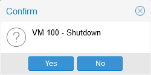
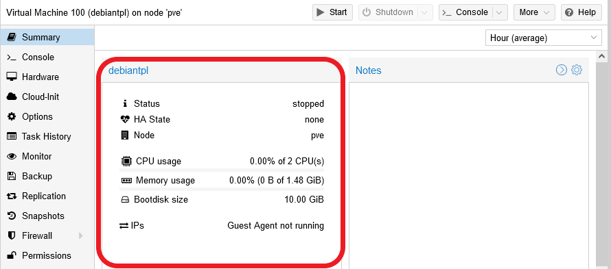
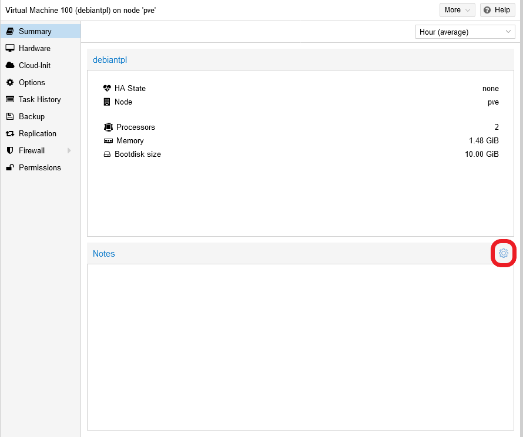
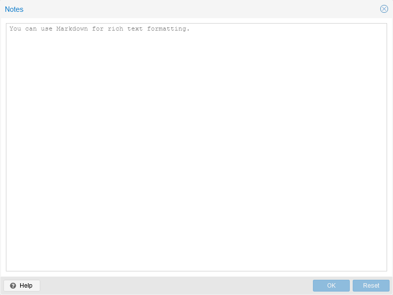
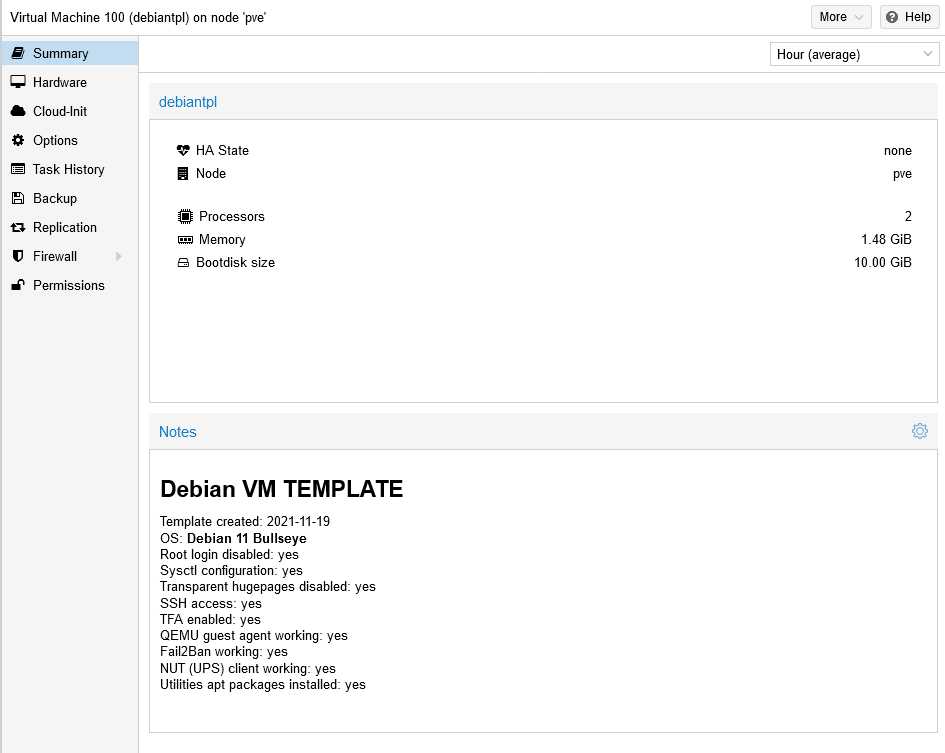
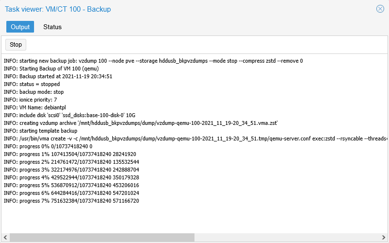
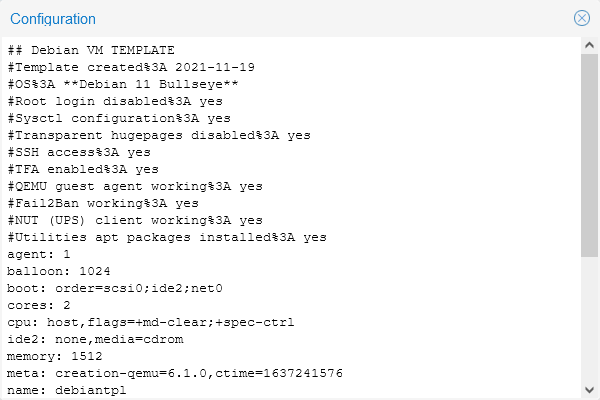
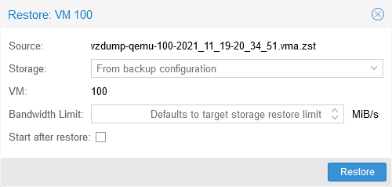
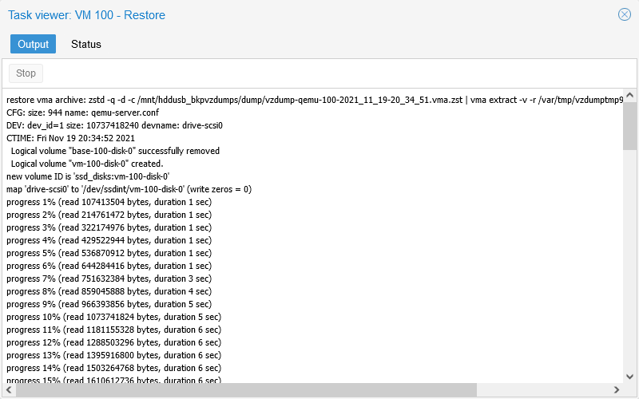

# G023 - K3s cluster setup 06 ~ Debian VM template and backup

Now that you have a Debian VM configured, you can turn it into a VM template. This way, you'll be able to create new Debian based VMs much faster just by cloning this template.

## Turning the Debian VM into a VM template

To do this conversion, browse to your Proxmox VE web console and follow the steps below.

1. First, stop your VM by clicking on the `Shutdown` button.

    

    You'll have to confirm the `Shutdown` action.

    

    It shouldn't take more than a few seconds for your VM to shut down.

    

    The VM's Status will change to `stopped`, and other indicators like CPU and memory usage won't show any kind of activity.

2. Click on the `More` button and choose the `Convert to template` option.

    

3. The web console will ask for your confirmation of this action.

    

4. Just click on `Yes`, and Proxmox VE will turn the VM into a template in a few seconds. When the task is finished, the VM's `Summary` page will refresh automatically. There, you'll notice several changes.

    

    See that the `Summary` no longer shows the VM's status or the usage statistics. Also notice that some tabs are missing below the `Summary` one: `Console`, `Monitor` and `Snapshot` are not available anymore. Further, the `Start`, `Shutdown` and `Console` buttons that used to be at the VM page's top are not there either. This is because VM templates **cannot be started**, they're just **read-only** models that you can clone to create new VMs. Another minor detail that has changed is the icon the VM has in the tree shown at the web console's left.

5. It's very advisable to leave a proper description in the `Notes` text block available in the `Summary` view.

    - Click on the `Notes`' gear icon.

        

    - You'll get an editor window in which you can type anything you want, and even use **Markdown** syntax.

        

    - For instance, you could type something like the following there.

        > **BEWARE!**  
        > The text below is formatted with **Markdown** so, if you use it as a template for your notes, be mindful of, among other things, the double spacing used at the end of each line. Double spacing in Markdown [forces a hard line break](https://spec.commonmark.org/0.30/#hard-line-breaks), equivalent to a ` ` tag in html.

        ~~~markdown
        # Debian VM TEMPLATE
        Template created: 2021-11-19  
        OS: **Debian 11 Bullseye**  
        Root login disabled: yes  
        Sysctl configuration: yes  
        Transparent hugepages disabled: yes  
        SSH access: yes  
        TFA enabled: yes  
        QEMU guest agent working: yes  
        Fail2Ban working: yes  
        NUT (UPS) client working: yes  
        Utilities apt packages installed: yes  
        ~~~

        As you can see, you can use it as a reminder of what's inside your VM template.

    - When you have the text ready, just click on `OK` and the `Notes` block will be updated in the `Summary` view.

        

## VM template's backup

It's convenient to have a backup of your VM template, just in case anything happens. For VMs and containers, the kind of backup you can do in Proxmox VE is a **vzdump**. These dumps have to be saved in a storage configured for it but, since you already configured a special Proxmox VE directory for that (in the external usb storage drive) in the [**G019** guide](G019%20-%20K3s%20cluster%20setup%2002%20~%20Storage%20setup.md#setting-up-the-directories), now you just have to worry about doing the backup itself.

### _Creating the backup of the VM template_

1. In the Proxmox VE web console, browse to the `Backup` view of your VM template.

    

    At this point, you'll find this view empty of backups. The two main things you must notice here are the `Backup now` button and the `Storage` unfoldable list on the right. There's only the `hddusb_bkpvzdumps` storage available for VM dumps, which you configured as the sole directory for holding vzdumps, back in the [**G019** guide](G019%20-%20K3s%20cluster%20setup%2002%20~%20Storage%20setup.md#setting-up-the-directories). Now you can take advantage of it and, since its already selected as the storage of choice for VM dumps, just press on the `Backup now`.

2. An editor window appears for creating a new backup.

    

    There you have the following parameters to fill.

    - `Storage`: it's the same list you have available in the `Backup` view.

    - `Mode`: indicates how you want to execute the backup on your VM. In case of running VMs, you'll have to consider if you want to execute the backup in parallel with the VM still running (`Snapshot` and `Suspend` modes, which also use the QEMU guest agent if available in the VM) or stopping it while the backup is being done (`Stop` mode). For a VM template backup, it shouldn't matter which mode you choose, although the only one that makes sense to use in this case is `Stop` mode.
        > **BEWARE!**  
        > The behaviour of these backup modes for containers is similar but not equivalent to how they work for VMs. Check the Proxmox VE help to see the differences.

    - `Compression`: offers you the possibility of compressing or not the backup of your VM or container. In a scenario with very limited storage like the one used in this guide series, its mandatory to compress the dumps as much as possible. The default `ZSTD` option is the best option since is not only the fastest algorithm of the three offered, but also is multi-threaded.

    - `Send email to`: if you want Proxmox VE to send an email to someone about the execution of this backup, type their email (or emails) here. This may not work depending on your network and security configuration.

    Knowing all that, you may set the configuration for the new backup like below, just changing the `Mode` to `Stop`.

    

3. Click on the `Backup` button and you'll see a progress window like the one below.

    

    After a while, you should see in the `Output` log informative lines like the ones below.

    ~~~log
    INFO: image drive-scsi0: size=10737418240 zeros=8918171648 saved=1819246592
    INFO: archive file size: 600MB
    INFO: Finished Backup of VM 100 (00:01:15)
    INFO: Backup finished at 2021-11-19 20:36:06
    INFO: Backup job finished successfully
    TASK OK
    ~~~

    This means that the dump has been done correctly.

4. Close the status window to return to the `Backup` view. There, you'll see the new backup listed as a vzdump file compressed in `.zst` format.

    

Notice that, in this case, the backup takes up to 629.93 MiB, a decent compression of the 2.18 GiB used by the VM template's `base-100-disk-0` disk image.

### _Restoring the VM template's backup_

Restoring the backup of a VM or VM template is not much more complex than creating them.

1. Go back to the `Backup` view of your VM template and select the only backup you have listed there.

    

    Notice how all the buttons next to `Backup now` are active. The ones that you should pay attention to are `Restore` and `Show Configuration`.

2. It may happen that it has been a while since you did the backup, and you don't remember what's inside of it. To help you with this, you can press on `Show Configuration`.

    

    This window shows you the configuration of the VM or VM template saved in the backup, including the notes you may have added to the VM itself. This gives you an idea of what is going to be put back when you restore the backup.

3. Close the backup's `Configuration` window, then press on `Restore`.

    

    The fields you see mean the following.

    - `Source`: the backup file from which you're going to restore the VM or VM template.

    - `Storage`: the storage where you want to restore the backup. Left by default, the backup will restore the VM hard disks in the locations indicated in its configuration.

    - `VM`: the id of the VM you're restoring.

    - `Bandwith Limit`: this parameter is to restrict the system's resources taken up by the restoration process, and limit the impact it will have in your system performance.

    - `Start after restore`: makes the restored VM start immediately after being restore, although this won't work on a VM template.

4. With the default values you're fine, so press on `Restore` and you'll see the following confirmation window.

    

    > **BEWARE!**  
    > The restoration process will **replace** the hard disk you currently have linked to the VM template with the one stored within the backup.

5. After accepting the confirmation, you'll reach the progress window of the `Restore` process.

    

    After a while you should see in the output the `TASK OK` message, as a sign of the successful end of the process. Also, in those log lines, you may notice a line like the following.

    ~~~bash
    space reduction due to 4K zero blocks 4.93%
    ~~~

    This means that the restoration procedure has found some empty (`zero`) blocks in the backup and, due to that, the space taken up by the restored VM has been reduced by a certain percentage (`4.93%` in the example above).

### _Considerations about backups_

- **Different restore commands for VM and containers**  
    You can also restore commands through a shell:

    - `qmrestore`: VM restore utility.
    - `pct restore`: container restore utility.

    Check their `man` pages to see how they work.

- **Careful with storages**  
    The hard disks attached to VMs or containers could be configured to storages that are no longer available in your system, or that have changed their names. So always check the configuration of the VM or container before you restore it, to see in which storage you can put it back.

- **Hardware setup is saved in the backup**  
    The hardware configuration of a VM that you see in the Proxmox VE web console is also stored in its backup. So, when you recover the backup of a VM, the hardware configuration will also be recovered, although the PVE web console may ask you about the differences it finds between the current VM configuration and the one stored in the backup.

    > This point is directly related with the previous one.

## Other considerations regarding VM templates

- **Nature of VM templates**  
    It might seem odd that, in the Proxmox VE platform, the VM templates are treated almost as normal VMs. To understand this, you have to think about VM templates just as frozen-in-time VMs. Thanks to this nature, you can clone them in Proxmox VE to create new but similar VMs much faster.

- **Proxmox VE doesn't compress the templates**  
    Directly related to this "frozen VM" nature, you must bear in mind that a VM template's hard disk won't be compressed or shrinked in any way by Proxmox VE. Whatever storage space was used by the VM disk image, that's exactly the space the template will still take up. The only thing that will change, as you've seen in this guide, is the write permission on the corresponding light volume and its status to inactive. Now, in case you happened to be using a `qcow2` image file, how this read-only restriction is enforced will change. Given how the storage setup has been configured already, the `qcow2` format won't be covered in this guide series.

- **Clone VM templates to update them**  
    Since VM templates are read-only, **you can't modify them**. If you want to update a template, you'll have to clone it into a new VM, update that VM and, then, turn the updated VM into a new VM template.

- **Hardware configuration can be changed**  
    The part that really is read-only in a template is the storage drive that becomes the disk image, but the hardware setup can still be changed. If you have to do this, you must be careful that the changes won't contradict what the templated VM saved in the image knows about its hardware. For instance, changing the number of vCPUs or the RAM won't usually give you any trouble, but removing a network device could have concerning consecuences.

## References

- [CommonMark (Markdown) Spec](https://spec.commonmark.org/)
- [Proxmox VE documentation. Backup and Restore](https://pve.proxmox.com/pve-docs/pve-admin-guide.html#chapter_vzdump)

## Navigation

[<< Previous (**G022. K3s cluster setup 05**)](G022%20-%20K3s%20cluster%20setup%2005%20~%20Connecting%20the%20VM%20to%20the%20NUT%20server.md) | [+Table Of Contents+](G000%20-%20Table%20Of%20Contents.md) | [Next (**G024. K3s cluster setup 07**) >>](G024%20-%20K3s%20cluster%20setup%2007%20~%20K3s%20node%20VM%20template%20setup.md)
