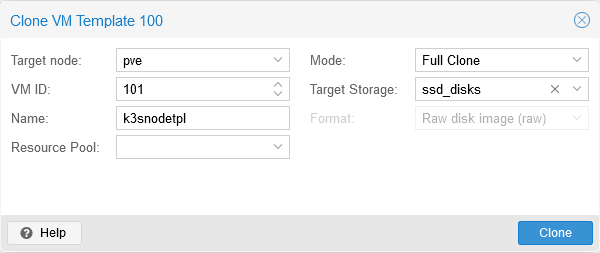
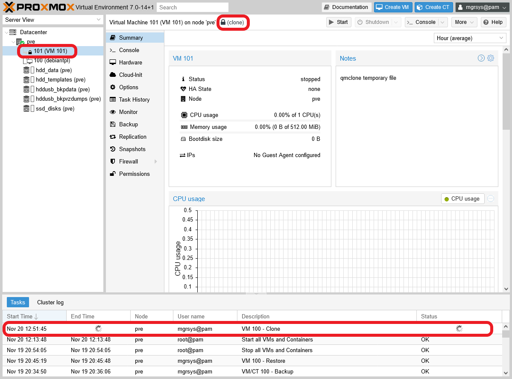
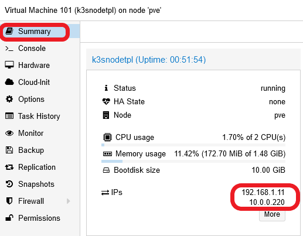
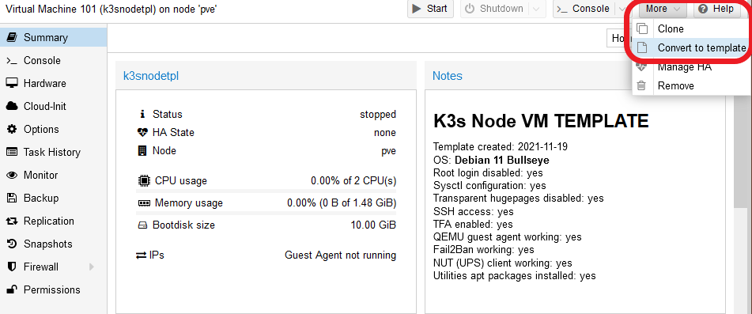

# G024 - K3s cluster setup 07 ~ K3s node VM template setup

At this point, you have a plain Debian VM template ready. You can use that template to build any server system you want but, to create VMs that work as K3s Kubernetes cluster nodes, further adjustments are necessary. Since those changes are required for any node of your future K3s cluster, you'll want to have a more specialized VM template that comes with all those adjustments already configured.

## Reasons for a new VM template

Next, I'll list the main reasons or things necessary to do in a new VM, cloned from the Debian VM template you already have, so it can suit better the role of a K3s node.

- **Disabling the swap volume**  
Since its beginnings, Kubernetes hasn't offered support for using swap memory, and demands to have it disabled in order to run. K3s, on the other hand, seems to be able to run with swap enabled but it will warn you about it when you validate its configuration (meaning that it could have problems when a node hits swap).

    On the other hand, at the time of writing this paragraph, support for swap is coming as an _alpha feature_ in the `1.22` version of Kubernetes, and it's expected to graduate to GA level at around the `1.25` version. [Find all the details about this enhancement in the Kubernetes enhancement proposal 2400 github page here](https://github.com/kubernetes/enhancements/tree/master/keps/sig-node/2400-node-swap). In this guide I'll show you the "traditional" way of dealing with swap in a Kubernetes cluster, that is, by disabling it completely.

- **Renaming the root VG**  
In the LVM storage structure of your VM, the name of the only VG present is based on your  Debian 11 VM template's hostname. This is not a problem per se, but could be misleading while doing some system maintenance tasks. Instead, you should change it to a more suitable name fitting for all your future K3s nodes.

- **Preparing the second network card**  
The VM template you've setup in the previous guides has two network cards, but only the principal NIC is active. The second one, connected to the isolated `vmbr1` bridge, is currently disabled but you'll need to activate it. This way, the only thing left to adjust on each K3s node will be the IP address.

- **Setting up sysctl parameters**  
With a particular experimental option enabled, K3s requires certain `sysctl` parameters to have concrete values. If they're not set up in such fashion, the K3s service refuses to run.

These points affect all the nodes in the K3s cluster. Then, the smart thing to do is to set them right first in a VM which, in turn, will become the template from which you'll clone the final VMs that'll run as nodes of your K3s cluster.

## Creating a new VM based on the Debian VM template

### _Full cloning of the Debian VM template_

Since in this new VM you're going to modify its filesystem structure, let's fully clone your Debian VM template.

1. Go to your `debiantpl` template, then unfold the `More` options list. There you'll find the `Clone` option.

    

2. Click on `Clone` to see its corresponding window.

    

    I'll explain the form parameters below.

    - `Target node`: which node in the Proxmox VE cluster you want to place your cloned VM in. In your case you only have one standalone node, `pve`.

    - `VM ID`: the numerical ID that Proxmox VE uses to identify this VM. Notice how the form already assigns the next available number, in this case 101.
        > **BEWARE!**  
        > Proxmox VE doesn't allow IDs lower than 100.

    - `Name`:  this string must be a valid FQDN, like `debiantpl.your.pve.domain`.
        > **BEWARE!**  
        > The official Proxmox VE documentation says that this name is `a free form text string you can use to describe the VM`, which contradicts what the web console actually validates as correct.

    - `Resource Pool`: here you can indicate to which pool you want to make this VM a member of.

    - `Mode`: this is a list with two options available.

        - `Linked Clone`: this creates a clone that still refers to the original VM, therefore is _linked_ to it. This option can only be used with read-only VMs, or templates, since the linked clone uses the original VM's volume to run, saving in its own image only the differences. Also, linked clones must be stored in the same `Target Storage` where the original VM's storage is.
            > **BEWARE!**  
            > Templates cannot be removed as long as they have **linked clones** attached to them.

        - `Full Clone`: is a full copy of the original VM, so its not linked to it. Also, this type allows to be put in a different `Target Storage` if required.

    - `Target Storage`: here you can choose where you want to put the new VM, although you can only choose in case of making a **full clone**. In this list there are storage types that won't appear, like directories.

    - `Format`: depending on the mode and target storage configured, you'll see that this value changes to adapt to those other two parameters. It just indicates in which format is going the new VM's volumes to be stored in the Proxmox VE system.

3. Fill the `Clone` form to create a new **full clone**  VM as follows.

    

    Notice the name I've given (`k3snodetpl`), and that I've chosen explicitly the `ssd_disks` as target storage. I could have left the default `Same as source` option since the template volume is also placed in that storage, but I preferred to be explicit here for the sake of clarity.

4. Click on `Clone` when ready and the window will disappear. You'll have to pay attention to the `Tasks` console at the bottom to see how the cloning process goes.

    

    See how the new 101 VM appears with a lock icon in the tree at the left. Also, in its `Summary` view, you can see how Proxmox VE warns you that the VM is still being created with the `clone` operation, and even in the `Notes` you can see a reference to a `qmclone temporary file`.

5. When you see in the `Tasks` log that the cloning task appears as `OK`, refresh the `Summary` view to see the VM unlocked and fully created.

    

    See how all the details in the `Summary` view are the same as what the original template had (like the `Notes` for instance).

## Set an static IP for the main network device (`net0`)

Don't forget to set up a static IP for the main network device (the `net0` one) of this VM in your router or gateway, ideally following some criteria. You can see the MACs, in the `Hardware` view, as the value of the `virtio` parameter on each network device attached to the VM.

## Setting a proper hostname string

Since this new VM is a clone of the Debian 11 template you prepared before, its hostname is the same one set in the template (`debiantpl`). It's better, for coherence and clarity, to set up a more proper hostname for this particular VM which, in this case, will be called `k3snodetpl`. Then, to change the hostname string on the VM, do the following.

1. Start the VM, then login as `mgrsys` (with the same credentials used in the Debian VM template). To change the hostname value (`debiantpl` in this case) in the `/etc/hostname` file, better use the `hostnamectl` command.

    ~~~bash
    $ sudo hostnamectl set-hostname k3snodetpl
    ~~~

    If you edit the `/etc/hostname` file directly instead, you'll have to reboot the VM to make it load the new hostname.

2. Edit the `/etc/hosts` file, where you must replace the old hostname (again, `debiantpl`) with the new one. The hostname should only appear in the `127.0.1.1` line.

    ~~~properties
    127.0.1.1   k3snodetpl.deimos.cloud    k3snodetpl
    ~~~

To see the change applied, exit your current session and log back. You should see that the new hostname shows up in your shell prompt.

## Disabling the swap volume

Follow the next steps to remove the swap completely from your VM.

1. First disable the currently active swap memory.

    ~~~bash
    $ sudo swapoff -a
    ~~~

    The `swapoff` command disables the swap only temporarily, the system will reactivate it after a reboot. To verify that the swap is actually disabled, check the `/proc/swaps` file.

    ~~~bash
    $ cat /proc/swaps
    Filename                                Type            Size    Used    Priority
    ~~~

    If there are no filenames listed in the output, that means the swap is disabled (although just till next reboot).

2. Make a backup of the `/etc/fstab` file.

    ~~~bash
    $ sudo cp /etc/fstab /etc/fstab.orig
    ~~~

    Then edit the `fstab` file and comment out, with a '#' character, the line that begins with the `/dev/mapper/debiantpl--vg-swap_1` string.

    ~~~properties
    ...
    #/dev/mapper/debiantpl--vg-swap_1 none            swap    sw              0       0
    ...
    ~~~

3. Edit the `/etc/initramfs-tools/conf.d/resume` file, commenting out with a '#' character the line related to the `swap_1` volume.

    ~~~properties
    #RESUME=/dev/mapper/debiantpl--vg-swap_1
    ~~~

    > **BEWARE!**  
    Notice that I haven't told you to make a backup of this file. This is because the `update-initramfs` command would also read the backup file regardless of having a different name, and that would lead to an error.

4. Check with `lvs` the name of the swap LVM volume.

    ~~~bash
    $ sudo lvs
      LV     VG           Attr       LSize   Pool Origin Data%  Meta%  Move Log Cpy%Sync Convert
      root   debiantpl-vg -wi-ao----   8.54g
      swap_1 debiantpl-vg -wi-a----- 976.00m
    ~~~

    In the output above it's the `swap_1` light volume within the `debiantpl-vg` volume group. Now you can use `lvremove` on it to free that space.

    ~~~bash
    $ sudo lvremove debiantpl-vg/swap_1
    Do you really want to remove active logical volume debiantpl-vg/swap_1? [y/n]: y
      Logical volume "swap_1" successfully removed
    ~~~

    Then, check again with `lvs` that the swap partition is gone.

    ~~~bash
    $ sudo lvs
      LV   VG           Attr       LSize Pool Origin Data%  Meta%  Move Log Cpy%Sync Convert
      root debiantpl-vg -wi-ao---- 8.54g
    ~~~

    Also, see with `vgs` that the `debiantpl-vg` VG has now free space (`VFree` column).

    ~~~bash
    $ sudo vgs
      VG           #PV #LV #SN Attr   VSize  VFree
      debiantpl-vg   1   1   0 wz--n- <9.52g 1000.00m
    ~~~

5. To expand the `root` LV into the newly freed space, execute `lvextend` like below.

    ~~~bash
    $ sudo lvextend -r -l +100%FREE debiantpl-vg/root
    ~~~

    The options mean the following.
    - `-r` calls the `resize2fs` command right after resizing the LV, to also extend the filesystem in the LV over the added space.
    - `-l +100%FREE` indicates that the LV has to be extended over the 100% of free space available in the VG.

    Check with `lvs` the new size of the `root` LV.

    ~~~bash
    $ sudo lvs
      LV   VG           Attr       LSize  Pool Origin Data%  Meta%  Move Log Cpy%Sync Convert
      root debiantpl-vg -wi-ao---- <9.52g
    ~~~

    Also verify that there's no free space left in the `debiantpl-vg` VG.

    ~~~bash
    $ sudo vgs
      VG           #PV #LV #SN Attr   VSize  VFree
      debiantpl-vg   1   1   0 wz--n- <9.52g    0
    ~~~

6. The final touch is to modify the `swappiness` sysctl parameter, which you already left set with a low value in the `/etc/sysctl.d/85_memory_optimizations.conf` file. As usual, first make a backup of the file.

    ~~~bash
    $ sudo cp /etc/sysctl.d/85_memory_optimizations.conf /etc/sysctl.d/85_memory_optimizations.conf.bkp
    ~~~

    Then, edit the `/etc/sysctl.d/85_memory_optimizations.conf` file, but just modify the `vm.swappiness` value, setting it to `0`.

    ~~~properties
    ...
    vm.swappiness = 0
    ...
    ~~~

7. Save the changes, refresh the sysctl configuration and reboot.

    ~~~bash
    $ sudo sysctl -p /etc/sysctl.d/85_memory_optimizations.conf
    $ sudo reboot
    ~~~

## Changing the VG's name

The VG you have in your VM's LVM structure is the same one defined in your Debian VM template, meaning that it was made correlative to the hostname of the original system. Although this is not an issue per se, you'll probably prefer to give to the VG's name a more sensible string. Since this VM will become a template for all the VMs you'll use as K3s nodes, lets give the VG the name `k3snode-vg`. It's generic but still more meaningful for all the K3s nodes you'll create later than the `debiantpl-vg` string.

> **BEWARE!**  
> Although this is not a difficult procedure, follow all the next steps carefully, or you may end messing up your VM's filesystem!

1. Using the `vgrename` command, rename the VG with the suggested name `k3snode-vg`.

    ~~~bash
    $ sudo vgrename debiantpl-vg k3snode-vg
      Volume group "debiantpl-vg" successfully renamed to "k3snode-vg"
    ~~~

    Verify with `vgs` that the renaming has been done.

    ~~~bash
    $ sudo vgs
      VG         #PV #LV #SN Attr   VSize  VFree
      k3snode-vg   1   1   0 wz--n- <9.52g 1000.00m
    ~~~

2. Next you must edit the `/etc/fstab` file, replacing only the `debiantpl` string with `k3snode` in the line related to the `root` volume and, if you like, also in the commented `swap_1` line to keep it coherent.

    ~~~bash
    ...
    /dev/mapper/k3snode--vg-root /               ext4    errors=remount-ro 0           1
    ...
    #/dev/mapper/k3snode--vg-swap_1 none            swap    sw              0           0
    ...
    ~~~

    > **BEWARE!**  
    > Careful of **not** reducing the double dash ('`--`') to only one, just replace the `debiantpl` part with the new `k3snode` string.

3. Next, you must find and change all the `debiantpl` strings present in the `/boot/grub/grub.cfg` file. Although first don't forget to make a backup.

    ~~~bash
    $ sudo cp /boot/grub/grub.cfg /boot/grub/grub.cfg.orig
    ~~~

4. Edit the `/boot/grub/grub.cfg` file (mind you, is **read-only** even for the `root` user) to change all the `debiantpl` name with the new `k3snode` one in lines that contain the string `root=/dev/mapper/debiantpl--vg-root`.

5. Now you must update the initramfs with the `update-initramfs` command.

    ~~~bash
    $ sudo update-initramfs -u -k all
    ~~~

6. Reboot the system to load the changes.

    ~~~bash
    $ sudo reboot
    ~~~

7. Next, you have to execute the `dpkg-reconfigure` command to regenerate the grub in your VM. To get the correct image to reconfigure, just autocomplete the command after typing `linux-image` and then type the one that corresponds with the kernel **currently running** in your VM.

    ~~~bash
    $ sudo dpkg-reconfigure linux-image-5.10.0-9-amd64
    ~~~

8. Again, reboot the system to load the changes.

    ~~~bash
    $ sudo reboot
    ~~~

## Setting up the second network card

The VM has a second network card that is yet to be configured and enabled, and which is already set to communicate through the isolated `vmbr1` bridge of your Proxmox VE's virtual network. In order to set up this NIC properly, you have to do the following.

1. First, you need the name of the second network interface to use it later. Execute the following `ip` command.

    ~~~bash
    $ ip a
    1: lo: <LOOPBACK,UP,LOWER_UP> mtu 65536 qdisc noqueue state UNKNOWN group default qlen 1000
        link/loopback 00:00:00:00:00:00 brd 00:00:00:00:00:00
        inet 127.0.0.1/8 scope host lo
           valid_lft forever preferred_lft forever
    2: ens18: <BROADCAST,MULTICAST,UP,LOWER_UP> mtu 1500 qdisc fq state UP group default qlen 1000
        link/ether 96:2c:74:8a:e2:04 brd ff:ff:ff:ff:ff:ff
        altname enp0s18
        inet 192.168.1.11/24 brd 192.168.1.255 scope global dynamic ens18
           valid_lft 85566sec preferred_lft 85566sec
    3: ens19: <BROADCAST,MULTICAST> mtu 1500 qdisc noop state DOWN group default qlen 1000
        link/ether 3e:f1:88:9c:d1:86 brd ff:ff:ff:ff:ff:ff
        altname enp0s19
    ~~~

    In the output above, the second network device is the one named `ens19`, the one with `state DOWN` and no IP assigned (no `inet` line).

2. Next, you'll have to configure the `ens19` NIC in the `/etc/network/interfaces` file. As usual, first make a backup of the file.

    ~~~bash
    $ sudo cp /etc/network/interfaces /etc/network/interfaces.orig
    ~~~

    Then, **append** the following configuration to the `interfaces` file.

    ~~~bash
    # The secondary network interface
    allow-hotplug ens19
    iface ens19 inet static
      address 10.0.0.220
      netmask 255.255.255.0
    ~~~

    Notice that I've set an IP address within the range I decided to use for the secondary NICs of the K3s nodes, but with a high fourth number (`220`) to have plenty of room between this address and the ones given to the VMs you'll create later.

    > **BEWARE!**  
    > Remember to put the correct name of the network interface as it appears in your VM when you copy the configuration above!

3. You can enable the interface with the following `ifup` command.

    ~~~bash
    $ sudo ifup ens19
    ~~~

    The command won't return any output.

4. Use the `ip` command to check out the new network setup.

    ~~~bash
    $ ip a
    1: lo: <LOOPBACK,UP,LOWER_UP> mtu 65536 qdisc noqueue state UNKNOWN group default qlen 1000
        link/loopback 00:00:00:00:00:00 brd 00:00:00:00:00:00
        inet 127.0.0.1/8 scope host lo
           valid_lft forever preferred_lft forever
    2: ens18: <BROADCAST,MULTICAST,UP,LOWER_UP> mtu 1500 qdisc fq state UP group default qlen 1000
        link/ether 96:2c:74:8a:e2:04 brd ff:ff:ff:ff:ff:ff
        altname enp0s18
        inet 192.168.1.11/24 brd 192.168.1.255 scope global dynamic ens18
           valid_lft 85409sec preferred_lft 85409sec
    3: ens19: <BROADCAST,MULTICAST,UP,LOWER_UP> mtu 1500 qdisc fq state UP group default qlen 1000
        link/ether 3e:f1:88:9c:d1:86 brd ff:ff:ff:ff:ff:ff
        altname enp0s19
        inet 10.0.0.220/24 brd 10.0.0.255 scope global ens19
           valid_lft forever preferred_lft forever
    ~~~

    Your `ens19` interface is now active with a static IP address. You can also see that, thanks to the QEMU agent, the second IP appears immediately after applying the change in the `Status` block of the VM's `Summary` view, in the Proxmox VE web console.

    

Thanks to this configuration, now you have an network interface enabled and connected to an isolated bridge. This will help to improve somewhat the hardening of the internal network of the K3s cluster you'll create in upcoming guides.

## Setting up sysctl kernel parameters for K3s nodes

In the installation of the K3s cluster, which you'll do later in the [**G025** guide](G025%20-%20K3s%20cluster%20setup%2008%20~%20K3s%20Kubernetes%20cluster%20setup.md), I'll tell you to use the `protect-kernel-defaults` option. With it enabled, you must set certain sysctl parameters to concrete values or the kubelet process executed by the K3s service won't run.

1. Create a new empty file in the path `/etc/sysctl.d/90_k3s_kubelet_demands.conf`.

    ~~~bash
    $ sudo touch /etc/sysctl.d/90_k3s_kubelet_demands.conf
    ~~~

2. Edit this `90_k3s_kubelet_demands.conf` file, adding the following lines.

    ~~~properties
    ## K3s kubelet demands
    # Values demanded by the kubelet process when K3s is run with the 'protect-kernel-defaults' option enabled.

    # This enables or disables panic on out-of-memory feature.
    # https://sysctl-explorer.net/vm/panic_on_oom/
    vm.panic_on_oom=0

    # This value contains a flag that enables memory overcommitment.
    # https://sysctl-explorer.net/vm/overcommit_memory/
    #  Already enabled with the same value in the 85_memory_optimizations.conf file.
    #vm.overcommit_memory=1

    # Represents the number of seconds the kernel waits before rebooting on a panic.
    # https://sysctl-explorer.net/kernel/panic/
    kernel.panic = 10

    # Controls the kernel's behavior when an oops or BUG is encountered.
    # https://sysctl-explorer.net/kernel/panic_on_oops/
    kernel.panic_on_oops = 1
    ~~~

3. Save the `90_k3s_kubelet_demands.conf` file and apply the changes, then reboot the VM.

    ~~~bash
    $ sudo sysctl -p /etc/sysctl.d/90_k3s_kubelet_demands.conf
    $ sudo reboot
    ~~~

## Turning the VM into a VM template

Now that the VM has been adjusted, you can turn it into a VM template. You have already done this in the previous [**G023** guide](G023%20-%20K3s%20cluster%20setup%2006%20~%20Debian%20VM%20template%20and%20backup.md#turning-the-debian-vm-into-a-vm-template), so I'll just remind you that the `Convert to template` action is available as an option in the `More` list of any VM.

> **BEWARE!**  
> Before executing the conversion, **first shut down the VM you're converting**.

Moreover, update the `Notes` text of this VM with any new or extra detail you might think relevant, and don't forget to make a full backup of the template. This is something you also did in the [**G023** guide](G023%20-%20K3s%20cluster%20setup%2006%20~%20Debian%20VM%20template%20and%20backup.md#turning-the-debian-vm-into-a-vm-template), so here I'll just remind you where the option is.

Remember that restoring backups can free some space (due to the restoration process detecting and ignoring the empty blocks within the image), so consider restoring the VM template immediately after doing the backup to recover some storage space. This is an action you also saw how to do back in the [**G023** guide](G023%20-%20K3s%20cluster%20setup%2006%20~%20Debian%20VM%20template%20and%20backup.md).

## Protecting VMs and VM templates in Proxmox VE

There's an interesting option available for VMs in Proxmox VE. Go to the `Options` page of any of your VMs or VM templates, and look for the `Protection` option.

With this flag enabled, Proxmox VE disables the `remove` and `remove disk` operations on the VM. Very advisable to be enabled, in particular for your VM templates.

> **BEWARE!**  
> When this option is enabled, a VM or VM template cannot be restored from a backup because Proxmox VE protects the VM image from being replaced.

## Relevant system paths

### _Folders on the VM_

- `/boot/grub`
- `/etc`
- `/etc/initramfs-tools/conf.d`
- `/etc/network`
- `/etc/sysctl.d`
- `/proc`

### _Files on the VM_

- `/boot/grub/grub.cfg`
- `/boot/grub/grub.cfg.orig`
- `/etc/fstab`
- `/etc/fstab.orig`
- `/etc/hostname`
- `/etc/hosts`
- `/etc/initramfs-tools/conf.d/resume`
- `/etc/network/interfaces`
- `/etc/network/interfaces.orig`
- `/etc/sysctl.d/85_memory_optimizations.conf`
- `/etc/sysctl.d/85_memory_optimizations.conf.bkp`
- `/etc/sysctl.d/90_k3s_kubelet_demands.conf`
- `/proc/swaps`

## References

### _Debian and Linux SysOps_

#### **Changing the `Hostname`**

- [How to Change Hostname in Debian](https://linuxhandbook.com/debian-change-hostname/)

#### **Disabling the swap**

- [Swap Off - why is it necessary?](https://discuss.kubernetes.io/t/swap-off-why-is-it-necessary/6879/4)
- [How to safely turn off swap permanently and reclaim the space? (on Debian Jessie)](https://unix.stackexchange.com/questions/224156/how-to-safely-turn-off-swap-permanently-and-reclaim-the-space-on-debian-jessie)
- [Permanently Disable Swap for Kubernetes Cluster](https://brandonwillmott.com/2020/10/15/permanently-disable-swap-for-kubernetes-cluster/)
- [KEP-2400: Node system swap support (enhancement on Kubernetes)](https://github.com/kubernetes/enhancements/tree/master/keps/sig-node/2400-node-swap)
- [lvextend command examples in Linux](https://www.thegeekdiary.com/lvextend-command-examples-in-linux/)

#### **Changing the VG's name of a `root` LV**

- [Rename LVM Volume Group Holding Root File System Volume](https://oraganism.wordpress.com/2013/03/09/rename-lvm-vg-for-root-fs-lv/)
- [How to fix “volume group old-vg-name not found” at boot after renaming it?](https://unix.stackexchange.com/questions/579720/how-to-fix-volume-group-old-vg-name-not-found-at-boot-after-renaming-it)
- [Rename a Volume Group on Debian](https://blog.raveland.org/post/rename_vg/)
- [Unable to change Volume Group name](https://www.linuxquestions.org/questions/linux-newbie-8/unable-to-change-volume-group-name-4175676775/)

#### **Network interfaces configuration**

- [Debian wiki. Network Configuration](https://wiki.debian.org/NetworkConfiguration)
- [How To Configure VLAN Interface on Debian 10 (Buster)](https://techviewleo.com/how-to-configure-vlan-interface-on-debian/)
- [How to setup a Static IP address on Debian Linux](https://linuxconfig.org/how-to-setup-a-static-ip-address-on-debian-linux)
- [Howto: Ubuntu Linux convert DHCP network configuration to static IP configuration](https://www.cyberciti.biz/tips/howto-ubuntu-linux-convert-dhcp-network-configuration-to-static-ip-configuration.html)
- [Debian Linux Configure Network Interface Cards – IP address and Netmasks](https://www.cyberciti.biz/faq/howto-configuring-network-interface-cards-on-debian/)
- [Net.bridge.bridge-nf-call and sysctl.conf](https://wiki.libvirt.org/page/Net.bridge.bridge-nf-call_and_sysctl.conf)

### _K3s configuration_

- [K3s CIS Hardening Guide. Ensure `protect-kernel-defaults` is set](https://rancher.com/docs/k3s/latest/en/security/hardening_guide/#ensure-protect-kernel-defaults-is-set)

## Navigation

[<< Previous (**G023. K3s cluster setup 06**)](G023%20-%20K3s%20cluster%20setup%2006%20~%20Debian%20VM%20template%20and%20backup.md) | [+Table Of Contents+](G000%20-%20Table%20Of%20Contents.md) | [Next (**G025. K3s cluster setup 08**) >>](G025%20-%20K3s%20cluster%20setup%2008%20~%20K3s%20Kubernetes%20cluster%20setup.md)
