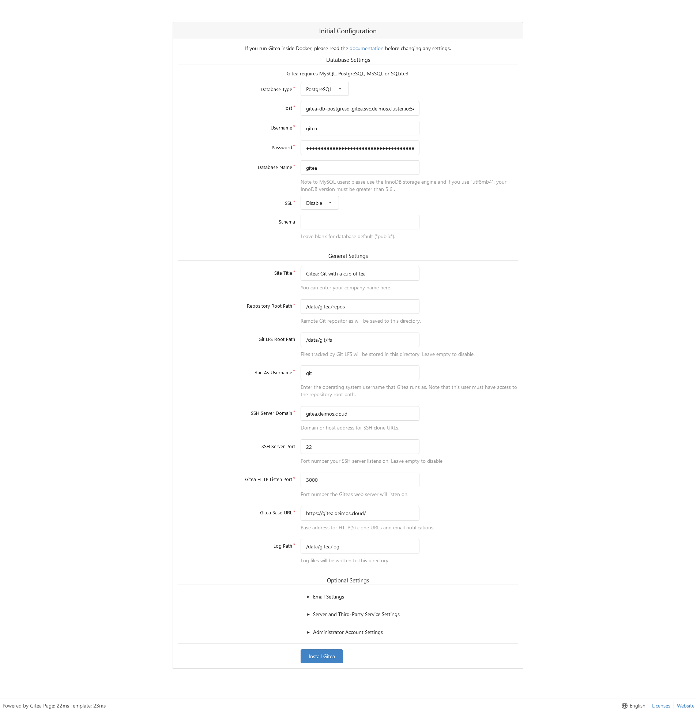
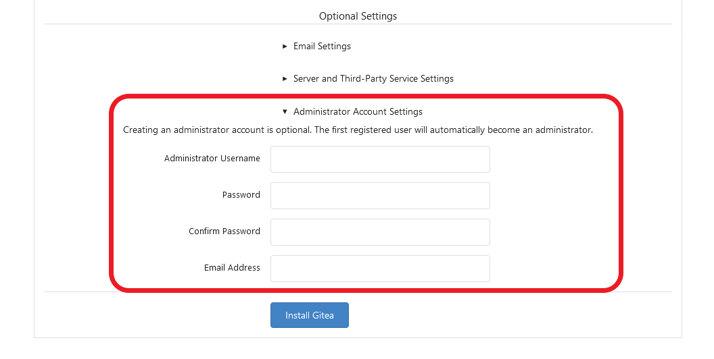
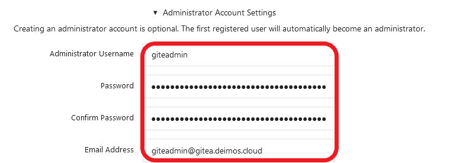
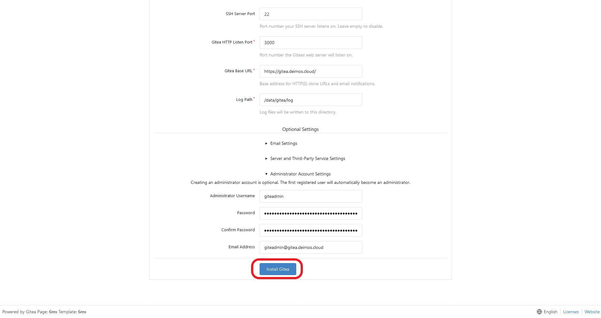

# G034 - Deploying services 03 ~ Gitea - Part 5 - Complete Gitea platform

With all the main components prepared, you have to declare some pending elements and the global Kustomize project assembling the pieces of your Gitea platform.

## Declaring the pending Gitea platform elements

You need to declare the persistent volumes claimed by the PostgreSQL and the Gitea servers, also a namespace for the whole Gitea platform, and put the wildcard certificate you produced in the [**G029** guide](G029%20-%20K3s%20cluster%20setup%2012%20~%20Setting%20up%20cert-manager%20and%20wildcard%20certificate.md#setting-up-a-wildcard-certificate-for-a-domain) in that new namespace.

So, the very first thing you need to do is create a `resources` folder at the root of this Gitea Kustomize project.

~~~bash
$ mkdir -p $HOME/k8sprjs/gitea/resources
~~~

### _Persistent volumes_

Here you'll declare as persistent volumes the three storage volumes you already left prepared in [the first part of this guide](G034%20-%20Deploying%20services%2003%20~%20Gitea%20-%20Part%201%20-%20Outlining%20setup,%20arranging%20storage%20and%20choosing%20service%20IPs.md).

1. Create three yaml files, one per persistent volume.

    ~~~bash
    $ touch $HOME/k8sprjs/gitea/resources/{data-gitea,db-gitea,repos-gitea}.persistentvolume.yaml
    ~~~

2. Put the following declarations in their corresponding yaml files.

    - In `data-gitea.persistentvolume.yaml`.

        ~~~yaml
        apiVersion: v1
        kind: PersistentVolume

        metadata:
          name: data-gitea
        spec:
          capacity:
            storage: 1.2G
          volumeMode: Filesystem
          accessModes:
          - ReadWriteOnce
          storageClassName: local-path
          persistentVolumeReclaimPolicy: Retain
          local:
            path: /mnt/gitea-ssd/data/k3smnt
          nodeAffinity:
            required:
              nodeSelectorTerms:
              - matchExpressions:
                - key: kubernetes.io/hostname
                  operator: In
                  values:
                  - k3sagent01
        ~~~

    - In `db-gitea.persistentvolume.yaml`.

        ~~~yaml
        apiVersion: v1
        kind: PersistentVolume

        metadata:
          name: db-gitea
        spec:
          capacity:
            storage: 3.5G
          volumeMode: Filesystem
          accessModes:
          - ReadWriteOnce
          storageClassName: local-path
          persistentVolumeReclaimPolicy: Retain
          local:
            path: /mnt/gitea-ssd/db/k3smnt
          nodeAffinity:
            required:
              nodeSelectorTerms:
              - matchExpressions:
                - key: kubernetes.io/hostname
                  operator: In
                  values:
                  - k3sagent01
        ~~~

    - In `repos-gitea.persistentvolume.yaml`.

        ~~~yaml
        apiVersion: v1
        kind: PersistentVolume

        metadata:
          name: repos-gitea
        spec:
          capacity:
            storage: 9.3G
          volumeMode: Filesystem
          accessModes:
          - ReadWriteOnce
          storageClassName: local-path
          persistentVolumeReclaimPolicy: Retain
          local:
            path: /mnt/gitea-hdd/repos/k3smnt
          nodeAffinity:
            required:
              nodeSelectorTerms:
              - matchExpressions:
                - key: kubernetes.io/hostname
                  operator: In
                  values:
                  - k3sagent01
        ~~~

    All these PVs are like the ones [you declared for the Nextcloud platform](G033%20-%20Deploying%20services%2002%20~%20Nextcloud%20-%20Part%205%20-%20Complete%20Nextcloud%20platform.md#persistent-volumes), so I won't repeat what I explained about them here. Just remember the following.

    - Ensure that names and capacities correspond to what you've declared in the corresponding persistent volume claims.

    - Verify that paths exist and are correct.

    - The `nodeAffinity` specification has to point to the right node, in this case the `k3sagent01` one.

### _Gitea Namespace resource_

Let's declare a `gitea` namespace where to put all the components of your Gitea platform.

1. Create a file for the namespace element under the `resources` folder.

    ~~~bash
    $ touch $HOME/k8sprjs/gitea/resources/gitea.namespace.yaml
    ~~~

2. Copy the following declaration in `gitea.namespace.yaml`.

    ~~~yaml
    apiVersion: v1
    kind: Namespace

    metadata:
      name: gitea
    ~~~

### _Updating wildcard certificate's Reflector-managed namespaces_

Now you need to configure the Secret of your wilcard certificate in the `gitea` namespace. Remember that, [in the last part of the Nextcloud platform guide](G033%20-%20Deploying%20services%2002%20~%20Nextcloud%20-%20Part%205%20-%20Complete%20Nextcloud%20platform.md#updating-wildcard-certificates-reflector-managed-namespaces), you saw how to configure a patch to modify the original resource with any extra namespaces you require. So here you'll just modify that patch to add the `gitea` namespace to the list.

1. You'll have to edit the `wildcard.deimos.cloud-tls.certificate.cert-manager.reflector.namespaces.yaml` file found in the `certificates/patches` directory of your `cert-manager` Kustomize project. It's full path on this guide is `$HOME/k8sprjs/cert-manager/certificates/patches/wildcard.deimos.cloud-tls.certificate.cert-manager.reflector.namespaces.yaml`. In it, only add the `gitea` namespace to the `reflector` annotations there. The file should end looking like below.

    ~~~yaml
    # Certificate wildcard.deimos.cloud-tls patch for Reflector-managed namespaces
    apiVersion: cert-manager.io/v1
    kind: Certificate

    metadata:
      name: wildcard.deimos.cloud-tls
      namespace: certificates
    spec:
      secretTemplate:
        annotations:
          reflector.v1.k8s.emberstack.com/reflection-allowed-namespaces: "kube-system,nextcloud,gitea"
          reflector.v1.k8s.emberstack.com/reflection-auto-namespaces: "kube-system,nextcloud,gitea"
    ~~~

2. Validate the Kustomize output of the `certificates` project (`kubectl kustomize $HOME/k8sprjs/cert-manager/certificates | less`). It should be like the one next.

    ~~~yaml
    apiVersion: v1
    kind: Namespace
    metadata:
      name: certificates
    ---
    apiVersion: cert-manager.io/v1
    kind: Certificate
    metadata:
      name: wildcard.deimos.cloud-tls
      namespace: certificates
    spec:
      dnsNames:
      - '*.deimos.cloud'
      - deimos.cloud
      duration: 8760h
      isCA: false
      issuerRef:
        group: cert-manager.io
        kind: ClusterIssuer
        name: cluster-issuer-selfsigned
      privateKey:
        algorithm: ECDSA
        encoding: PKCS8
        rotationPolicy: Always
        size: 384
      renewBefore: 720h
      secretName: wildcard.deimos.cloud-tls
      secretTemplate:
        annotations:
          reflector.v1.k8s.emberstack.com/reflection-allowed: "true"
          reflector.v1.k8s.emberstack.com/reflection-allowed-namespaces: kube-system,nextcloud,gitea
          reflector.v1.k8s.emberstack.com/reflection-auto-enabled: "true"
          reflector.v1.k8s.emberstack.com/reflection-auto-namespaces: kube-system,nextcloud,gitea
      subject:
        organizations:
        - Deimos
    ---
    apiVersion: cert-manager.io/v1
    kind: ClusterIssuer
    metadata:
      name: cluster-issuer-selfsigned
    spec:
      selfSigned: {}
    ~~~

3. If the output is correct, apply the project to your cluster.

    ~~~bash
    $ kubectl apply -k $HOME/k8sprjs/cert-manager/certificates
    ~~~

> **BEWARE!**  
> Keep in mind that the `cert-manager` system won't automatically apply this modification to the annotations in the secret already generated for your wildcard certificate. This isn't an issue yet but later, after you've deployed the whole monitoring stack, you must apply the change to the certificate's secret to make Reflector clone it into the new `gitea` namespace.

## Kustomize project for Gitea platform

Last resource you must declare is the Kustomize project that puts together all the components making up your Gitea platform.

1. Produce a `kustomization.yaml` file under the `gitea` folder.

    ~~~yaml
    touch $HOME/k8sprjs/gitea/kustomization.yaml
    ~~~

2. Put the following yaml declaration in that new `kustomization.yaml`.

    ~~~yaml
    # Gitea platform setup
    apiVersion: kustomize.config.k8s.io/v1beta1
    kind: Kustomization

    namespace: gitea

    commonLabels:
      platform: gitea

    namePrefix: gitea-

    resources:
    - resources/data-gitea.persistentvolume.yaml
    - resources/db-gitea.persistentvolume.yaml
    - resources/repos-gitea.persistentvolume.yaml
    - resources/gitea.namespace.yaml
    - components/cache-redis
    - components/db-postgresql
    - components/server-gitea
    ~~~

    This file is like the one [you declared for your Nextcloud platform](G033%20-%20Deploying%20services%2002%20~%20Nextcloud%20-%20Part%205%20-%20Complete%20Nextcloud%20platform.md#kustomize-project-for-nextcloud-platform), so I'll refer to my explanations there for this yaml.

3. You have to validate the output of this Kustomize project. Since it's quite big, first dump it in a file with a significant name like `gitea.k.output.yaml`.

    ~~~bash
    $ kubectl kustomize $HOME/k8sprjs/gitea > gitea.k.output.yaml
    ~~~

4. Compare the dumped Kustomize output in your `gitea.k.output.yaml` file with the one below.

    ~~~yaml
    apiVersion: v1
    kind: Namespace
    metadata:
      labels:
        platform: gitea
      name: gitea
    ---
    apiVersion: v1
    data:
      redis.conf: |
        port 6379
        bind 0.0.0.0
        protected-mode no
        maxmemory 64mb
        maxmemory-policy allkeys-lru
    kind: ConfigMap
    metadata:
      labels:
        app: cache-redis
        platform: gitea
      name: gitea-cache-redis-6967fc5hc5
      namespace: gitea
    ---
    apiVersion: v1
    data:
      gitea-username: gitea
      initdb.sh: |
        #!/bin/bash
        echo ">>> Initializing PostgreSQL server"
        set -e

        echo ">>> Creating user ${POSTGRESQL_GITEA_USERNAME} for Gitea"
        psql -v ON_ERROR_STOP=1 --username "${POSTGRES_USER}" --dbname "${POSTGRES_DB}" <<-EOSQL
            CREATE ROLE ${POSTGRESQL_GITEA_USERNAME} WITH LOGIN PASSWORD '${POSTGRESQL_GITEA_PASSWORD}';
            GRANT ALL PRIVILEGES ON DATABASE ${POSTGRES_DB} TO ${POSTGRESQL_GITEA_USERNAME};
        EOSQL

        echo ">>> Enabling [pg_stat_statements] module on database ${POSTGRES_DB}"
        psql -v ON_ERROR_STOP=1 --username "${POSTGRES_USER}" --dbname "${POSTGRES_DB}" <<-EOSQL
            CREATE EXTENSION pg_stat_statements;
        EOSQL

        echo ">>> Creating user and schema ${POSTGRESQL_PROMETHEUS_EXPORTER_USERNAME} for PostgreSQL Prometheus metrics exporter"
        psql -v ON_ERROR_STOP=1 --username "${POSTGRES_USER}" --dbname "${POSTGRES_DB}" <<-EOSQL
            -- To use IF statements, hence to be able to check if the user exists before
            -- attempting creation, we need to switch to procedural SQL (PL/pgSQL)
            -- instead of standard SQL.
            -- More: https://www.postgresql.org/docs/14/plpgsql-overview.html
            -- To preserve compatibility with <9.0, DO blocks are not used; instead,
            -- a function is created and dropped.
            CREATE OR REPLACE FUNCTION __tmp_create_user() returns void as
            '
            BEGIN
              IF NOT EXISTS (
                      SELECT                       -- SELECT list can stay empty for this
                      FROM   pg_catalog.pg_user
                      WHERE  usename = ''${POSTGRESQL_PROMETHEUS_EXPORTER_USERNAME}'') THEN
                CREATE USER ${POSTGRESQL_PROMETHEUS_EXPORTER_USERNAME};
              END IF;
            END;
            ' language plpgsql;

            SELECT __tmp_create_user();
            DROP FUNCTION __tmp_create_user();

            ALTER USER ${POSTGRESQL_PROMETHEUS_EXPORTER_USERNAME} WITH PASSWORD '${POSTGRESQL_PROMETHEUS_EXPORTER_PASSWORD}';
            ALTER USER ${POSTGRESQL_PROMETHEUS_EXPORTER_USERNAME} SET SEARCH_PATH TO ${POSTGRESQL_PROMETHEUS_EXPORTER_USERNAME},pg_catalog;

            -- If deploying as non-superuser (for example in AWS RDS), uncomment the GRANT
            -- line below and replace <MASTER_USER> with your root user.
            -- GRANT ${POSTGRESQL_PROMETHEUS_EXPORTER_USERNAME} TO <MASTER_USER>;
            CREATE SCHEMA IF NOT EXISTS ${POSTGRESQL_PROMETHEUS_EXPORTER_USERNAME};
            GRANT USAGE ON SCHEMA ${POSTGRESQL_PROMETHEUS_EXPORTER_USERNAME} TO ${POSTGRESQL_PROMETHEUS_EXPORTER_USERNAME};
            GRANT CONNECT ON DATABASE ${POSTGRES_DB} TO ${POSTGRESQL_PROMETHEUS_EXPORTER_USERNAME};

            CREATE OR REPLACE FUNCTION get_pg_stat_activity() RETURNS SETOF pg_stat_activity AS
            ' SELECT * FROM pg_catalog.pg_stat_activity; '
            LANGUAGE sql
            VOLATILE
            SECURITY DEFINER;

            CREATE OR REPLACE VIEW ${POSTGRESQL_PROMETHEUS_EXPORTER_USERNAME}.pg_stat_activity
            AS
              SELECT * from get_pg_stat_activity();

            GRANT SELECT ON ${POSTGRESQL_PROMETHEUS_EXPORTER_USERNAME}.pg_stat_activity TO ${POSTGRESQL_PROMETHEUS_EXPORTER_USERNAME};

            CREATE OR REPLACE FUNCTION get_pg_stat_replication() RETURNS SETOF pg_stat_replication AS
            ' SELECT * FROM pg_catalog.pg_stat_replication; '
            LANGUAGE sql
            VOLATILE
            SECURITY DEFINER;

            CREATE OR REPLACE VIEW ${POSTGRESQL_PROMETHEUS_EXPORTER_USERNAME}.pg_stat_replication
            AS
              SELECT * FROM get_pg_stat_replication();

            GRANT SELECT ON ${POSTGRESQL_PROMETHEUS_EXPORTER_USERNAME}.pg_stat_replication TO ${POSTGRESQL_PROMETHEUS_EXPORTER_USERNAME};

            CREATE OR REPLACE FUNCTION get_pg_stat_statements() RETURNS SETOF pg_stat_statements AS
            ' SELECT * FROM public.pg_stat_statements; '
            LANGUAGE sql
            VOLATILE
            SECURITY DEFINER;

            CREATE OR REPLACE VIEW ${POSTGRESQL_PROMETHEUS_EXPORTER_USERNAME}.pg_stat_statements
            AS
              SELECT * FROM get_pg_stat_statements();

            GRANT SELECT ON ${POSTGRESQL_PROMETHEUS_EXPORTER_USERNAME}.pg_stat_statements TO ${POSTGRESQL_PROMETHEUS_EXPORTER_USERNAME};
        EOSQL
      postgresql-db-name: gitea
      postgresql-superuser-name: postgres
      postgresql.conf: |-
        # Extension libraries loading
        shared_preload_libraries = 'pg_stat_statements'

        # Connection settings
        listen_addresses = '0.0.0.0'
        port = 5432
        max_connections = 100
        superuser_reserved_connections = 3

        # Memory
        shared_buffers = 128MB
        work_mem = 8MB
        hash_mem_multiplier = 2.0
        maintenance_work_mem = 16MB

        # Logging
        log_destination = 'stderr'
        logging_collector = off
        log_min_messages = 'INFO'
        log_error_verbosity = 'DEFAULT'
        log_connections = on
        log_disconnections = on
        log_hostname = off

        # pg_stat_statements extension library
        compute_query_id = on
        pg_stat_statements.max = 10000
        pg_stat_statements.track = all
      prometheus-exporter-username: prom_metrics
    kind: ConfigMap
    metadata:
      labels:
        app: db-postgresql
        platform: gitea
      name: gitea-db-postgresql-2m294k4k9m
      namespace: gitea
    ---
    apiVersion: v1
    data:
      cache-redis-svc-fqdn: gitea-cache-redis.gitea.svc.deimos.cluster.io
      db-postgresql-svc-fqdn: gitea-db-postgresql.gitea.svc.deimos.cluster.io
    kind: ConfigMap
    metadata:
      labels:
        app: server-gitea
        platform: gitea
      name: gitea-server-gitea-hffkf88tm4
      namespace: gitea
    ---
    apiVersion: v1
    data:
      redis-password: |
        Tm9wZV90aGlzX2lzX05PVF9vbmVfb2ZfbXlfcGFzc3dvcmRzX0FuZC15b3Vfc2hvdWxkbnRfdXNl
        X3RoaXNfb25lX2VpdGhlciEK
    kind: Secret
    metadata:
      labels:
        app: cache-redis
        platform: gitea
      name: gitea-cache-redis-4dg79kf68c
      namespace: gitea
    type: Opaque
    ---
    apiVersion: v1
    data:
      gitea-user-password: |
        bDBuRy5QbDRpbl9UM3h0X3NFa1JldF9wNHM1d09SRC1Gb1JfZ0k3ZUFfdVozciEK
      postgresql-superuser-password: |
        bDBuRy5QbDRpbl9UM3h0X3NFa1JldF9wNHM1d09SRC1Gb1JfczRwRXJ1WjNyIQo=
      prometheus-exporter-password: |
        bDBuRy5QbDRpbl9UM3h0X3NFa1JldF9wNHM1d09SRC1Gb1JfM3hQMHJUZVJfdVozciEK
    kind: Secret
    metadata:
      labels:
        app: db-postgresql
        platform: gitea
      name: gitea-db-postgresql-2gmd96742m
      namespace: gitea
    type: Opaque
    ---
    apiVersion: v1
    kind: Service
    metadata:
      annotations:
        prometheus.io/port: "9121"
        prometheus.io/scrape: "true"
      labels:
        app: cache-redis
        platform: gitea
      name: gitea-cache-redis
      namespace: gitea
    spec:
      ports:
      - name: server
        port: 6379
        protocol: TCP
      - name: metrics
        port: 9121
        protocol: TCP
      selector:
        app: cache-redis
        platform: gitea
      type: ClusterIP
    ---
    apiVersion: v1
    kind: Service
    metadata:
      annotations:
        prometheus.io/port: "9187"
        prometheus.io/scrape: "true"
      labels:
        app: db-postgresql
        platform: gitea
      name: gitea-db-postgresql
      namespace: gitea
    spec:
      ports:
      - name: server
        port: 5432
        protocol: TCP
      - name: metrics
        port: 9187
        protocol: TCP
      selector:
        app: db-postgresql
        platform: gitea
      type: ClusterIP
    ---
    apiVersion: v1
    kind: Service
    metadata:
      annotations:
        prometheus.io/path: /metrics
        prometheus.io/port: "3000"
        prometheus.io/scheme: https
        prometheus.io/scrape: "true"
      labels:
        app: server-gitea
        platform: gitea
      name: gitea-server-gitea
      namespace: gitea
    spec:
      loadBalancerIP: 192.168.1.43
      ports:
      - name: https
        port: 443
        protocol: TCP
        targetPort: 3000
      - name: ssh
        port: 22
        protocol: TCP
      selector:
        app: server-gitea
        platform: gitea
      type: LoadBalancer
    ---
    apiVersion: v1
    kind: PersistentVolume
    metadata:
      labels:
        platform: gitea
      name: gitea-data-gitea
    spec:
      accessModes:
      - ReadWriteOnce
      capacity:
        storage: 1.2G
      local:
        path: /mnt/gitea-ssd/data/k3smnt
      nodeAffinity:
        required:
          nodeSelectorTerms:
          - matchExpressions:
            - key: kubernetes.io/hostname
              operator: In
              values:
              - k3sagent01
      persistentVolumeReclaimPolicy: Retain
      storageClassName: local-path
      volumeMode: Filesystem
    ---
    apiVersion: v1
    kind: PersistentVolume
    metadata:
      labels:
        platform: gitea
      name: gitea-db-gitea
    spec:
      accessModes:
      - ReadWriteOnce
      capacity:
        storage: 3.5G
      local:
        path: /mnt/gitea-ssd/db/k3smnt
      nodeAffinity:
        required:
          nodeSelectorTerms:
          - matchExpressions:
            - key: kubernetes.io/hostname
              operator: In
              values:
              - k3sagent01
      persistentVolumeReclaimPolicy: Retain
      storageClassName: local-path
      volumeMode: Filesystem
    ---
    apiVersion: v1
    kind: PersistentVolume
    metadata:
      labels:
        platform: gitea
      name: gitea-repos-gitea
    spec:
      accessModes:
      - ReadWriteOnce
      capacity:
        storage: 9.3G
      local:
        path: /mnt/gitea-hdd/repos/k3smnt
      nodeAffinity:
        required:
          nodeSelectorTerms:
          - matchExpressions:
            - key: kubernetes.io/hostname
              operator: In
              values:
              - k3sagent01
      persistentVolumeReclaimPolicy: Retain
      storageClassName: local-path
      volumeMode: Filesystem
    ---
    apiVersion: v1
    kind: PersistentVolumeClaim
    metadata:
      labels:
        app: server-gitea
        platform: gitea
      name: gitea-data-server-gitea
      namespace: gitea
    spec:
      accessModes:
      - ReadWriteOnce
      resources:
        requests:
          storage: 1.2G
      storageClassName: local-path
      volumeName: gitea-data-gitea
    ---
    apiVersion: v1
    kind: PersistentVolumeClaim
    metadata:
      labels:
        app: db-postgresql
        platform: gitea
      name: gitea-db-postgresql
      namespace: gitea
    spec:
      accessModes:
      - ReadWriteOnce
      resources:
        requests:
          storage: 3.5G
      storageClassName: local-path
      volumeName: gitea-db-gitea
    ---
    apiVersion: v1
    kind: PersistentVolumeClaim
    metadata:
      labels:
        app: server-gitea
        platform: gitea
      name: gitea-repos-server-gitea
      namespace: gitea
    spec:
      accessModes:
      - ReadWriteOnce
      resources:
        requests:
          storage: 9.3G
      storageClassName: local-path
      volumeName: gitea-repos-gitea
    ---
    apiVersion: apps/v1
    kind: Deployment
    metadata:
      labels:
        app: cache-redis
        platform: gitea
      name: gitea-cache-redis
      namespace: gitea
    spec:
      replicas: 1
      selector:
        matchLabels:
          app: cache-redis
          platform: gitea
      template:
        metadata:
          labels:
            app: cache-redis
            platform: gitea
        spec:
          affinity:
            podAffinity:
              requiredDuringSchedulingIgnoredDuringExecution:
              - labelSelector:
                  matchExpressions:
                  - key: app
                    operator: In
                    values:
                    - server-gitea
                topologyKey: kubernetes.io/hostname
          containers:
          - command:
            - redis-server
            - /etc/redis/redis.conf
            - --requirepass $(REDIS_PASSWORD)
            env:
            - name: REDIS_PASSWORD
              valueFrom:
                secretKeyRef:
                  key: redis-password
                  name: gitea-cache-redis-4dg79kf68c
            image: redis:6.2-alpine
            name: server
            ports:
            - containerPort: 6379
            resources:
              limits:
                memory: 64Mi
            volumeMounts:
            - mountPath: /etc/redis/redis.conf
              name: redis-config
              subPath: redis.conf
          - env:
            - name: REDIS_PASSWORD
              valueFrom:
                secretKeyRef:
                  key: redis-password
                  name: gitea-cache-redis-4dg79kf68c
            image: oliver006/redis_exporter:v1.32.0-alpine
            name: metrics
            ports:
            - containerPort: 9121
            resources:
              limits:
                memory: 32Mi
          volumes:
          - configMap:
              defaultMode: 292
              items:
              - key: redis.conf
                path: redis.conf
              name: gitea-cache-redis-6967fc5hc5
            name: redis-config
    ---
    apiVersion: apps/v1
    kind: StatefulSet
    metadata:
      labels:
        app: db-postgresql
        platform: gitea
      name: gitea-db-postgresql
      namespace: gitea
    spec:
      replicas: 1
      selector:
        matchLabels:
          app: db-postgresql
          platform: gitea
      serviceName: gitea-db-postgresql
      template:
        metadata:
          labels:
            app: db-postgresql
            platform: gitea
        spec:
          containers:
          - args:
            - -c
            - config_file=/etc/postgresql/postgresql.conf
            env:
            - name: POSTGRES_USER
              valueFrom:
                configMapKeyRef:
                  key: postgresql-superuser-name
                  name: gitea-db-postgresql-2m294k4k9m
            - name: POSTGRES_PASSWORD
              valueFrom:
                secretKeyRef:
                  key: postgresql-superuser-password
                  name: gitea-db-postgresql-2gmd96742m
            - name: POSTGRES_DB
              valueFrom:
                configMapKeyRef:
                  key: postgresql-db-name
                  name: gitea-db-postgresql-2m294k4k9m
            - name: POSTGRESQL_GITEA_USERNAME
              valueFrom:
                configMapKeyRef:
                  key: gitea-username
                  name: gitea-db-postgresql-2m294k4k9m
            - name: POSTGRESQL_GITEA_PASSWORD
              valueFrom:
                secretKeyRef:
                  key: gitea-user-password
                  name: gitea-db-postgresql-2gmd96742m
            - name: POSTGRESQL_PROMETHEUS_EXPORTER_USERNAME
              valueFrom:
                configMapKeyRef:
                  key: prometheus-exporter-username
                  name: gitea-db-postgresql-2m294k4k9m
            - name: POSTGRESQL_PROMETHEUS_EXPORTER_PASSWORD
              valueFrom:
                secretKeyRef:
                  key: prometheus-exporter-password
                  name: gitea-db-postgresql-2gmd96742m
            image: postgres:14.1-bullseye
            name: server
            ports:
            - containerPort: 5432
            resources:
              limits:
                memory: 320Mi
            volumeMounts:
            - mountPath: /var/lib/postgresql/data
              name: postgresql-storage
            - mountPath: /etc/postgresql/postgresql.conf
              name: postgresql-config
              subPath: postgresql.conf
            - mountPath: /docker-entrypoint-initdb.d/initdb.sh
              name: postgresql-config
              subPath: initdb.sh
          - env:
            - name: DATA_SOURCE_USER
              valueFrom:
                configMapKeyRef:
                  key: prometheus-exporter-username
                  name: gitea-db-postgresql-2m294k4k9m
            - name: DATA_SOURCE_PASS
              valueFrom:
                secretKeyRef:
                  key: prometheus-exporter-password
                  name: gitea-db-postgresql-2gmd96742m
            - name: DATA_SOURCE_URI
              value: localhost:5432/?sslmode=disable
            - name: PG_EXPORTER_AUTO_DISCOVER_DATABASES
              value: "true"
            image: wrouesnel/postgres_exporter:latest
            name: metrics
            ports:
            - containerPort: 9187
            resources:
              limits:
                memory: 32Mi
          volumes:
          - configMap:
              items:
              - key: initdb.sh
                path: initdb.sh
              - key: postgresql.conf
                path: postgresql.conf
              name: gitea-db-postgresql-2m294k4k9m
            name: postgresql-config
          - name: postgresql-storage
            persistentVolumeClaim:
              claimName: gitea-db-postgresql
    ---
    apiVersion: apps/v1
    kind: StatefulSet
    metadata:
      labels:
        app: server-gitea
        platform: gitea
      name: gitea-server-gitea
      namespace: gitea
    spec:
      replicas: 1
      selector:
        matchLabels:
          app: server-gitea
          platform: gitea
      serviceName: gitea-server-gitea
      template:
        metadata:
          labels:
            app: server-gitea
            platform: gitea
        spec:
          containers:
          - env:
            - name: GITEA__server__PROTOCOL
              value: https
            - name: GITEA__server__DOMAIN
              value: gitea.deimos.cloud
            - name: GITEA__server__HTTP_ADDR
              value: 0.0.0.0
            - name: GITEA__server__ROOT_URL
              value: $(GITEA__server__PROTOCOL)://$(GITEA__server__DOMAIN)/
            - name: GITEA__server__CERT_FILE
              value: https/wildcard.deimos.cloud-tls.crt
            - name: GITEA__server__KEY_FILE
              value: https/wildcard.deimos.cloud-tls.key
            - name: GITEA__repository__ROOT
              value: /data/gitea/repos
            - name: GITEA__metrics__ENABLED
              value: "true"
            - name: GITEA__database__DB_TYPE
              value: postgres
            - name: POSTGRESQL_HOST_FQDN
              valueFrom:
                configMapKeyRef:
                  key: db-postgresql-svc-fqdn
                  name: gitea-server-gitea-hffkf88tm4
            - name: GITEA__database__HOST
              value: $(POSTGRESQL_HOST_FQDN):5432
            - name: GITEA__database__NAME
              valueFrom:
                configMapKeyRef:
                  key: postgresql-db-name
                  name: gitea-db-postgresql-2m294k4k9m
            - name: GITEA__database__USER
              valueFrom:
                configMapKeyRef:
                  key: gitea-username
                  name: gitea-db-postgresql-2m294k4k9m
            - name: GITEA__database__PASSWD
              valueFrom:
                secretKeyRef:
                  key: gitea-user-password
                  name: gitea-db-postgresql-2gmd96742m
            - name: GITEA__database__SSL_MODE
              value: disable
            - name: GITEA__cache__ENABLED
              value: "true"
            - name: GITEA__cache__ADAPTER
              value: redis
            - name: REDIS_HOST_FQDN
              valueFrom:
                configMapKeyRef:
                  key: cache-redis-svc-fqdn
                  name: gitea-server-gitea-hffkf88tm4
            - name: REDIS_HOST_PASSWORD
              valueFrom:
                secretKeyRef:
                  key: redis-password
                  name: gitea-cache-redis-4dg79kf68c
            - name: GITEA__cache__HOST
              value: redis://:$(REDIS_HOST_PASSWORD)@$(REDIS_HOST_FQDN):6379/0?pool_size=100&idle_timeout=180s
            - name: GITEA__queue__TYPE
              value: redis
            - name: GITEA__queue__CONN_STR
              value: redis://:$(REDIS_HOST_PASSWORD)@$(REDIS_HOST_FQDN):6379/0
            - name: GITEA__session__PROVIDER
              value: redis
            - name: GITEA__session__PROVIDER_CONFIG
              value: $(GITEA__cache__HOST)
            - name: GITEA__session__COOKIE_SECURE
              value: "true"
            - name: GITEA__session__COOKIE_NAME
              value: gitea_cookie
            - name: GITEA__log__ROUTER_LOG_LEVEL
              value: trace
            image: gitea/gitea:1.15.9
            name: server
            ports:
            - containerPort: 3000
              name: https
            - containerPort: 22
              name: ssh
            resources:
              limits:
                memory: 256Mi
            volumeMounts:
            - mountPath: /data
              name: data-storage
            - mountPath: /data/gitea/https/wildcard.deimos.cloud-tls.crt
              name: certificate
              subPath: wildcard.deimos.cloud-tls.crt
            - mountPath: /data/gitea/https/wildcard.deimos.cloud-tls.key
              name: certificate
              subPath: wildcard.deimos.cloud-tls.key
            - mountPath: /data/gitea/repos
              name: repos-storage
          volumes:
          - name: certificate
            secret:
              items:
              - key: tls.crt
                path: wildcard.deimos.cloud-tls.crt
              - key: tls.key
                path: wildcard.deimos.cloud-tls.key
              secretName: wildcard.deimos.cloud-tls
          - name: data-storage
            persistentVolumeClaim:
              claimName: gitea-data-server-gitea
          - name: repos-storage
            persistentVolumeClaim:
              claimName: gitea-repos-server-gitea
    ~~~

    The main things to check are the names of the resources, validating that they've been transformed correctly by Kustomize and appear in the right places.

5. If the Kustomize output is fine by you, apply it to your K3s cluster.

    ~~~bash
    $ kubectl apply -k $HOME/k8sprjs/gitea
    ~~~

6. After applying the Kustomize project, you can check the progress of its deployment with `kubectl` (in another shell).

    ~~~bash
    $ watch kubectl -n gitea get pv,pvc,cm,secret,deployment,replicaset,statefulset,pod,svc
    ~~~

    Below, you can see how the output from the `kubectl` command above could look.

    ~~~bash
    Every 2,0s: kubectl -n gitea get pv,pvc,cm,secret,deployment,replicaset,statefulset,pod,svc                                              jv11dev: Sat Jan  1 17:48:59 2022

    NAME                                   CAPACITY   ACCESS MODES   RECLAIM POLICY   STATUS   CLAIM                                  STORAGECLASS   REASON   AGE
    persistentvolume/nxcd-data-nextcloud   9300M      RWO            Retain           Bound    nextcloud/nxcd-data-server-nextcloud   local-path              3d1h
    persistentvolume/nxcd-db-nextcloud     3500M      RWO            Retain           Bound    nextcloud/nxcd-db-mariadb              local-path              3d1h
    persistentvolume/nxcd-html-nextcloud   1200M      RWO            Retain           Bound    nextcloud/nxcd-html-server-nextcloud   local-path              3d1h
    persistentvolume/gitea-data-gitea      1200M      RWO            Retain           Bound    gitea/gitea-data-server-gitea          local-path              5m3s
    persistentvolume/gitea-db-gitea        3500M      RWO            Retain           Bound    gitea/gitea-db-postgresql              local-path              5m3s
    persistentvolume/gitea-repos-gitea     9300M      RWO            Retain           Bound    gitea/gitea-repos-server-gitea         local-path              5m3s

    NAME                                             STATUS   VOLUME              CAPACITY   ACCESS MODES   STORAGECLASS   AGE
    persistentvolumeclaim/gitea-db-postgresql        Bound    gitea-db-gitea      3500M      RWO            local-path     5m3s
    persistentvolumeclaim/gitea-data-server-gitea    Bound    gitea-data-gitea    1200M      RWO            local-path     5m3s
    persistentvolumeclaim/gitea-repos-server-gitea   Bound    gitea-repos-gitea   9300M      RWO            local-path     5m3s

    NAME                                       DATA   AGE
    configmap/kube-root-ca.crt                 1      5m4s
    configmap/gitea-cache-redis-6967fc5hc5     1      5m4s
    configmap/gitea-db-postgresql-2m294k4k9m   6      5m4s
    configmap/gitea-server-gitea-hffkf88tm4    2      5m4s

    NAME                                    TYPE                                  DATA   AGE
    secret/default-token-t9c85              kubernetes.io/service-account-token   3      5m4s
    secret/gitea-cache-redis-d5mfg2c4fh     Opaque                                1      5m4s
    secret/gitea-db-postgresql-2gmd96742m   Opaque                                3      5m4s

    NAME                                READY   UP-TO-DATE   AVAILABLE   AGE
    deployment.apps/gitea-cache-redis   1/1     1            1           5m3s

    NAME                                           DESIRED   CURRENT   READY   AGE
    replicaset.apps/gitea-cache-redis-6f9bfb47f8   1         1         1       5m3s

    NAME                                   READY   AGE
    statefulset.apps/gitea-server-gitea    0/1     5m3s
    statefulset.apps/gitea-db-postgresql   1/1     5m3s

    NAME                                     READY   STATUS              RESTARTS   AGE
    pod/gitea-db-postgresql-0                2/2     Running             0          5m3s
    pod/gitea-server-gitea-0                 0/1     ContainerCreating   0          5m2s
    pod/gitea-cache-redis-6f9bfb47f8-qjwtb   2/2     Running             0          5m3s

    NAME                          TYPE           CLUSTER-IP      EXTERNAL-IP    PORT(S)                      AGE
    service/gitea-cache-redis     ClusterIP      10.43.165.238   <none>         6379/TCP,9121/TCP            5m4s
    service/gitea-db-postgresql   ClusterIP      10.43.38.165    <none>         5432/TCP,9187/TCP            5m4s
    service/gitea-server-gitea    LoadBalancer   10.43.204.30    192.168.1.43   443:30943/TCP,22:31261/TCP   5m3s
    ~~~

    There are some particularities in this output.

    - The `kubectl` command used doesn't have the `-o wide` option, to make the output shorter so it could fit my shell screen.

    - In the list of persistent volumes you can see the ones that correspond to the Nextcloud platform. This is because persistent volumes are not namespaced, like the nodes of the cluster.

    - The `wildcard.deimos.cloud-tls` secret is missing and the `gitea-server-gitea-0` pod is in `ContainerCreating` status, waiting for that secret to be available.

### _Cloning wildcard certificate's secret into the `gitea` namespace_

Now is when you must update your wildcard certificate's secret like you did after deploying the [Nextcloud's platform](G033%20-%20Deploying%20services%2002%20~%20Nextcloud%20-%20Part%205%20-%20Complete%20Nextcloud%20platform.md#cloning-wildcard-certificates-secret-into-the-nextcloud-namespace). It was nothing more than executing the cert-manager command with `kubectl` as shown next.

~~~bash
$ kubectl cert-manager -n certificates renew wildcard.deimos.cloud-tls
Manually triggered issuance of Certificate certificates/wildcard.deimos.cloud-tls
~~~

The certificate's secret should be updated immediately, although Reflector may take a moment before it replicates the secret into the `gitea` namespace. Remember to check it out with `kubectl`.

~~~bash
$ kubectl -n gitea get secrets
NAME                             TYPE                                  DATA   AGE
default-token-w6rq6              kubernetes.io/service-account-token   3      22m
gitea-cache-redis-4dg79kf68c     Opaque                                1      22m
gitea-db-postgresql-2gmd96742m   Opaque                                3      22m
wildcard.deimos.cloud-tls        kubernetes.io/tls                     3      6m
~~~

Notice that the `wildcard.deimos.cloud-tls` secret is the one with the most recent `AGE` in my `gitea` namespace.

## Finishing Gitea platform's setup

Now you have all the Gitea platform components running, but this doesn't mean that you've completed the Gitea setup.

1. Open in a browser the domain or IP you've set up for this Gitea server, in this guide's case the URL will be `https://192.168.1.43` or `https://gitea.deimos.cloud`. First you'll see a security warning about the certificate, accept it and then you should see your Gitea's `Initial Configuration` page.

    

    It's a long form in which you'll see how some of its values are the ones you've setup in [your Gitea server's stateful set](G034%20-%20Deploying%20services%2003%20~%20Gitea%20-%20Part%204%20-%20Gitea%20server.md#gitea-server-stateful-resource). The rest of values are just defaults.

2. At the bottom of this page, there are three unfolded sections under the title `Optional Settings`. Unfold the one named `Administrator Account Settings`.

    

    With this you can create an independent administrator account for your Gitea platform, something I very much recommend you to do. Remember that, from a security standpoint, it's much better not to use a normal user as an administrator. You could define an administrator as in the next capture.

    

3. The next thing to do is to press the `Install Gitea` button found at the bottom of this `Initial Configuration` page.

    

    A few seconds after pressing the button, you'll see a progress animation with the Gitea logo.

    

    Some seconds later, Gitea will restart it's own web server so you may see an error page in your browser while it tries to reach the `/user/login` page (in this guide `https://gitea.deimos.cloud/user/login`) of your Gitea server.

4. Give Gitea a few seconds more, then refresh the Gitea page that failed in your browser. That way you should get directly in the Gitea dashboard, logged in with your administrator account.

    

## Security considerations in Gitea

With your Gitea platform running, there are a few particular things you might like to consider to do to iron particular security concerns.

1. Enable the two-factor authentication of your administrator user.
   - Never use this administrator user for everyday Gitea usage (like for uploading Git repositories).

2. Create a new normal user for regular usage of your Gitea platform.
   - Enable 2FA to this normal user.
   - Assign its own SSH and GPG keys to this user, which are used for Git authentication and commit signing respectively.

## Gitea platform's Kustomize project attached to this guide series

You can find the Kustomize project for this Gitea platform deployment in the following attached folder.

- `k8sprjs/gitea`

## Relevant system paths

### _Folders in `kubectl` client system_

- `$HOME/k8sprjs/cert-manager/certificates`
- `$HOME/k8sprjs/cert-manager/certificates/patches`
- `$HOME/k8sprjs/gitea`
- `$HOME/k8sprjs/gitea/components/`
- `$HOME/k8sprjs/gitea/components/cache-redis`
- `$HOME/k8sprjs/gitea/components/db-postgresql`
- `$HOME/k8sprjs/gitea/components/server-gitea`
- `$HOME/k8sprjs/gitea/resources/`

### _Files in `kubectl` client system_

- `$HOME/k8sprjs/cert-manager/certificates/kustomization.yaml`
- `$HOME/k8sprjs/cert-manager/certificates/patches/wildcard.deimos.cloud-tls.certificate.cert-manager.reflector.namespaces.yaml`
- `$HOME/k8sprjs/gitea/kustomization.yaml`
- `$HOME/k8sprjs/gitea/resources/data-gitea.persistentvolume.yaml`
- `$HOME/k8sprjs/gitea/resources/db-gitea.persistentvolume.yaml`
- `$HOME/k8sprjs/gitea/resources/gitea.namespace.yaml`
- `$HOME/k8sprjs/gitea/resources/repos-gitea.persistentvolume.yaml`

## References

### _Kubernetes_

#### **Storage**

- [Official Doc - Local Storage Volumes](https://kubernetes.io/docs/concepts/storage/volumes/#local)
- [Official Doc - Local Persistent Volumes for Kubernetes Goes Beta](https://kubernetes.io/blog/2018/04/13/local-persistent-volumes-beta/)
- [Official Doc - Reserving a PersistentVolume](https://kubernetes.io/docs/concepts/storage/persistent-volumes/#reserving-a-persistentvolume)
- [Official Doc - Local StorageClass](https://kubernetes.io/docs/concepts/storage/storage-classes/#local)
- [Official Doc - Reclaiming Persistent Volumes](https://kubernetes.io/docs/concepts/storage/persistent-volumes/#reclaiming)
- [Kubernetes API - PersistentVolume](https://kubernetes.io/docs/reference/kubernetes-api/config-and-storage-resources/persistent-volume-v1/)
- [Kubernetes API - PersistentVolumeClaim](https://kubernetes.io/docs/reference/kubernetes-api/config-and-storage-resources/persistent-volume-claim-v1/)
- [Kubernetes Persistent Volumes, Claims, Storage Classes, and More](https://cloud.netapp.com/blog/kubernetes-persistent-storage-why-where-and-how)
- [Rancher K3s - Setting up the Local Storage Provider](https://rancher.com/docs/k3s/latest/en/storage/)
- [K3s local path provisioner on GitHub](https://github.com/rancher/local-path-provisioner)
- [Using "local-path" in persistent volume requires sudo to edit files on host node?](https://github.com/k3s-io/k3s/issues/1823)
- [Kubernetes size definitions: What's the difference of "Gi" and "G"?](https://stackoverflow.com/questions/50804915/kubernetes-size-definitions-whats-the-difference-of-gi-and-g)
- [distinguish unset and empty values for storageClassName](https://github.com/helm/helm/issues/2600)
- [Kubernetes Mounting Volumes in Pods. Mount Path Ownership and Permissions](https://kb.novaordis.com/index.php/Kubernetes_Mounting_Volumes_in_Pods#Mount_Path_Ownership_and_Permissions)

#### **Pod scheduling**

- [Official Doc - Assigning Pods to Nodes](https://kubernetes.io/docs/concepts/scheduling-eviction/assign-pod-node/)
- [Official Doc - Assign Pods to Nodes using Node Affinity](https://kubernetes.io/docs/tasks/configure-pod-container/assign-pods-nodes-using-node-affinity/)
- [Kubernetes API - Pod scheduling](https://kubernetes.io/docs/reference/kubernetes-api/workload-resources/pod-v1/#scheduling)
- [STRATEGIES FOR KUBERNETES POD PLACEMENT AND SCHEDULING](https://thenewstack.io/strategies-for-kubernetes-pod-placement-and-scheduling/)
- [Implement Node and Pod Affinity/Anti-Affinity in Kubernetes: A Practical Example](https://thenewstack.io/implement-node-and-pod-affinity-anti-affinity-in-kubernetes-a-practical-example/)
- [Tutorial: Apply the Sidecar Pattern to Deploy Redis in Kubernetes](https://thenewstack.io/tutorial-apply-the-sidecar-pattern-to-deploy-redis-in-kubernetes/)
- [Amazon EKS Workshop Official Doc - Assigning Pods to Nodes](https://www.eksworkshop.com/beginner/140_assigning_pods/affinity_usecases/)

#### **StatefulSets**

- [Official Doc](https://kubernetes.io/docs/concepts/workloads/controllers/statefulset/)

#### **ConfigMaps and secrets**

- [Official Doc - ConfigMaps](https://kubernetes.io/docs/concepts/configuration/configmap/)
- [Official Doc - Configure a Pod to Use a ConfigMap](https://kubernetes.io/docs/tasks/configure-pod-container/configure-pod-configmap/)
- [An Introduction to Kubernetes Secrets and ConfigMaps](https://opensource.com/article/19/6/introduction-kubernetes-secrets-and-configmaps)
- [Kubernetes - Using ConfigMap SubPaths to Mount Files](https://dev.to/joshduffney/kubernetes-using-configmap-subpaths-to-mount-files-3a1i)
- [Kubernetes Secrets | Declare confidential data with examples](https://www.golinuxcloud.com/kubernetes-secrets/)
- [Kubernetes ConfigMaps and Secrets](https://shravan-kuchkula.github.io/kubernetes/configmaps-secrets/)
- [Import data to config map from kubernetes secret](https://stackoverflow.com/questions/50452665/import-data-to-config-map-from-kubernetes-secret)

### _cert-manager_

- [Kubectl cert-manager plugin](https://cert-manager.io/docs/usage/kubectl-plugin/)

### _Gitea_

- [Gitea Official site](https://gitea.io/en-us/)
- [Gitea Docker image](https://hub.docker.com/r/gitea/gitea)
- [Gitea on GitHub](https://github.com/go-gitea/gitea)
- [Installation with Docker](https://docs.gitea.io/en-us/install-with-docker/)
- [Configuration Cheat Sheet](https://docs.gitea.io/en-us/config-cheat-sheet/)
- [Managing Deployments With Environment Variables](https://docs.gitea.io/en-us/install-with-docker/#managing-deployments-with-environment-variables)
- [HTTPS setup to encrypt connections to Gitea](https://docs.gitea.io/en-us/https-setup/)
- [Gitea `app.example.ini`](https://github.com/go-gitea/gitea/blob/main/custom/conf/app.example.ini)
- [Gitea Environment To Ini](https://github.com/go-gitea/gitea/tree/main/contrib/environment-to-ini)
- [Gitea command line global options](https://docs.gitea.io/en-us/command-line/#global-options)
- [Gitea Configuration Cheat Sheet](https://docs.gitea.io/en-us/config-cheat-sheet)
- [Where does Gitea store what file](https://docs.gitea.io/en-us/faq/#where-does-gitea-store-what-file)
- [Monitor Gitea with Prometheus](https://serverfault.com/questions/999413/monitor-gitea-with-prometheus)
- [Install and Configure Gitea Git Service on Kubernetes / OpenShift](https://computingforgeeks.com/install-gitea-git-service-on-kubernetes-openshift/)
- [Running Gitea on Kubernetes](https://ralph.blog.imixs.com/2021/02/25/running-gitea-on-kubernetes/)
- [Running Gitea on a Virtual Cloud Server](https://ralph.blog.imixs.com/2021/02/26/running-gitea-on-a-virtual-cloud-server/)
- [Setup a Self-Hosted Git Service with Gitea](https://dev.to/ruanbekker/setup-a-self-hosted-git-service-with-gitea-11ce)
- [gitea support HA mode for redis & postgres](https://gitanswer.com/gitea-support-ha-mode-for-redis-postgres-go-906452007)
