# G035 - Deploying services 04 ~ Monitoring stack - Part 6 - Complete monitoring stack setup

After declaring all the main elements for your monitoring stack setup, it's time to define the remaining components and prepare the global Kustomize project that puts them together.

## Declaring the remaining monitoring stack components

The components you're missing in your monitoring stack setup are several different resources. So, start by creating the usual `resources` folder at the root of this Prometheus server Kustomize project.

~~~bash
$ mkdir -p $HOME/k8sprjs/monitoring/resources
~~~

### _Persistent volumes_

You have to enable the two storage volumes you configured in [the first part of this guide](G035%20-%20Deploying%20services%2004%20~%20Monitoring%20stack%20-%20Part%201%20-%20Outlining%20setup%20and%20arranging%20storage.md) as persitent volume resources. Do the following.

1. Generate two new yaml files under the `resources` folder, one per persistent volume.

    ~~~bash
    $ touch $HOME/k8sprjs/monitoring/resources/{data-grafana,data-prometheus}.persistentvolume.yaml
    ~~~

2. Copy each yaml below in their correct file.

    - In `data-grafana.persistentvolume.yaml`.

        ~~~yaml
        apiVersion: v1
        kind: PersistentVolume

        metadata:
          name: data-grafana
        spec:
          capacity:
            storage: 1.9G
          volumeMode: Filesystem
          accessModes:
          - ReadWriteOnce
          storageClassName: local-path
          persistentVolumeReclaimPolicy: Retain
          local:
            path: /mnt/monitoring-ssd/grafana-data/k3smnt
          nodeAffinity:
            required:
              nodeSelectorTerms:
              - matchExpressions:
                - key: kubernetes.io/hostname
                  operator: In
                  values:
                  - k3sagent01
        ~~~

    - In `data-prometheus.persistentvolume.yaml`.

        ~~~yaml
        apiVersion: v1
        kind: PersistentVolume

        metadata:
          name: data-prometheus
        spec:
          capacity:
            storage: 9.8G
          volumeMode: Filesystem
          accessModes:
          - ReadWriteOnce
          storageClassName: local-path
          persistentVolumeReclaimPolicy: Retain
          local:
            path: /mnt/monitoring-ssd/prometheus-data/k3smnt
          nodeAffinity:
            required:
              nodeSelectorTerms:
              - matchExpressions:
                - key: kubernetes.io/hostname
                  operator: In
                  values:
                  - k3sagent02
        ~~~

    Both PVs above are like the ones [you declared for the Nextcloud platform](G033%20-%20Deploying%20services%2002%20~%20Nextcloud%20-%20Part%205%20-%20Complete%20Nextcloud%20platform.md#persistent-volumes), so I won't repeat what I explained about them here. Just remember the following.
    - Ensure that names and capacities align to what you've declared in the corresponding persistent volume claims.
    - Verify that the paths exist in the corresponding K3s agent nodes.
    - The `nodeAffinity` specification has to point, in the `values` list, to the right node **on each PV**.

### _Monitoring Namespace resource_

Although Prometheus is the core element of this setup, I decided to identify the whole thing with the _monitoring_ moniker. Therefore, let's declare the namespace with such term as follows.

1. Create a file for the namespace element under the `resources` folder.

    ~~~bash
    $ touch $HOME/k8sprjs/monitoring/resources/monitoring.namespace.yaml
    ~~~

2. Put in `monitoring.namespace.yaml` the declaration below.

    ~~~yaml
    apiVersion: v1
    kind: Namespace

    metadata:
      name: monitoring
    ~~~

### _Prometheus ClusterRole resource_

Your Prometheus server will call the Kubernetes APIs available in your K3s cluster to scrape all the available metrics from resources like nodes, pods, deployments, and more. So you need to associate the proper read-only privileges to your monitoring stack with an RBAC policy declared in a `ClusterRole` resource, as it's done next.

1. Generate the file `monitoring.clusterrole.yaml` within the `resources` directory.

    ~~~bash
    $ touch $HOME/k8sprjs/monitoring/resources/monitoring.clusterrole.yaml
    ~~~

2. In your new `monitoring.clusterrole.yaml` file, copy the following yaml.

    ~~~yaml
    apiVersion: rbac.authorization.k8s.io/v1
    kind: ClusterRole

    metadata:
      name: monitoring
    rules:
    - apiGroups: [""]
      resources:
      - nodes
      - nodes/proxy
      - services
      - endpoints
      - pods
      verbs: ["get", "list", "watch"]
    - apiGroups:
      - extensions
      resources:
      - ingresses
      verbs: ["get", "list", "watch"]
    - nonResourceURLs: ["/metrics"]
      verbs: ["get"]
    ~~~

    Notice the list of `resources` that this `ClusterRole` resource allows to reach, and also that all the `verbs` indicated are related to read-only actions.

    > **BEWARE!**  
    > The `ClusterRole` resources are **not** namespaced, so you won't see a `namespace` parameter in them.

### _Prometheus ClusterRoleBinding resource_

The ClusterRole you've just created before won't be enforced unless you bind it to a user or set of users. Here you'll bind it to a `default` `ServiceAccount` user within the `monitoring` namespace, which is the one that always exists by default within any namespace and the one used by services unless other is created and specified.

1. Produce a new `monitoring.clusterrolebinding.yaml` file in the `resources` directory.

    ~~~bash
    $ touch $HOME/k8sprjs/monitoring/resources/monitoring.clusterrolebinding.yaml
    ~~~

2. Put the yaml below in `monitoring.clusterrolebinding.yaml`.

    ~~~yaml
    apiVersion: rbac.authorization.k8s.io/v1
    kind: ClusterRoleBinding

    metadata:
      name: monitoring
    roleRef:
      apiGroup: rbac.authorization.k8s.io
      kind: ClusterRole
      name: monitoring
    subjects:
    - kind: ServiceAccount
      name: default
      namespace: monitoring
    ~~~

    Above, you can see how the `monitoring` `ClusterRole` is binded to the users specified in `subjects` list which, in this case, only has the `default` `ServiceAccount` user within the `monitoring` namespace.

### _Updating wildcard certificate's Reflector-managed namespaces_

To clone the `Secret` of your wildcard certificate, you'll have to do exactly the same as in previous setups like [Gitea's](G034%20-%20Deploying%20services%2003%20~%20Gitea%20-%20Part%205%20-%20Complete%20Gitea%20platform.md#updating-wildcard-certificates-reflector-managed-namespaces) or [Nextcloud's](G033%20-%20Deploying%20services%2002%20~%20Nextcloud%20-%20Part%205%20-%20Complete%20Nextcloud%20platform.md#updating-wildcard-certificates-reflector-managed-namespaces): modify the patch yaml file you have within the `cert-manager` Kustomize project to add the desired new namespace after the ones already present in the Reflector annotations.

1. Edit the `wildcard.deimos.cloud-tls.certificate.cert-manager.reflector.namespaces.yaml` file found in the `certificates/patches` directory under your `cert-manager` Kustomize project. It's full path on this guide is `$HOME/k8sprjs/cert-manager/certificates/patches/wildcard.deimos.cloud-tls.certificate.cert-manager.reflector.namespaces.yaml`. There, just concatenate the `monitoring` namespace to both `reflector` annotations. The file should end looking like below.

    ~~~yaml
    # Certificate wildcard.deimos.cloud-tls patch for Reflector-managed namespaces
    apiVersion: cert-manager.io/v1
    kind: Certificate

    metadata:
      name: wildcard.deimos.cloud-tls
      namespace: certificates
    spec:
      secretTemplate:
        annotations:
          reflector.v1.k8s.emberstack.com/reflection-allowed-namespaces: "kube-system,nextcloud,gitea,monitoring"
          reflector.v1.k8s.emberstack.com/reflection-auto-namespaces: "kube-system,nextcloud,gitea,monitoring"
    ~~~

2. Check the Kustomize output of the `certificates` project (`kubectl kustomize $HOME/k8sprjs/cert-manager/certificates | less`) to ensure that it looks like below.

    ~~~yaml
    apiVersion: v1
    kind: Namespace
    metadata:
      name: certificates
    ---
    apiVersion: cert-manager.io/v1
    kind: Certificate
    metadata:
      name: wildcard.deimos.cloud-tls
      namespace: certificates
    spec:
      dnsNames:
      - '*.deimos.cloud'
      - deimos.cloud
      duration: 8760h
      isCA: false
      issuerRef:
        group: cert-manager.io
        kind: ClusterIssuer
        name: cluster-issuer-selfsigned
      privateKey:
        algorithm: ECDSA
        encoding: PKCS8
        rotationPolicy: Always
        size: 384
      renewBefore: 720h
      secretName: wildcard.deimos.cloud-tls
      secretTemplate:
        annotations:
          reflector.v1.k8s.emberstack.com/reflection-allowed: "true"
          reflector.v1.k8s.emberstack.com/reflection-allowed-namespaces: kube-system,nextcloud,gitea,monitoring
          reflector.v1.k8s.emberstack.com/reflection-auto-enabled: "true"
          reflector.v1.k8s.emberstack.com/reflection-auto-namespaces: kube-system,nextcloud,gitea,monitoring
      subject:
        organizations:
        - Deimos
    ---
    apiVersion: cert-manager.io/v1
    kind: ClusterIssuer
    metadata:
      name: cluster-issuer-selfsigned
    spec:
      selfSigned: {}
    ~~~

3. After validating the output, apply the project on your cluster.

    ~~~bash
    $ kubectl apply -k $HOME/k8sprjs/cert-manager/certificates
    ~~~

> **BEWARE!**  
> Don't forget that the `cert-manager` system won't automatically apply this modification to the annotations in the secret already generated for your wildcard certificate. This is fine at this point but later, after you've deployed the whole monitoring stack, you'll have to apply the change to the certificate's secret to make Reflector clone it into the new `monitoring` namespace.

## Kustomize project for the monitoring setup

Next, you must tie everything up with the mandatory `kustomization.yaml` file required for your monitoring setup. Do as it's explained next.

1. Under the `monitoring` folder, generate a `kustomization.yaml` file.

    ~~~yaml
    touch $HOME/k8sprjs/monitoring/kustomization.yaml
    ~~~

2. Put the following yaml declaration in that new `kustomization.yaml`.

    ~~~yaml
    # Monitoring stack setup
    apiVersion: kustomize.config.k8s.io/v1beta1
    kind: Kustomization

    namespace: monitoring

    commonLabels:
      platform: monitoring

    namePrefix: mntr-

    resources:
    - resources/data-grafana.persistentvolume.yaml
    - resources/data-prometheus.persistentvolume.yaml
    - resources/monitoring.namespace.yaml
    - resources/monitoring.clusterrole.yaml
    - resources/monitoring.clusterrolebinding.yaml
    - components/agent-kube-state-metrics
    - components/agent-prometheus-node-exporter
    - components/server-prometheus
    - components/ui-grafana
    ~~~

    You declared a very similar file for [your Nextcloud platform](G033%20-%20Deploying%20services%2002%20~%20Nextcloud%20-%20Part%205%20-%20Complete%20Nextcloud%20platform.md#kustomize-project-for-nextcloud-platform), so go back to my explanation in that guide if you don't remember anything about this yaml. Beyond that, notice that the `nameprefix` for all the resources in this monitoring stack will be `mntr-`.

3. As in other cases, before you apply this `kustomization.yaml` file, you have to be sure that the output of this Kustomize project is correct. Be aware that the output it's quite big, so dump it in a file with a significant name like `monitoring.k.output.yaml`.

    ~~~bash
    $ kubectl kustomize $HOME/k8sprjs/monitoring > monitoring.k.output.yaml
    ~~~

4. Compare the dumped Kustomize output in your `monitoring.k.output.yaml` file with the one below.

    ~~~yaml
    apiVersion: v1
    kind: Namespace
    metadata:
      labels:
        platform: monitoring
      name: monitoring
    ---
    apiVersion: v1
    automountServiceAccountToken: false
    kind: ServiceAccount
    metadata:
      labels:
        app.kubernetes.io/component: exporter
        app.kubernetes.io/name: kube-state-metrics
        app.kubernetes.io/version: 2.5.0
        platform: monitoring
      name: mntr-agent-kube-state-metrics
      namespace: monitoring
    ---
    apiVersion: rbac.authorization.k8s.io/v1
    kind: ClusterRole
    metadata:
      labels:
        app.kubernetes.io/component: exporter
        app.kubernetes.io/name: kube-state-metrics
        app.kubernetes.io/version: 2.5.0
        platform: monitoring
      name: mntr-agent-kube-state-metrics
    rules:
    - apiGroups:
      - ""
      resources:
      - configmaps
      - secrets
      - nodes
      - pods
      - services
      - resourcequotas
      - replicationcontrollers
      - limitranges
      - persistentvolumeclaims
      - persistentvolumes
      - namespaces
      - endpoints
      verbs:
      - list
      - watch
    - apiGroups:
      - apps
      resources:
      - statefulsets
      - daemonsets
      - deployments
      - replicasets
      verbs:
      - list
      - watch
    - apiGroups:
      - batch
      resources:
      - cronjobs
      - jobs
      verbs:
      - list
      - watch
    - apiGroups:
      - autoscaling
      resources:
      - horizontalpodautoscalers
      verbs:
      - list
      - watch
    - apiGroups:
      - authentication.k8s.io
      resources:
      - tokenreviews
      verbs:
      - create
    - apiGroups:
      - authorization.k8s.io
      resources:
      - subjectaccessreviews
      verbs:
      - create
    - apiGroups:
      - policy
      resources:
      - poddisruptionbudgets
      verbs:
      - list
      - watch
    - apiGroups:
      - certificates.k8s.io
      resources:
      - certificatesigningrequests
      verbs:
      - list
      - watch
    - apiGroups:
      - storage.k8s.io
      resources:
      - storageclasses
      - volumeattachments
      verbs:
      - list
      - watch
    - apiGroups:
      - admissionregistration.k8s.io
      resources:
      - mutatingwebhookconfigurations
      - validatingwebhookconfigurations
      verbs:
      - list
      - watch
    - apiGroups:
      - networking.k8s.io
      resources:
      - networkpolicies
      - ingresses
      verbs:
      - list
      - watch
    - apiGroups:
      - coordination.k8s.io
      resources:
      - leases
      verbs:
      - list
      - watch
    ---
    apiVersion: rbac.authorization.k8s.io/v1
    kind: ClusterRole
    metadata:
      labels:
        platform: monitoring
      name: mntr-monitoring
    rules:
    - apiGroups:
      - ""
      resources:
      - nodes
      - nodes/proxy
      - services
      - endpoints
      - pods
      verbs:
      - get
      - list
      - watch
    - apiGroups:
      - extensions
      resources:
      - ingresses
      verbs:
      - get
      - list
      - watch
    - nonResourceURLs:
      - /metrics
      verbs:
      - get
    ---
    apiVersion: rbac.authorization.k8s.io/v1
    kind: ClusterRoleBinding
    metadata:
      labels:
        app.kubernetes.io/component: exporter
        app.kubernetes.io/name: kube-state-metrics
        app.kubernetes.io/version: 2.5.0
        platform: monitoring
      name: mntr-agent-kube-state-metrics
    roleRef:
      apiGroup: rbac.authorization.k8s.io
      kind: ClusterRole
      name: mntr-agent-kube-state-metrics
    subjects:
    - kind: ServiceAccount
      name: mntr-agent-kube-state-metrics
      namespace: monitoring
    ---
    apiVersion: rbac.authorization.k8s.io/v1
    kind: ClusterRoleBinding
    metadata:
      labels:
        platform: monitoring
      name: mntr-monitoring
    roleRef:
      apiGroup: rbac.authorization.k8s.io
      kind: ClusterRole
      name: mntr-monitoring
    subjects:
    - kind: ServiceAccount
      name: default
      namespace: monitoring
    ---
    apiVersion: v1
    data:
      prometheus.rules.yaml: |-
        groups:
        - name: example_alert_rule_unique_name
          rules:
          - alert: HighRequestLatency
            expr: job:request_latency_seconds:mean5m{job="node-exporter"} > 0.5
            for: 10m
            labels:
              severity: page
            annotations:
              summary: High request latency
      prometheus.yaml: |
        # Prometheus main configuration file

        global:
          scrape_interval: 60s
          evaluation_interval: 60s

        rule_files:
          - /etc/prometheus/prometheus_alerts.rules.yaml

        alerting:
          alertmanagers:
          - scheme: http
            static_configs:
            - targets:
            #  - "mntr-alertmanager.monitoring.svc.deimos.cluster.io:9093"

        scrape_configs:
          - job_name: 'kubernetes-apiservers'
            scrape_interval: 180s
            kubernetes_sd_configs:
            - role: endpoints
            scheme: https
            tls_config:
              ca_file: /var/run/secrets/kubernetes.io/serviceaccount/ca.crt
            bearer_token_file: /var/run/secrets/kubernetes.io/serviceaccount/token
            relabel_configs:
            - source_labels: [__meta_kubernetes_namespace, __meta_kubernetes_service_name, __meta_kubernetes_endpoint_port_name]
              action: keep
              regex: default;kubernetes;https

          - job_name: 'kubernetes-nodes'
            scrape_interval: 120s
            scheme: https
            tls_config:
              ca_file: /var/run/secrets/kubernetes.io/serviceaccount/ca.crt
            bearer_token_file: /var/run/secrets/kubernetes.io/serviceaccount/token
            kubernetes_sd_configs:
            - role: node
            relabel_configs:
            - action: labelmap
              regex: __meta_kubernetes_node_label_(.+)
            - target_label: __address__
              replacement: kubernetes.default.svc.deimos.cluster.io:443
            - source_labels: [__meta_kubernetes_node_name]
              regex: (.+)
              target_label: __metrics_path__
              replacement: /api/v1/nodes/${1}/proxy/metrics

          - job_name: 'kubernetes-pods'
            scrape_interval: 240s
            kubernetes_sd_configs:
            - role: pod
            relabel_configs:
            - source_labels: [__meta_kubernetes_pod_annotation_prometheus_io_scrape]
              action: keep
              regex: true
            - source_labels: [__meta_kubernetes_pod_annotation_prometheus_io_path]
              action: replace
              target_label: __metrics_path__
              regex: (.+)
            - source_labels: [__address__, __meta_kubernetes_pod_annotation_prometheus_io_port]
              action: replace
              regex: ([^:]+)(?::\d+)?;(\d+)
              replacement: $1:$2
              target_label: __address__
            - action: labelmap
              regex: __meta_kubernetes_pod_label_(.+)
            - source_labels: [__meta_kubernetes_namespace]
              action: replace
              target_label: kubernetes_namespace
            - source_labels: [__meta_kubernetes_pod_name]
              action: replace
              target_label: kubernetes_pod_name

          - job_name: 'kubernetes-cadvisor'
            scrape_interval: 180s
            scheme: https
            tls_config:
              ca_file: /var/run/secrets/kubernetes.io/serviceaccount/ca.crt
            bearer_token_file: /var/run/secrets/kubernetes.io/serviceaccount/token
            kubernetes_sd_configs:
            - role: node
            relabel_configs:
            - action: labelmap
              regex: __meta_kubernetes_node_label_(.+)
            - target_label: __address__
              replacement: kubernetes.default.svc.deimos.cluster.io:443
            - source_labels: [__meta_kubernetes_node_name]
              regex: (.+)
              target_label: __metrics_path__
              replacement: /api/v1/nodes/${1}/proxy/metrics/cadvisor

          - job_name: 'kubernetes-service-endpoints'
            scrape_interval: 45s
            kubernetes_sd_configs:
            - role: endpoints
            relabel_configs:
            - source_labels: [__meta_kubernetes_service_annotation_prometheus_io_scrape]
              action: keep
              regex: true
            - source_labels: [__meta_kubernetes_service_annotation_prometheus_io_scheme]
              action: replace
              target_label: __scheme__
              regex: (https?)
            - source_labels: [__meta_kubernetes_service_annotation_prometheus_io_path]
              action: replace
              target_label: __metrics_path__
              regex: (.+)
            - source_labels: [__address__, __meta_kubernetes_service_annotation_prometheus_io_port]
              action: replace
              target_label: __address__
              regex: ([^:]+)(?::\d+)?;(\d+)
              replacement: $1:$2
            - action: labelmap
              regex: __meta_kubernetes_service_label_(.+)
            - source_labels: [__meta_kubernetes_namespace]
              action: replace
              target_label: kubernetes_namespace
            - source_labels: [__meta_kubernetes_service_name]
              action: replace
              target_label: kubernetes_name
            tls_config:
              insecure_skip_verify: true

          - job_name: 'kube-state-metrics'
            scrape_interval: 50s
            static_configs:
              - targets: ['mntr-agent-kube-state-metrics.monitoring.svc.deimos.cluster.io:8080']

          - job_name: 'node-exporter'
            scrape_interval: 55s
            kubernetes_sd_configs:
              - role: endpoints
            relabel_configs:
            - source_labels: [__meta_kubernetes_endpoints_name]
              regex: 'node-exporter'
              action: keep
    kind: ConfigMap
    metadata:
      labels:
        app: server-prometheus
        platform: monitoring
      name: mntr-server-prometheus-6mdmdtddbk
      namespace: monitoring
    ---
    apiVersion: v1
    kind: Service
    metadata:
      labels:
        app.kubernetes.io/component: exporter
        app.kubernetes.io/name: kube-state-metrics
        app.kubernetes.io/version: 2.5.0
        platform: monitoring
      name: mntr-agent-kube-state-metrics
      namespace: monitoring
    spec:
      clusterIP: None
      ports:
      - name: http-metrics
        port: 8080
        targetPort: http-metrics
      - name: telemetry
        port: 8081
        targetPort: telemetry
      selector:
        app.kubernetes.io/component: exporter
        app.kubernetes.io/name: kube-state-metrics
        app.kubernetes.io/version: 2.5.0
        platform: monitoring
    ---
    apiVersion: v1
    kind: Service
    metadata:
      annotations:
        prometheus.io/port: "9100"
        prometheus.io/scrape: "true"
      labels:
        app.kubernetes.io/component: exporter
        app.kubernetes.io/name: node-exporter
        platform: monitoring
      name: mntr-agent-prometheus-node-exporter
      namespace: monitoring
    spec:
      ports:
      - name: node-exporter
        port: 9100
        protocol: TCP
        targetPort: 9100
      selector:
        app.kubernetes.io/component: exporter
        app.kubernetes.io/name: node-exporter
        platform: monitoring
    ---
    apiVersion: v1
    kind: Service
    metadata:
      labels:
        app: server-prometheus
        platform: monitoring
      name: mntr-server-prometheus
      namespace: monitoring
    spec:
      ports:
      - name: http
        port: 443
        protocol: TCP
        targetPort: 9090
      selector:
        app: server-prometheus
        platform: monitoring
      type: ClusterIP
    ---
    apiVersion: v1
    kind: Service
    metadata:
      annotations:
        prometheus.io/port: "3000"
        prometheus.io/scrape: "true"
      labels:
        app: ui-grafana
        platform: monitoring
      name: mntr-ui-grafana
      namespace: monitoring
    spec:
      ports:
      - name: http
        port: 443
        protocol: TCP
        targetPort: 3000
      selector:
        app: ui-grafana
        platform: monitoring
      type: ClusterIP
    ---
    apiVersion: v1
    kind: PersistentVolume
    metadata:
      labels:
        platform: monitoring
      name: mntr-data-grafana
    spec:
      accessModes:
      - ReadWriteOnce
      capacity:
        storage: 1.9G
      local:
        path: /mnt/monitoring-ssd/grafana-data/k3smnt
      nodeAffinity:
        required:
          nodeSelectorTerms:
          - matchExpressions:
            - key: kubernetes.io/hostname
              operator: In
              values:
              - k3sagent01
      persistentVolumeReclaimPolicy: Retain
      storageClassName: local-path
      volumeMode: Filesystem
    ---
    apiVersion: v1
    kind: PersistentVolume
    metadata:
      labels:
        platform: monitoring
      name: mntr-data-prometheus
    spec:
      accessModes:
      - ReadWriteOnce
      capacity:
        storage: 9.8G
      local:
        path: /mnt/monitoring-ssd/prometheus-data/k3smnt
      nodeAffinity:
        required:
          nodeSelectorTerms:
          - matchExpressions:
            - key: kubernetes.io/hostname
              operator: In
              values:
              - k3sagent02
      persistentVolumeReclaimPolicy: Retain
      storageClassName: local-path
      volumeMode: Filesystem
    ---
    apiVersion: v1
    kind: PersistentVolumeClaim
    metadata:
      labels:
        app: server-prometheus
        platform: monitoring
      name: mntr-data-server-prometheus
      namespace: monitoring
    spec:
      accessModes:
      - ReadWriteOnce
      resources:
        requests:
          storage: 9.8G
      storageClassName: local-path
      volumeName: mntr-data-prometheus
    ---
    apiVersion: v1
    kind: PersistentVolumeClaim
    metadata:
      labels:
        app: ui-grafana
        platform: monitoring
      name: mntr-data-ui-grafana
      namespace: monitoring
    spec:
      accessModes:
      - ReadWriteOnce
      resources:
        requests:
          storage: 1.9G
      storageClassName: local-path
      volumeName: mntr-data-grafana
    ---
    apiVersion: apps/v1
    kind: Deployment
    metadata:
      labels:
        app.kubernetes.io/component: exporter
        app.kubernetes.io/name: kube-state-metrics
        app.kubernetes.io/version: 2.5.0
        platform: monitoring
      name: mntr-agent-kube-state-metrics
      namespace: monitoring
    spec:
      replicas: 1
      selector:
        matchLabels:
          app.kubernetes.io/component: exporter
          app.kubernetes.io/name: kube-state-metrics
          app.kubernetes.io/version: 2.5.0
          platform: monitoring
      template:
        metadata:
          labels:
            app.kubernetes.io/component: exporter
            app.kubernetes.io/name: kube-state-metrics
            app.kubernetes.io/version: 2.5.0
            platform: monitoring
        spec:
          automountServiceAccountToken: true
          containers:
          - image: registry.k8s.io/kube-state-metrics/kube-state-metrics:v2.5.0
            livenessProbe:
              httpGet:
                path: /healthz
                port: 8080
              initialDelaySeconds: 5
              timeoutSeconds: 5
            name: server
            ports:
            - containerPort: 8080
              name: http-metrics
            - containerPort: 8081
              name: telemetry
            readinessProbe:
              httpGet:
                path: /
                port: 8081
              initialDelaySeconds: 5
              timeoutSeconds: 5
            resources:
              limits:
                cpu: 500m
                memory: 128Mi
              requests:
                cpu: 250m
                memory: 64Mi
            securityContext:
              allowPrivilegeEscalation: false
              capabilities:
                drop:
                - ALL
              readOnlyRootFilesystem: true
              runAsUser: 65534
          nodeSelector:
            kubernetes.io/os: linux
          serviceAccountName: mntr-agent-kube-state-metrics
          tolerations:
          - effect: NoExecute
            operator: Exists
    ---
    apiVersion: apps/v1
    kind: StatefulSet
    metadata:
      labels:
        app: server-prometheus
        platform: monitoring
      name: mntr-server-prometheus
      namespace: monitoring
    spec:
      replicas: 1
      selector:
        matchLabels:
          app: server-prometheus
          platform: monitoring
      serviceName: mntr-server-prometheus
      template:
        metadata:
          labels:
            app: server-prometheus
            platform: monitoring
        spec:
          containers:
          - args:
            - --storage.tsdb.retention.time=12h
            - --config.file=/etc/prometheus/prometheus.yaml
            - --storage.tsdb.path=/prometheus
            image: prom/prometheus:v2.35.0
            name: server
            ports:
            - containerPort: 9090
              name: http
            resources:
              limits:
                cpu: 1000m
                memory: 512Mi
              requests:
                cpu: 500m
                memory: 256Mi
            volumeMounts:
            - mountPath: /etc/prometheus/prometheus.yaml
              name: server-prometheus-config
              subPath: prometheus.yaml
            - mountPath: /etc/prometheus/prometheus.rules.yaml
              name: server-prometheus-config
              subPath: prometheus.rules.yaml
            - mountPath: /prometheus
              name: server-prometheus-storage
          securityContext:
            fsGroup: 65534
            runAsGroup: 65534
            runAsNonRoot: true
            runAsUser: 65534
          volumes:
          - configMap:
              defaultMode: 420
              items:
              - key: prometheus.yaml
                path: prometheus.yaml
              - key: prometheus.rules.yaml
                path: prometheus.rules.yaml
              name: mntr-server-prometheus-6mdmdtddbk
            name: server-prometheus-config
          - name: server-prometheus-storage
            persistentVolumeClaim:
              claimName: mntr-data-server-prometheus
    ---
    apiVersion: apps/v1
    kind: StatefulSet
    metadata:
      labels:
        app: ui-grafana
        platform: monitoring
      name: mntr-ui-grafana
      namespace: monitoring
    spec:
      replicas: 1
      selector:
        matchLabels:
          app: ui-grafana
          platform: monitoring
      serviceName: mntr-ui-grafana
      template:
        metadata:
          labels:
            app: ui-grafana
            platform: monitoring
        spec:
          containers:
          - image: grafana/grafana:8.5.2
            livenessProbe:
              failureThreshold: 3
              initialDelaySeconds: 30
              periodSeconds: 10
              successThreshold: 1
              tcpSocket:
                port: 3000
              timeoutSeconds: 1
            name: server
            ports:
            - containerPort: 3000
              name: http
              protocol: TCP
            readinessProbe:
              failureThreshold: 3
              httpGet:
                path: /robots.txt
                port: 3000
                scheme: HTTP
              initialDelaySeconds: 10
              periodSeconds: 30
              successThreshold: 1
              timeoutSeconds: 2
            resources:
              limits:
                cpu: 500m
                memory: 256Mi
              requests:
                cpu: 250m
                memory: 128Mi
            volumeMounts:
            - mountPath: /var/lib/grafana
              name: ui-grafana-storage
          securityContext:
            fsGroup: 472
            supplementalGroups:
            - 0
          volumes:
          - name: ui-grafana-storage
            persistentVolumeClaim:
              claimName: mntr-data-ui-grafana
    ---
    apiVersion: apps/v1
    kind: DaemonSet
    metadata:
      labels:
        app.kubernetes.io/component: exporter
        app.kubernetes.io/name: node-exporter
        platform: monitoring
      name: mntr-agent-prometheus-node-exporter
      namespace: monitoring
    spec:
      selector:
        matchLabels:
          app.kubernetes.io/component: exporter
          app.kubernetes.io/name: node-exporter
          platform: monitoring
      template:
        metadata:
          labels:
            app.kubernetes.io/component: exporter
            app.kubernetes.io/name: node-exporter
            platform: monitoring
        spec:
          containers:
          - args:
            - --path.sysfs=/host/sys
            - --path.rootfs=/host/root
            - --no-collector.wifi
            - --no-collector.hwmon
            - --collector.filesystem.mount-points-exclude=^/(dev|proc|sys|var/lib/docker/.+|var/lib/kubelet/pods/.+)($|/)
            - --collector.netclass.ignored-devices=^(veth.*)$
            image: prom/node-exporter:v1.3.1
            name: server
            ports:
            - containerPort: 9100
              protocol: TCP
            resources:
              limits:
                cpu: 250m
                memory: 180Mi
              requests:
                cpu: 102m
                memory: 180Mi
            volumeMounts:
            - mountPath: /host/sys
              mountPropagation: HostToContainer
              name: sys
              readOnly: true
            - mountPath: /host/root
              mountPropagation: HostToContainer
              name: root
              readOnly: true
          tolerations:
          - effect: NoExecute
            operator: Exists
          volumes:
          - hostPath:
              path: /sys
            name: sys
          - hostPath:
              path: /
            name: root
    ---
    apiVersion: traefik.containo.us/v1alpha1
    kind: IngressRoute
    metadata:
      labels:
        app: server-prometheus
        platform: monitoring
      name: mntr-server-prometheus
      namespace: monitoring
    spec:
      entryPoints:
      - websecure
      routes:
      - kind: Rule
        match: Host(`prometheus.deimos.cloud`) || Host(`prm.deimos.cloud`)
        services:
        - kind: Service
          name: mntr-server-prometheus
          port: 443
          scheme: http
      tls:
        secretName: wildcard.deimos.cloud-tls
    ---
    apiVersion: traefik.containo.us/v1alpha1
    kind: IngressRoute
    metadata:
      labels:
        app: ui-grafana
        platform: monitoring
      name: mntr-ui-grafana
      namespace: monitoring
    spec:
      entryPoints:
      - websecure
      routes:
      - kind: Rule
        match: Host(`grafana.deimos.cloud`) || Host(`gfn.deimos.cloud`)
        services:
        - kind: Service
          name: mntr-ui-grafana
          port: 443
          scheme: http
      tls:
        secretName: wildcard.deimos.cloud-tls
    ~~~

    Corroborate that the resource's `names` have been changed correctly by Kustomize and that they appear where they should. In particular, be sure that the `server-prometheus` and `ui-grafana` services' names have the `mntr-` prefix in the `IngressRoute` resources, prefix that was added in their respective previous guides.

5. After validating the Kustomize output, you can apply the yaml on your K3s cluster.

    ~~~bash
    $ kubectl apply -k $HOME/k8sprjs/monitoring
    ~~~

6. Right after executing the previous command, remember that you can monitor its progress with `kubectl` (in a different shell).

    ~~~bash
    $ watch kubectl -n monitoring get pvc,cm,secret,deployment,replicaset,statefulset,pod,svc
    ~~~

    Notice in the command above that I've omitted the parameter `pv` (for showing persistent volumes) that I've used in other guides. This is because the persistent volumes are not namespaced, so `kubectl get` with the `pv` option would show all the existing ones, which includes those of the Nextcloud and Gitea platforms that you may have running at this point. This would make the output print with too many lines to see in one screen, as it happened to me.

    The output of this `watch kubectl` command should end being similar as the following.

    ~~~bash
    Every 2,0s: kubectl -n monitoring get pvc,cm,secret,deployment,replicaset,statefulset,pod,svc                                            jv11dev: Tue Jun 14 13:32:33 2022

    NAME                                                STATUS   VOLUME                 CAPACITY   ACCESS MODES   STORAGECLASS   AGE
    persistentvolumeclaim/mntr-data-server-prometheus   Bound    mntr-data-prometheus   9800M      RWO            local-path     50s
    persistentvolumeclaim/mntr-data-ui-grafana          Bound    mntr-data-grafana      1900M      RWO            local-path     50s

    NAME                                          DATA   AGE
    configmap/kube-root-ca.crt                    1      52s
    configmap/mntr-server-prometheus-58dk66cf6g   2      51s

    NAME                                               TYPE                                  DATA   AGE
    secret/mntr-agent-kube-state-metrics-token-dmddr   kubernetes.io/service-account-token   3      51s
    secret/default-token-bhc66                         kubernetes.io/service-account-token   3      51s

    NAME                                            READY   UP-TO-DATE   AVAILABLE   AGE
    deployment.apps/mntr-agent-kube-state-metrics   1/1     1            1           50s

    NAME                                                       DESIRED   CURRENT   READY   AGE
    replicaset.apps/mntr-agent-kube-state-metrics-6b6f798cbf   1         1         1       50s

    NAME                                      READY   AGE
    statefulset.apps/mntr-server-prometheus   1/1     50s
    statefulset.apps/mntr-ui-grafana          1/1     50s

    NAME                                                 READY   STATUS    RESTARTS   AGE
    pod/mntr-agent-prometheus-node-exporter-n4sgc        1/1     Running   0          49s
    pod/mntr-agent-prometheus-node-exporter-lwrm6        1/1     Running   0          49s
    pod/mntr-server-prometheus-0                         1/1     Running   0          49s
    pod/mntr-agent-prometheus-node-exporter-jtdtf        1/1     Running   0          49s
    pod/mntr-agent-kube-state-metrics-6b6f798cbf-ck6l4   1/1     Running   0          50s
    pod/mntr-ui-grafana-0                                1/1     Running   0          49s

    NAME                                          TYPE        CLUSTER-IP      EXTERNAL-IP   PORT(S)             AGE
    service/mntr-agent-kube-state-metrics         ClusterIP   None            <none>        8080/TCP,8081/TCP   51s
    service/mntr-agent-prometheus-node-exporter   ClusterIP   10.43.229.121   <none>        9100/TCP            51s
    service/mntr-server-prometheus                ClusterIP   10.43.101.126   <none>        443/TCP             51s
    service/mntr-ui-grafana                       ClusterIP   10.43.23.222    <none>        443/TCP             51s
    ~~~

    > **BEWARE!**  
    > Notice how in my output above, the secret corresponding to the wildcard certificate (`wildcard.deimos.cloud-tls`) is not present yet in the `monitoring` namespace. Until it is, you won't be able to reach your Prometheus and Grafana web interfaces, you'll get an `Internal Server Error` if you try to browse to them. That error happens within the Traefik service, because it tries to use a secret that's not available where is expected.

### _Cloning wildcard certificate's secret into the `monitoring` namespace_

At this point, you need to update your wildcard certificate's secret exactly as you did for the [Nextcloud's](G033%20-%20Deploying%20services%2002%20~%20Nextcloud%20-%20Part%205%20-%20Complete%20Nextcloud%20platform.md#cloning-wildcard-certificates-secret-into-the-nextcloud-namespace)'s or [Gitea's](G034%20-%20Deploying%20services%2003%20~%20Gitea%20-%20Part%205%20-%20Complete%20Gitea%20platform.md#cloning-wildcard-certificates-secret-into-the-gitea-namespace) deployments. So, execute the cert-manager command with `kubectl` as follows.

~~~bash
$ kubectl cert-manager -n certificates renew wildcard.deimos.cloud-tls
Manually triggered issuance of Certificate certificates/wildcard.deimos.cloud-tls
~~~

After a moment, the certificate's secret should be updated, and Reflector will replicate the secret into your `monitoring` namespace. Check it out with `kubectl`.

~~~bash
$ kubectl -n monitoring get secrets 
NAME                                        TYPE                                  DATA   AGE
mntr-agent-kube-state-metrics-token-dmddr   kubernetes.io/service-account-token   3      24h
default-token-bhc66                         kubernetes.io/service-account-token   3      24h
wildcard.deimos.cloud-tls                   kubernetes.io/tls                     3      12m
~~~

Above, you can see how the `wildcard.deimos.cloud-tls` secret has the most recent `AGE` of all the secrets present in my `monitoring` namespace.

## Checking Prometheus

With the certificate in place and the whole deployment done, you can try browsing to the web interface of your Prometheus server and finish its setup. In this guide's case, you would browse to `https://prometheus.deimos.cloud`, accept the risk of the untrusted certificate (your wildcard one), and reach a page like the one below.

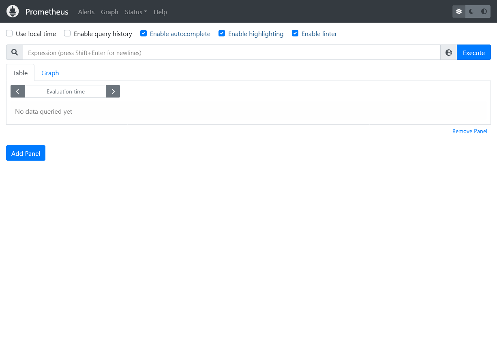

The page you reach is the `Graph` section of the Prometheus web interface. `Graph` is where you can make manual queries about any stats Prometheus has stored. Give Prometheus some time (about five minutes) to find and connect with the Prometheus-compatible endpoints currently available in your K3s cluster. Then, unfold the `Status` menu and click on `Targets`.

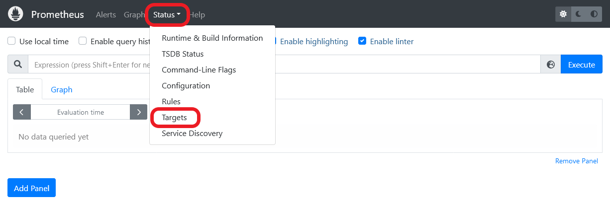

The `Targets` page lists all the Prometheus-compatible endpoints found in your Kubernetes cluster, which are the ones defined in the Prometheus configuration. Remember that a bunch of these stats are from endpoints declared in `Service` resources you annotated with `prometheus.io` tags. This page also shows the status of each detected endpoint and their related labels.

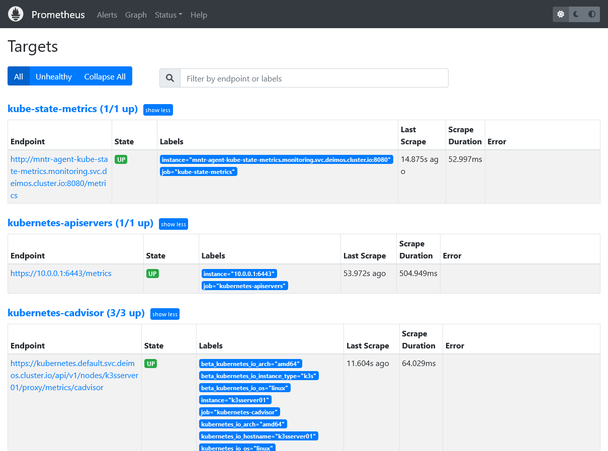

As you've seen, the interface is rather simple and essentially for read-only operations. Since querying manually about the statistics in your Kubernetes cluster can be cumbersome, it's better to use a more graphical interface like Grafana to get a more user-friendly representation of all those statistics that Prometheus gets from your cluster.

## Finishing Grafana's setup

Grafana is running in your K3s cluster yet needs some configuring, so let's get to it.

### _First login and password change_

1. Browse to it's URL, which in this guide is `https://grafana.deimos.cloud`. Accept the risk of your wildcard certificate and then you should be automatically redirected to the login page.

    

2. Enter `admin` as username  and also as password. Right after login you'll be asked to change the password. Do it or skip this step altogether.

    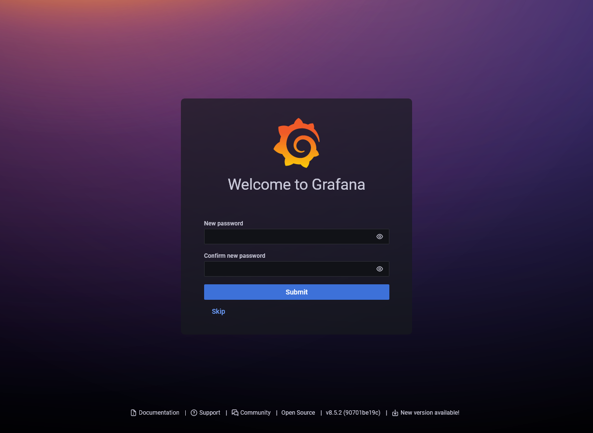

3. At this point you'll have reached your Grafana's _Home_ dashboard.

    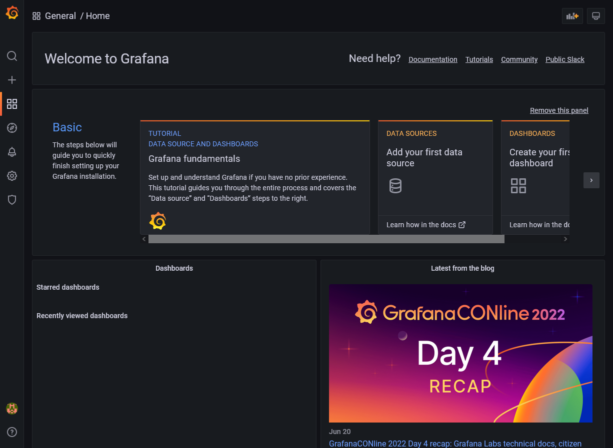

    This dashboard is essentially empty, since you don't have any data source connected nor any dashboard created.

### _Adding the Prometheus data source_

The very first thing you must configure is the connection to a datasource from which Grafana can get data to show. In this case you'll connect with your Prometheus server.

1. In the options available on the left bar, hover over the `Configuration` option to unfold it.

    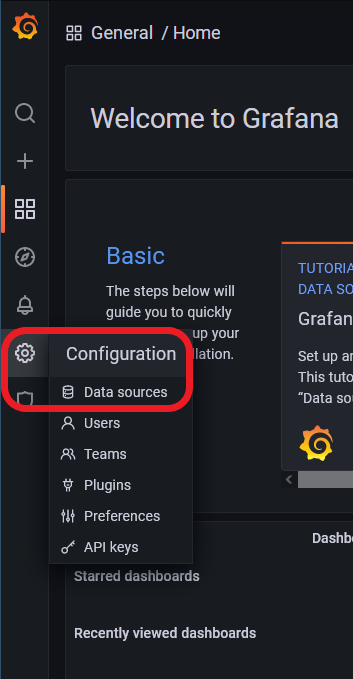

    The very first option in the list is the one you were looking for, `Data sources`.

2. Click on `Data sources` to reach the corresponding configuration page.

    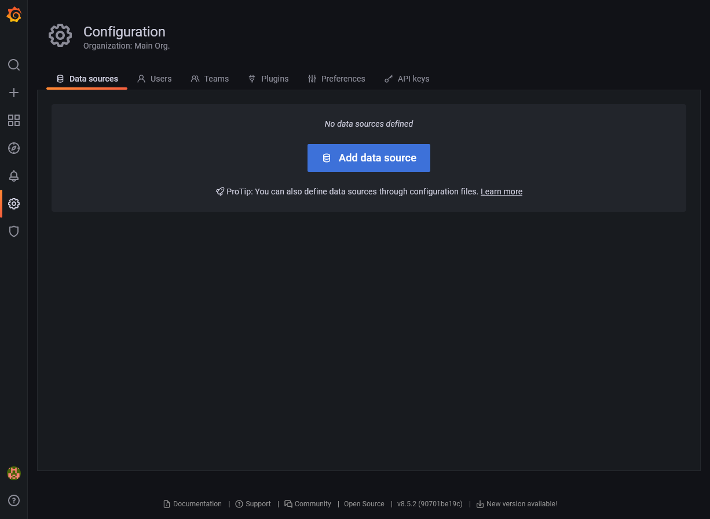

3. Press the `Add data source` button. The first thing you'll see is a list of data source types to choose from.

    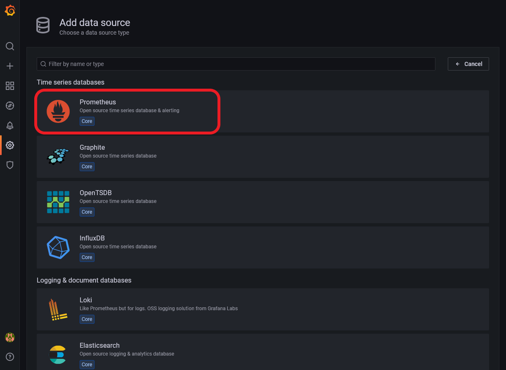

    See how the very first option offered happens to be Prometheus.

4. Choose the Prometheus option and you'll reach the form page below.

    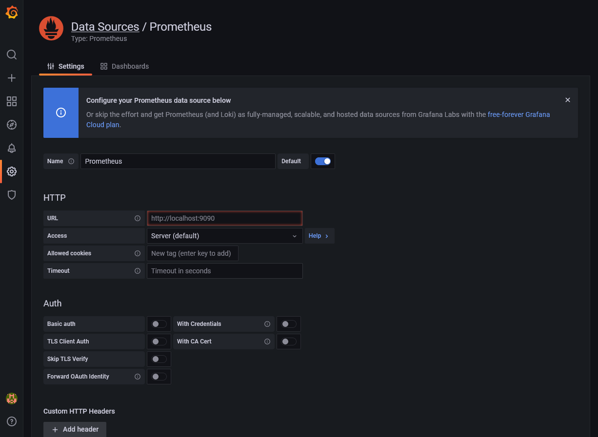

    Notice that there are two tabs on this page, and that you're in the `Settings` one.

5. Remain in the `Settings` tab and fill the form as indicated next.

    - `Name`: put something significant here, like `Prometheus Deimos Cloud server`.

    - `HTTP` section:
        - `URL`: here you must specify the [internal FQDN of your Prometheus `Service` resource](G035%20-%20Deploying%20services%2004%20~%20Monitoring%20stack%20-%20Part%204%20-%20Prometheus%20server.md#prometheus-server-services-fqdn-or-dns-record), which in this guide is `mntr-server-prometheus.monitoring.svc.deimos.cluster.io`, and concatenate to it the `443` port. Since within the cluster your Prometheus server answers to HTTP requests, the full url is as shown next:

            ~~~vim
            http://mntr-server-prometheus.monitoring.svc.deimos.cluster.io:443
            ~~~

            > **BEWARE!**  
            > You might be thinking that your Prometheus server is configured to listen in the `9090` port, but remember that you'll connect to its `Service` resource which is configured to listen in the `443` port and reroute traffic to the `9090` port.  
            > Also notice how the protocol specified in the url above is `http`, although `443` is the default port for `https`. You do this because in this case you're using the `443` port just as a regular `http` port for that service within the internal cluster networking. The HTTPS part is being taken care of by the related Traefik `IngressRoute` you declared for handling only external connections to Prometheus.

    Leave all the rest of fields in the form with their **default** values.

6. Go to the bottom of the form and click on `Save & test`.

    

    Right after pressing the button you should see above the buttons line a success message.

    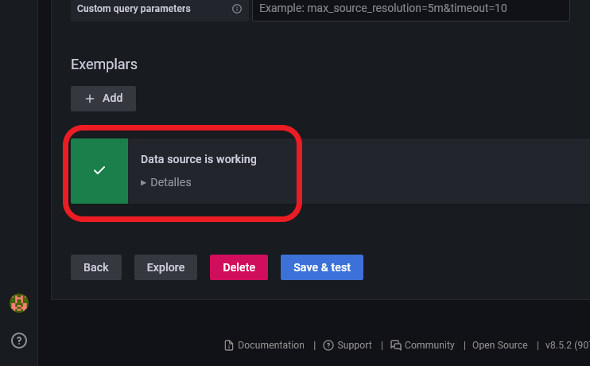

### _Enabling a dashboard for Prometheus data_

Now you have an active Prometheus data source, but you still need a dashboard to visualize the data it provides in Grafana.

1. Return to the top of your Prometheus data source form and click on the `Dashboards` tab.

    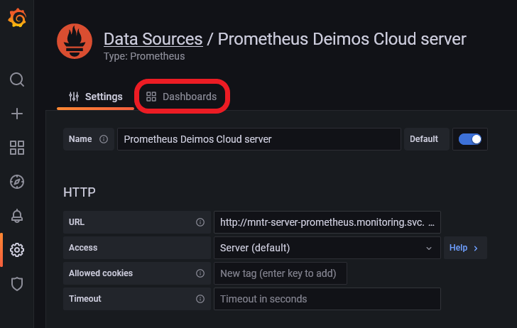

    You'll get to see the following list of dashboards.

    

2. Since you're using a Prometheus server of the branch 2.x, choose the `Prometheus 2.0 stats` from the dashboards list by pressing on the corresponding `Import` button.

    

    The action should be immediate, and the item will switch its `Import` button for a `Re-import` one as a result.

    

3. Go to `Dashboards` > `Browse`.

    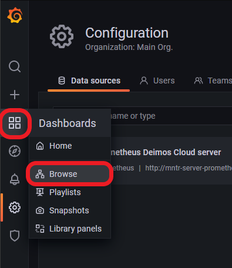

    In this page you'll find listed your newly imported `Prometheus 2.0 Stats` dashboard.

    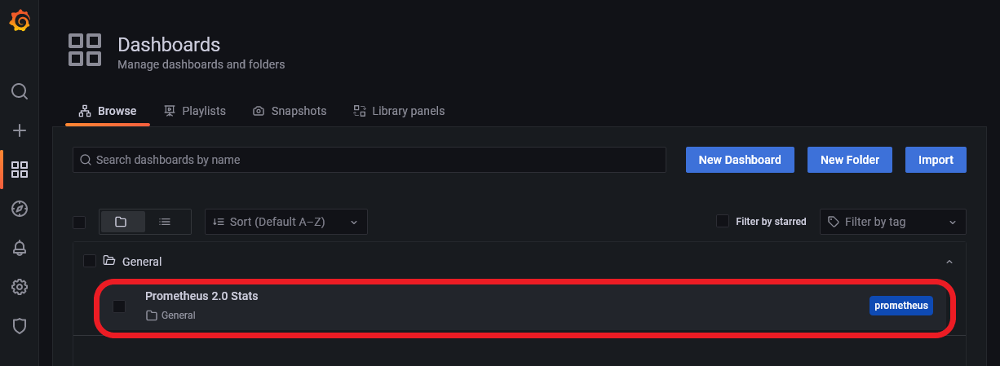

4. Click on the `Prometheus 2.0 Stats` one to enter into the following dashboard.

    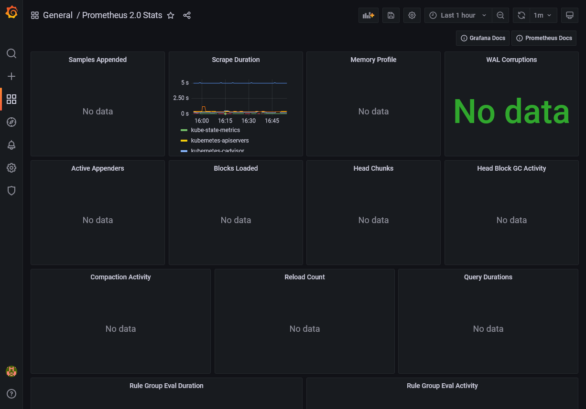

    As you can see, this dashboard only manages to show the `scrape duration` statistics and nothing else, but you can try and edit every other block to make them show what they're supposed to display or some other data.

Since it's not the intention of this guide series to go as deep as explaining how any of the deployed applications work, I'll leave to you to discover how to import other dashboards or even configure your own custom ones. A good starting point would be the [official "marketplace" that Grafana has for them](https://grafana.com/grafana/dashboards/).

## Security concerns on Prometheus and Grafana

### _On Prometheus_

As you've seen, a basic installation of Prometheus doesn't have any kind of security. If you want to enforce login with a user, you can do as you already did when you configured the access to the Traefik web dashboard [in the **G031** guide](G031%20-%20K3s%20cluster%20setup%2014%20~%20Enabling%20the%20Traefik%20dashboard.md#enabling-the-ingressroute): by enabling a basic auth login directly in the IngressRoute of your Prometheus server.

This will protect a bit the external accesses to your Prometheus dashboard, while it won't affect the connections through the internal networking of your cluster. To enforce more advanced security methods, you'll have to check out [the official Prometheus documentation](https://prometheus.io/docs/prometheus/2.35/configuration/https/) and see what security options are available.

### _On Grafana_

Unlike Prometheus, Grafana already comes with an integrated user authentication and management system. You can find its page in `Configuration` > `Users`.

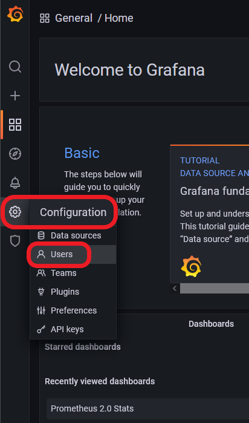

Click on the `Users` option and you'll reach the users management page of your Grafana setup.

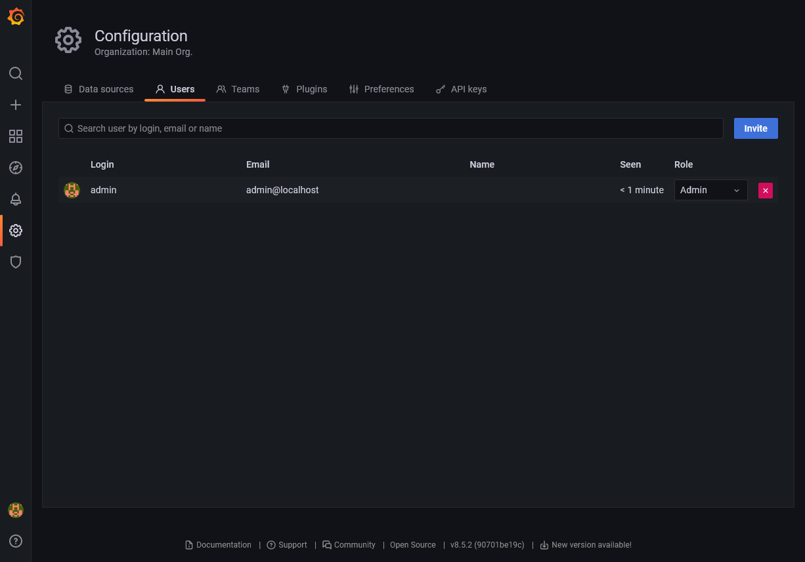

See that there's only the `admin` user you've used before, so it would be better if you created at least another one with lesser privileges to use it as your regular user.

## Monitoring stack's Kustomize project attached to this guide series

You can find the Kustomize project for this Monitoring stack deployment in the following attached folder.

- `k8sprjs/monitoring`

## Relevant system paths

### _Folders in `kubectl` client system_

- `$HOME/k8sprjs/monitoring`
- `$HOME/k8sprjs/monitoring/resources`

### _Files in `kubectl` client system_

- `$HOME/k8sprjs/monitoring/kustomization.yaml`
- `$HOME/k8sprjs/monitoring/resources/data-grafana.persistentvolume.yaml`
- `$HOME/k8sprjs/monitoring/resources/data-prometheus.persistentvolume.yaml`
- `$HOME/k8sprjs/monitoring/resources/monitoring.clusterrolebinding.yaml`
- `$HOME/k8sprjs/monitoring/resources/monitoring.clusterrole.yaml`
- `$HOME/k8sprjs/monitoring/resources/monitoring.namespace.yaml`

## References

### _cert-manager_

- [Kubectl cert-manager plugin](https://cert-manager.io/docs/usage/kubectl-plugin/)

### _Prometheus_

- [HTTPS AND AUTHENTICATION](https://prometheus.io/docs/prometheus/2.35/configuration/https/)

### _Grafana_

- [Grafana documentation](https://grafana.com/docs/)
- [Grafana fundamentals](https://grafana.com/tutorials/grafana-fundamentals/)
- [Prometheus data source](https://grafana.com/docs/grafana/v8.5/datasources/prometheus/)
- [Grafana dashboards](https://grafana.com/grafana/dashboards/)

## Navigation

[<< Previous (**G035. Deploying services 04. Monitoring stack Part 5**)](G035%20-%20Deploying%20services%2004%20~%20Monitoring%20stack%20-%20Part%205%20-%20Grafana.md) | [+Table Of Contents+](G000%20-%20Table%20Of%20Contents.md) | [Next (**G036. Host and K3s cluster**) >>](G036%20-%20Host%20and%20K3s%20cluster%20~%20Monitoring%20and%20diagnosis.md)
