# G040 - Backups 04 ~ UrBackup 01 - Server and agents setup

With [UrBackup](https://www.urbackup.org/) you can program backups of concrete directories rather than whole systems, as you've seen in the two previous guides. But first you need to deploy an UrBackup server and install the corresponding UrBackup clients in the target systems which, in this case, will be your K3s node VMs.

The UrBackup server could be deployed in your K3s Kubernetes cluster (there's a Docker image available of the UrBackup server), but usually you should have the backup server on a completely different system for safety. Of course, in this guide series' scenario, there's only one physical system, so I'll show you how to setup the UrBackup server on a small Debian 11 VM.

## Setting up a new VM for the UrBackup server

You already have a suitable VM template from which you can clone a new Debian 11 VM. This VM template is the one named `debiantpl`, which you prepared in the [**G020**](G020%20-%20K3s%20cluster%20setup%2003%20~%20Debian%20VM%20creation.md), [**G021**](G021%20-%20K3s%20cluster%20setup%2004%20~%20Debian%20VM%20configuration.md), [**G022**](G022%20-%20K3s%20cluster%20setup%2005%20~%20Connecting%20the%20VM%20to%20the%20NUT%20server.md) and [**G023**](G023%20-%20K3s%20cluster%20setup%2006%20~%20Debian%20VM%20template%20and%20backup.md) guides. The resulting VM will require some adjustments, in the same way you had to reconfigure the VMs that became K3s nodes. Since I've already explained how to do all those changes in earlier guides, in the following subsections I'll just indicate you what to change and why while also pointing you to the proper sections of previous guides.

### _Create a new VM based on the Debian VM template_

Clone a new VM from the `debiantpl` VM template, as is explained [here in the **G024** guide](G024%20-%20K3s%20cluster%20setup%2007%20~%20K3s%20node%20VM%20template%20setup.md#full-cloning-of-the-debian-vm-template). The cloning parameters for generating this guide's VM were set as follows:

- `VM ID`: `6161`. As you did with the K3s node VMs, give your new VM an ID correlated to the IPs it's going to have. So, for this guide, this new VM will have the ID `6161`, which corresponds to the IPs that you'll see used in this guide.

- `Name`: `bkpserver`. The VM name should be something meaningful like `bkpserver`. Be aware that later you'll set up this name also as the VM's `hostname` within Debian.

- `Mode`: `Linked Clone`, so this VM is linked to the VM template, instead of duplicating it.

After the new VM is cloned, **DON'T** start it. You'll need to take a look to its assigned hardware capabilities. If you have the same kind of limited hardware as the one used in this guide series, and also having a K3s Kubernetes cluster already running in the system, you must be careful of how much RAM and CPU you assign to any new VM. So, in this guide, the new VM will have the same hardware setup as the VM template, except on the memory department, in which it'll have an absolute maximum of 1 GiB.

In the capture below, you can see how the `Hardware` tab looks for this guide's new VM.

On the other hand, don't forget to modify the `Notes` section in the `Summary` tab of this VM. For instance, you could write something like the following.

~~~md
# Backup Server VM
Template created: 2022-07-05  
OS: **Debian 11 Bullseye**  
Root login disabled: yes  
Sysctl configuration: yes  
Transparent hugepages disabled: yes  
SWAP disabled: no  
SSH access: yes  
TFA enabled: yes  
QEMU guest agent working: yes  
Fail2Ban working: yes  
NUT (UPS) client working: yes  
Utilities apt packages installed: yes  
Backup server software: UrBackup
~~~

A final detail to do is to set to `Yes` the parameter `Start at boot` found in the `Options` tab, so the VM is booted up by Proxmox VE after the host system itself has started.

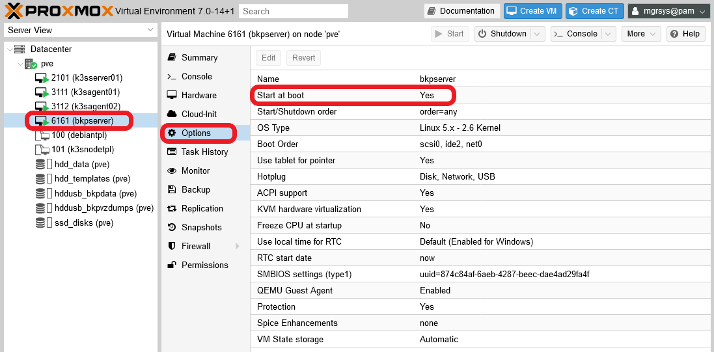

### _Set an static IP for the main network device (`net0`)_

To facilitate your remote access to the VM, set up a static IP for it's main network device (the `net0` one) in your router or gateway, as you've done for the other VMs. Remember that you can see the MAC of the network device in the `Hardware` tab of your new VM.

In this guide, the VM will have the IP `192.168.1.61`, and notice how the `61` portion corresponds with the ID of this VM.

### _System adjustments_

Boot up your `bkpserver` VM, then connect to it through remote SSH shell and login as `mgrsys`.

> **BEWARE!**  
> At this point, to access your `bkpserver` VM you'll have to use the same credentials as in the VM template.

#### **Setting a proper hostname string**

The very first thing you'll want to do is to change the hostname of this VM to match its name on Proxmox VE. So, to set the string `bkpserver`, do as it's already explained [in this section of the **G024** guide](G024%20-%20K3s%20cluster%20setup%2007%20~%20K3s%20node%20VM%20template%20setup.md#setting-a-proper-hostname-string).

#### **Changing the VG's name**

The LVM filesystem structure of this VM retains the same names as the VM template, and this could be confusing. In particular, it's the VG (volume group) that should be changed to something related to this VM, such as `bkpserver-vg`. But this is not a trivial change, in particular because this VM has a **SWAP partition active**. So, carefully follow the instructions next.

1. First, **temporarily** disable the active SWAP of this VM with the `swapoff` command below.

    ~~~bash
    $ sudo swapoff -a
    ~~~

    Verify that the command has been successful by checking the `/proc/swaps` file.

    ~~~bash
    $ cat /proc/swaps
    Filename                                Type            Size    Used    Priority
    ~~~

    If there's nothing listed, like above, you're good to go.

2. Now, follow closely the instructions specified [in this section of the **G024** guide](G024%20-%20K3s%20cluster%20setup%2007%20~%20K3s%20node%20VM%20template%20setup.md#changing-the-vgs-name), although bearing in mind that the new VG name is `bkpserver-vg` in this guide.

3. Finally, you'll need to edit the file `/etc/initramfs-tools/conf.d/resume` and again find and change the string `debiantpl` for the corresponding one, `bkpserver` in this guide. After the change, the line should look as below.

    ~~~bash
    RESUME=/dev/mapper/bkpserver--vg-swap_1
    ~~~

    > **BEWARE!**  
    > Don't make a `.orig` backup of this file, or not in the very same directory the original is. Debian reads all files within the directory!

#### **Setting up the second network card**

The second network device, or virtual ethernet card, in the new VM is disabled by default. You have to enable it and assign it a proper IP, so later it can communicate directly with the secondary virtual NICs of your K3s node VMs. Do this by following the instructions [in this particular section of the G024 guide](G024%20-%20K3s%20cluster%20setup%2007%20~%20K3s%20node%20VM%20template%20setup.md#setting-up-the-second-network-card), but configuring an IP within the same range (`10.0.0.x`) that is not already assigned. In this guide, to keep the relationship with the `6161` VM ID used in this guide, the IP for this secondary NIC will be `10.0.0.61`.

#### **Changing the password of mgrsys**

You should change the password of the `mgrsys` user, since it's the same one it had in the VM template. To do so, execute the `passwd` command as `mgrsys` and it'll ask you the old and new password for the account.

~~~bash
$ passwd
Changing password for mgrsys.
Current password:
New password:
Retype new password:
passwd: password updated successfully
~~~

#### **Changing the TOTP code for mgrsys**

As you've done with `mgrsys`' password, now you must change its TOTP to make it unique for this `bkpserver` VM. Just execute the `google-authenticator` command, and it will overwrite the current content of the `.google_authenticator` file in the `$HOME` directory of your current user. In this guide, for this VM the command will be as below.

~~~bash
$ google-authenticator -t -d -f -r 3 -R 30 -w 3 -Q UTF8 -i bkpserver.deimos.cloud -l mgrsys@bkpserver
~~~

> **BEWARE!**  
> Export and save all the codes and even the `.google_authenticator` file in a password manager or by any other secure method.

#### **Changing the SSH key pair of mgrsys**

To connect through SSH to the VM, you're using the key pair originally meant just for the VM template. The proper thing to do is to change it for a new pair meant only for this `bkpserver` VM. You already did this change for the K3s node VMs, a procedure detailed [in a concrete section within the **G025** guide](G025%20-%20K3s%20cluster%20setup%2008%20~%20K3s%20Kubernetes%20cluster%20setup.md#changing-the-ssh-key-pair). Follow those instructions, but set the comment (the `-C` option at the `ssh-keygen` command) in the new key pair to a meaningful string like `bkpserver.deimos.cloud@mgrsys`.

### _Adding a virtual storage drive to the VM_

The main purpose of this new VM is to store backups, therefore you'll need to attach a new virtual storage drive (a _hard disk_ in Proxmox VE) to the `bkpserver` VM.

#### **Attaching a new hard disk to the VM**

Get into your Proxmox VE web console and do the following.

1. Go to the `Hardware` tab of your `bkpserver` VM, there add a new `hard disk` with a configuration like in the snapshot below.

    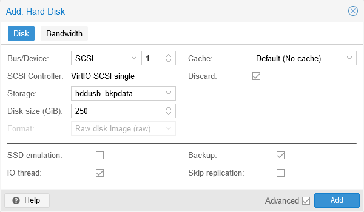

    The parameters above are configured for a big external storage drive.

    - `Storage`: is the partition enabled as `hddusb_bkpdata`, specifically reserved for storing data backups, which is found in the external USB storage drive attached to the Proxmox VE physical host.
    - `Disk size`: I've put 250 GiB here as an example, but you can input anything you want. Yet be careful of not going over the real capacity of the storage you've selected.
    - `Discard`: **enabled** since is an option supported by the underlying filesystem.
    - `SSD emulation`: **disabled** because the underlying physical storage device is a regular HDD drive.
    - `IO thread`: **enabled** to improve the I/O performance of this storage.

2. After adding the new hard disk, it should almost immediately appear listed in the `Hardware` tab among the VM's other devices.

    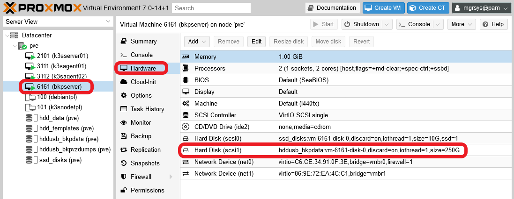

3. Next, open a shell as `mgrsys` in the `bkpserver` VM. Then, check with `fdisk` that the new storage is available.

    ~~~bash
    $ sudo fdisk -l

    Disk /dev/sda: 10 GiB, 10737418240 bytes, 20971520 sectors
    Disk model: QEMU HARDDISK
    Units: sectors of 1 * 512 = 512 bytes
    Sector size (logical/physical): 512 bytes / 512 bytes
    I/O size (minimum/optimal): 512 bytes / 512 bytes
    Disklabel type: dos
    Disk identifier: 0x76bd2712

    Device     Boot   Start      End  Sectors  Size Id Type
    /dev/sda1  *       2048   999423   997376  487M 83 Linux
    /dev/sda2       1001470 20969471 19968002  9.5G  5 Extended
    /dev/sda5       1001472 20969471 19968000  9.5G 8e Linux LVM

    Disk /dev/mapper/bkpserver--vg-root: 8.54 GiB, 9172942848 bytes, 17915904 sectors
    Units: sectors of 1 * 512 = 512 bytes
    Sector size (logical/physical): 512 bytes / 512 bytes
    I/O size (minimum/optimal): 512 bytes / 512 bytes

    Disk /dev/mapper/bkpserver--vg-swap_1: 976 MiB, 1023410176 bytes, 1998848 sectors
    Units: sectors of 1 * 512 = 512 bytes
    Sector size (logical/physical): 512 bytes / 512 bytes
    I/O size (minimum/optimal): 512 bytes / 512 bytes

    Disk /dev/sdb: 250 GiB, 268435456000 bytes, 524288000 sectors
    Disk model: QEMU HARDDISK
    Units: sectors of 1 * 512 = 512 bytes
    Sector size (logical/physical): 512 bytes / 512 bytes
    I/O size (minimum/optimal): 512 bytes / 512 bytes
    ~~~

    The newly attached storage appears at the bottom of the `fdisk` output as the `/dev/sdb` disk.

#### **BTRFS storage set up**

Btrfs, which seems to stand for _BeTTeR FileSystem_, is a filesystem with specific advanced capabilities that UrBackup can take advantage of for optimizing its backups. Debian 11 supports btrfs, but you need to install the package with tools for handling this filesystem.

~~~bash
$ sudo apt install -y btrfs-progs
~~~

With the tools available, now you can turn your `/dev/sdb` drive into a btrfs filesystem.

1. Start by adding the `/dev/sdb` to a new labelled multidevice btrfs configuration with the corresponding `mkfs.btrfs` command.

    ~~~bash
    $ sudo mkfs.btrfs -d single -L bkpdata-hdd /dev/sdb
    btrfs-progs v5.10.1
    See http://btrfs.wiki.kernel.org for more information.

    Label:              bkpdata-hdd
    UUID:               b4520c18-3d89-451e-8b30-f804c4d274f7
    Node size:          16384
    Sector size:        4096
    Filesystem size:    250.00GiB
    Block group profiles:
      Data:             single            8.00MiB
      Metadata:         DUP               1.00GiB
      System:           DUP               8.00MiB
    SSD detected:       no
    Incompat features:  extref, skinny-metadata
    Runtime features:
    Checksum:           crc32c
    Number of devices:  1
    Devices:
       ID        SIZE  PATH
        1   250.00GiB  /dev/sdb

    ~~~

    Let's analyze the command's output above.

    - The command has created a btrfs volume labeled `bkpdata-hdd`.
    - This volume is multidevice, although currently it only has one storage drive.
    - The volume works in `single` mode, meaning that:
        - The metadata will be mirrored in all the devices in the volume.
        - The data is allocated in "linear" fashion all along the devices in the volume.

    > **BEWARE!**  
    > Never build a multidevice volume with drives of different capabilities. So don't put in the same volume SSD devices with HDD ones, for instance. Always be sure that they all are of the same kind and have the same I/O capabilities.

    With the btrfs volume configured this way, when you're running out of space in it, you can add another storage device to it. [Check out how in the official btrfs wiki](https://btrfs.wiki.kernel.org/index.php/Using_Btrfs_with_Multiple_Devices#Adding_new_devices).

2. You need a mount point for the btrfs volume, so create one under the usual `/mnt` folder.

    ~~~bash
    $ sudo mkdir /mnt/bkpdata-hdd
    ~~~

3. Mount the btrfs volume in the mount point created before. To do the mounting, you can invoke in the `mount` command **ANY** of the devices used in the volume. In this case, there's only `/dev/sdb`.

    ~~~bash
    $ sudo mount /dev/sdb /mnt/bkpdata-hdd
    ~~~

4. To make that mounting permanent, you'll have to edit the `/etc/fstab` file and add the corresponding line there. First, make a backup of the `fstab` file.

    ~~~bash
    $ sudo cp /etc/fstab /etc/fstab.bkp
    ~~~

    Then **append** the lines next to the `fstab` file.

    ~~~bash
    # Backup storage
    /dev/sdb /mnt/bkpdata-hdd btrfs defaults,nofail 0 0
    ~~~

5. Reboot the VM.

    ~~~bash
    $ sudo reboot
    ~~~

6. Log back into a shell in the VM, then check with `df` that the volume is mounted.

    ~~~bash
    $ df -h
    Filesystem                      Size  Used Avail Use% Mounted on
    udev                            471M     0  471M   0% /dev
    tmpfs                            98M  520K   98M   1% /run
    /dev/mapper/bkpserver--vg-root  8.4G  1.2G  6.8G  15% /
    tmpfs                           489M     0  489M   0% /dev/shm
    tmpfs                           5.0M     0  5.0M   0% /run/lock
    /dev/sdb                        250G  3.8M  248G   1% /mnt/bkpdata-hdd
    /dev/sda1                       470M   48M  398M  11% /boot
    tmpfs                            98M     0   98M   0% /run/user/1000
    ~~~

    See above how the `/dev/sdb` device appears in the list of filesystems.

### _Updating Debian in the VM_

This VM is based on a VM template that could be at this point out of date. You should then use `apt` to update the Debian in this VM.

~~~bash
$ sudo apt update
$ sudo apt upgrade
~~~

If the upgrade affects many packages, or critical ones, you should reboot after applying the upgrade.

~~~bash
$ sudo reboot
~~~

## Deploying UrBackup

With the VM ready, you can proceed with the deployment of the UrBackup server on it.

### _Installing UrBackup server_

To install UrBackup server in your Debian 11 VM, you just need to install one `.deb` package. The problem is acquiring the most recent one, since the [official UrBackup page](https://www.urbackup.org/) doesn't link them at all. At the time of writing this, the latest non-beta version of UrBackup server is the `2.5.25`, and you can find it [in this web folder](https://beta.urbackup.org/Server/). So, knowing this particularity, let's get on with the installation procedure.

1. In a shell as `mgrsys`, use `wget` to download in the `bkpserver` VM the package for UrBackup version `2.5.25`.

    ~~~bash
    $ wget https://beta.urbackup.org/Server/2.5.25/urbackup-server_2.5.25_amd64.deb
    ~~~

2. Install the downloaded `urbackup-server_2.5.25_amd64.deb` package with `dpkg`.

    ~~~bash
    $ sudo dpkg -i urbackup-server_2.5.25_amd64.deb
    ~~~

    The output of this `dpkg` command may warn you of unsatisfied dependencies that have left the package installation unfinished. This is something you'll correct in the next step with `apt`.

3. Apply the following `apt` command to properly finalize the installation of the UrBackup package.

    ~~~bash
    $ sudo apt -f install
    ~~~

    A few seconds later, this `apt` command will launch a text-based window asking you where you want UrBackup to store its backups.

    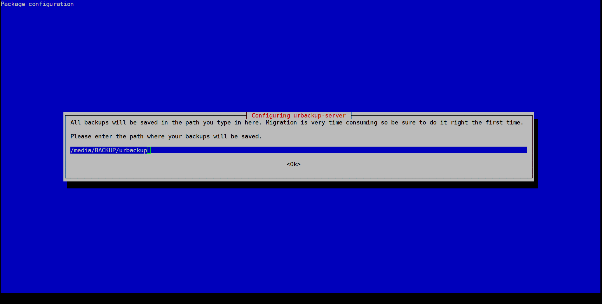

    Change the suggested path for the one where the btrfs volume is mounted, in this guide `/mnt/bkpdata-hdd`.

    

    With the path properly adjusted, press enter and the installation will be completed.

4. UrBackup server is installed in your VM, so now you can browse to its web console which you can access through an **http** connection to the port `55414`. So, for this guide's VM, the whole URL would be `http://192.168.1.61:55414/`. The first page you'll see is the `Status` tab of your new UrBackup server.

    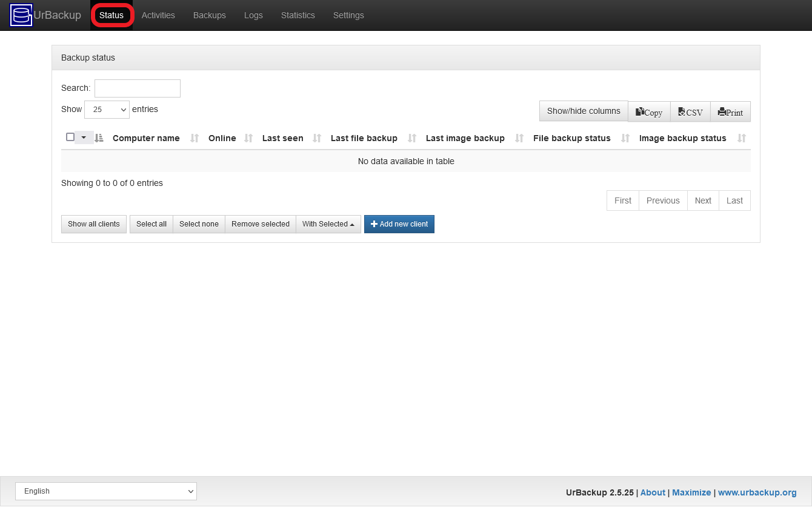

    Notice that you've gotten here without going through any kind of login. This security hole is one of several things you'll adjust in the following sections.

    On the other hand, go to the shell on the VM and list the contents of the `/mnt/bkpdata-hdd`.

    ~~~bash
    $ ls -al /mnt/bkpdata-hdd/
    total 20
    drwxr-xr-x 1 urbackup urbackup   50 Jul  6 19:19 .
    drwxr-xr-x 3 root     root     4096 Jul  6 17:10 ..
    drwxr-x--- 1 urbackup urbackup    0 Jul  6 19:11 clients
    drwxr-x--- 1 urbackup urbackup    0 Jul  6 19:19 urbackup_tmp_files
    ~~~

    You'll find that UrBackup has already made use of this storage, and with its own `urbackup` user no less, which confirms that the backup path configuration in UrBackup is correct.

5. There's a test you should do to confirm that your UrBackup server will be able to use the btrfs features of the chosen backup storage. Execute the following `urbackup_snapshot_helper` command in your `bkpserver` VM.

    ~~~bash
    $ urbackup_snapshot_helper test
    Testing for btrfs...
    Create subvolume '/mnt/bkpdata-hdd/testA54hj5luZtlorr494/A'
    Create a snapshot of '/mnt/bkpdata-hdd/testA54hj5luZtlorr494/A' in '/mnt/bkpdata-hdd/testA54hj5luZtlorr494/B'
    Delete subvolume (commit): '/mnt/bkpdata-hdd/testA54hj5luZtlorr494/A'
    Delete subvolume (commit): '/mnt/bkpdata-hdd/testA54hj5luZtlorr494/B'
    BTRFS TEST OK
    ~~~

    Notice two things:

    - The `urbackup_snapshot_helper` command **doesn't** require `sudo` to be executed.
    - At the end of its output it informs of the test result which, in this case, is the expected `OK`.

6. Unless you want to keep it in the server, you can remove now the `urbackup-server_2.5.25_amd64.deb` package file from the system.

    ~~~bash
    $ rm urbackup-server_2.5.25_amd64.deb
    ~~~

7. Know that the UrBackup server is installed as a service that you can manage with `systemctl` commands.

    ~~~bash
    $ sudo systemctl status urbackupsrv.service
    ● urbackupsrv.service - LSB: Server for doing backups
         Loaded: loaded (/etc/init.d/urbackupsrv; generated)
         Active: active (running) since Tue 2022-07-12 13:19:25 CEST; 1h 9min ago
           Docs: man:systemd-sysv-generator(8)
        Process: 667 ExecStart=/etc/init.d/urbackupsrv start (code=exited, status=0/SUCCESS)
          Tasks: 24 (limit: 1129)
         Memory: 122.0M
            CPU: 7.290s
         CGroup: /system.slice/urbackupsrv.service
                 └─674 /usr/bin/urbackupsrv run --config /etc/default/urbackupsrv --daemon --pidfile /var/run/urbackupsrv.pid

    Jul 12 13:19:25 bkpserver systemd[1]: Starting LSB: Server for doing backups...
    Jul 12 13:19:25 bkpserver systemd[1]: Started LSB: Server for doing backups.
    ~~~

### _Securing the user access to your UrBackup server_

Your UrBackup server at this point allows anyone to access and manage the backups, something you don't really want at all. Let's add an administrator user then.

1. In the UrBackup server's web interface, browse to the `Settings` tab. In the resulting page, click on `Users`.

    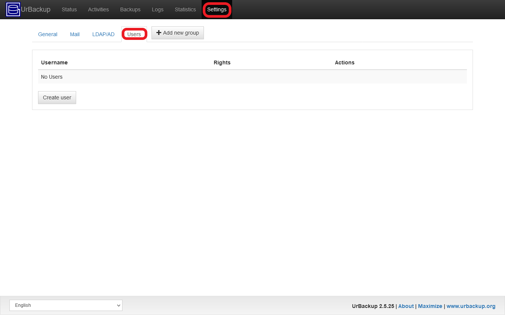

    Then click on the `Create user` button.

    

2. You'll get to the following simple form.

    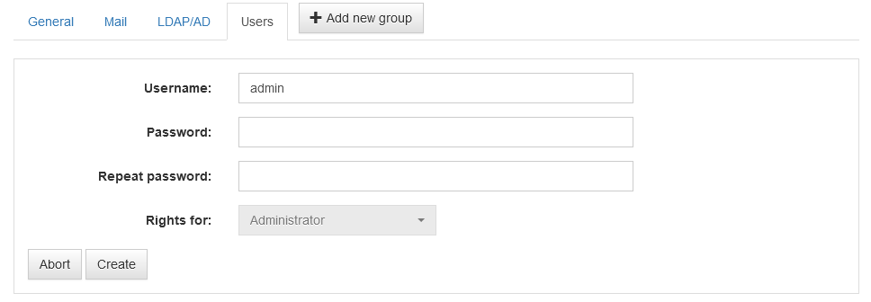

    There are a couple of thing to realize in this form.

    - It only allows you to create an administrator user, since the `Rights for` unfoldable list is greyed out.
    - You can change the default `admin` username to something else.

3. Fill the form, then press on `Create`.

    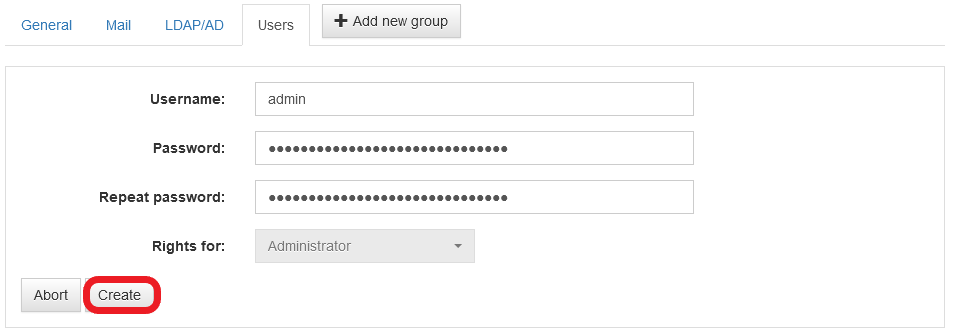

4. The creation is immediate and sends you back to the updated `Users` view.

    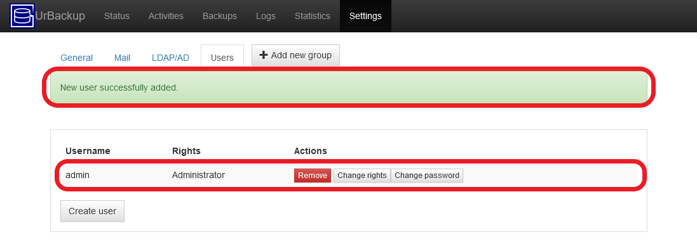

    The web interface warns you of the new user added, while you can see your new administrator listed in the user list.

5. Refresh the page in your browser and you'll get to see the web interface's login page.

    

    See that it only asks you for the password.

> **BEWARE!**  
> The web interface doesn't have a logout or disconnect button. To force the logout, you can manually refresh the page in your browser to get back to the login page.

### _Enabling a domain name for the UrBackup server in your network_

Remember to enable a domain name for your UrBackup server in your network, either by hosts files or configuring it in your local network router. In this guide, I'll assign the domain `bkpserver.deimos.cloud` to the `192.168.1.61` IP, to make reaching the web interface easier to remember.

### _Enabling SSL access to the UrBackup server_

UrBackup server doesn't come with SSL/TLS support so, to secure the connections to the web interface, you have to put a reverse proxy in front of it. I'll show you how to do this with an nginx server, slightly adapting what is explained [in this guide](https://github.com/Dmitrius7/UrBackup_simple_make_web_via_ssl_https).

1. Open a shell as `mgrsys` in your `bkpserver` VM, then install nginx with `apt`.

    ~~~bash
    $ sudo apt install -y nginx
    ~~~

2. With the `openssl` command, create a self-signed SSL certificate for encrypting the HTTPS connections.

    ~~~bash
    $ sudo openssl dhparam -out /etc/ssl/certs/dhparam.pem 2048
    $ sudo openssl req -x509 -nodes -days 2562 -newkey rsa:2048 -subj "/O=Urb Security/OU=Urb/CN=Urb.local/CN=Urb" -keyout /etc/ssl/certs/urb-cert.key -out /etc/ssl/certs/urb-cert.crt
    ~~~

    The first `openssl` command will take a bit to end, while the second one should finish faster.

3. Create an empty file in the path `/etc/nginx/sites-available/urbackup.conf`.

    ~~~bash
    $ sudo touch /etc/nginx/sites-available/urbackup.conf
    ~~~

4. Edit the new `urbackup.conf` file so it has the following content.

    ~~~nginx
    # Make UrBackup webinterface accessible via SSL
    server {
        # Define your listen https port
        listen 443 ssl;

        # (optionally)
        # server_name urbackup.yourdomain; 

        # SSL configuration
        ssl on;
        include snippets/ssl-params.conf;
        ssl_certificate /etc/ssl/certs/urb-cert.crt;
        ssl_certificate_key /etc/ssl/certs/urb-cert.key;
        # SSL configuration

        # set the root directory and index files
        root /usr/share/urbackup/www;
        index index.htm;

        # This location we have to 
        # Proxy the “x” file to the running UrBackup FastCGI server
        location /x {
           include fastcgi_params;
           fastcgi_pass 127.0.0.1:55413;
        }

        # If come here using HTTP, redirect them to HTTPS
        error_page 497 https://$host:$server_port$request_uri;

        # Disable logs
        access_log off;
        error_log off;

    }
    ~~~

    With this configuration, nginx will redirect calls on the default HTTPS port `443` to the UrBackup server, which is also listening in its localhost fastcgi `55413` port.

5. You need to enable the UrBackup configuration in nginx.

    ~~~bash
    $ sudo ln -s /etc/nginx/sites-available/urbackup.conf /etc/nginx/sites-enabled/urbackup.conf
    ~~~

6. Disable the `default` configuration that nginx has enabled in its standard installation.

    ~~~bash
    $ sudo rm /etc/nginx/sites-enabled/default
    ~~~

7. Create the file `/etc/nginx/snippets/ssl-params.conf`.

    ~~~bash
    $ sudo touch /etc/nginx/snippets/ssl-params.conf
    ~~~

8. Edit the new `ssl-params.conf` file so it has the following configuration lines.

    ~~~bash
    # from https://cipherli.st/
    # and https://raymii.org/s/tutorials/Strong_SSL_Security_On_nginx.html

    ssl_protocols TLSv1.3;
    ssl_prefer_server_ciphers on;
    ssl_ciphers "EECDH+AESGCM:EDH+AESGCM:AES256+EECDH:AES256+EDH";
    ssl_ecdh_curve secp384r1;
    ssl_session_cache shared:SSL:10m;
    ssl_session_tickets off;
    ssl_stapling on;
    ssl_stapling_verify on;
    resolver 8.8.8.8 8.8.4.4 valid=300s;
    resolver_timeout 5s;
    # Disable preloading HSTS for now.  You can use the commented out header line that includes
    # the "preload" directive if you understand the implications.
    #add_header Strict-Transport-Security "max-age=63072000; includeSubdomains; preload";
    add_header Strict-Transport-Security "max-age=63072000; includeSubdomains";
    add_header X-Frame-Options DENY;
    add_header X-Content-Type-Options nosniff;

    ssl_dhparam /etc/ssl/certs/dhparam.pem;

    # Disallow nginx version in HTTP headers
    server_tokens off;
    ~~~

    This configuration file not only tells nginx how to configure the SSL connections, but also other details like what DNS resolvers to use (the Google ones in this case).

9. At last, restart the nginx service to make it refresh its configuration.

    ~~~bash
    $ sudo systemctl restart nginx.service
    ~~~

10. Try to browse through HTTPS to your UrBackup server. For the configuration proposed in this guide, the correct HTTPS url is `https://bkpserver.deimos.cloud` or `https://192.168.1.61`.

## Firewall configuration on Proxmox VE

As you did for your K3s node VMs [in the **G025** guide](G025%20-%20K3s%20cluster%20setup%2008%20~%20K3s%20Kubernetes%20cluster%20setup.md#firewall-setup-for-the-k3s-cluster), you have to apply some firewall rules on Proxmox VE to increase the protection on your UrBackup server. In particular, you want this VM reachable only through the ports `22` (for SSH) and `443` (for HTTPS) on its `net0` network device.

1. At the `Datacenter` level, go to `Firewall` > `Alias`. There, add a new alias for the `bkpserver` main IP (the one for the first network device, named `net0` in Proxmox VE).

    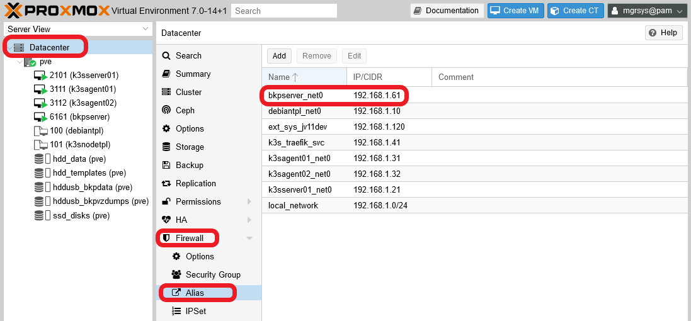

    See above how I named the alias `bkpserver_net0` after the VM it's related to.

2. Browse to the `Firewall` > `IPSet` tab, where you should create a new ipset that only includes the `bkpserver_net0` alias created before.

    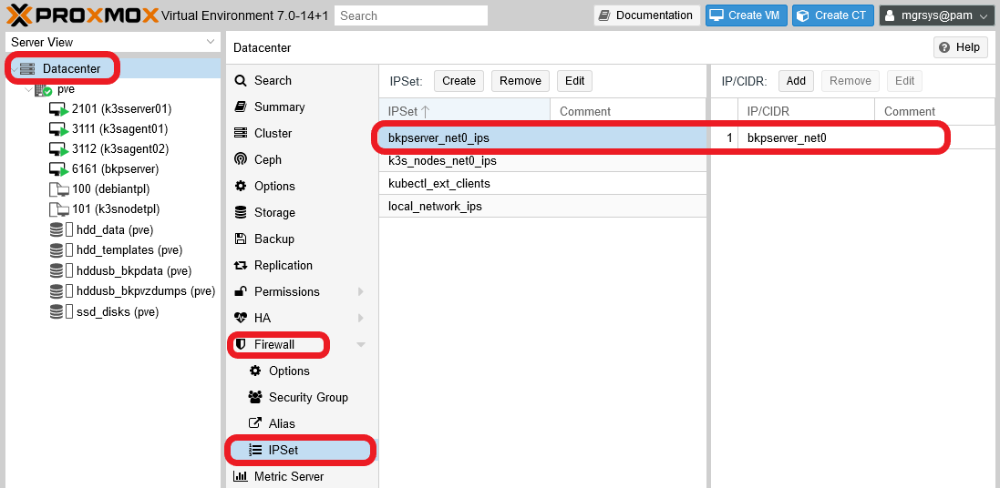

    Give this ipset a name related to the VM, like `bkpserver_net0_ips`.

3. Now go to the `Firewall` > `Security Group`, where you should create a security group with a name such as `bkpserver_net0_in`, and containing just the following rules.

    - `bkpserver_net0_in`:
        - Rule 1: Type `in`, Action `ACCEPT`, Protocol `tcp`, Source `local_network_ips`, Dest. port `22`, Comment `SSH standard port open for entire local network`.
        - Rule 2: Type `in`, Action `ACCEPT`, Protocol `tcp`, Source `local_network_ips`, Dest. port `443`, Comment `HTTPS standard port open for entire local network`.

    In the PVE web console, your new security group should look like in the snapshot below.

    

    > **BEWARE!**  
    > Don't forget to **enable** the rules when you create them, so revise the `On` column and check the ones you may have left disabled.

4. Next, you have to browse to the Firewall page of the `bkpserver` VM. Here you must press the `Insert: Security Group` to apply on this VM the security group you've just created before.

    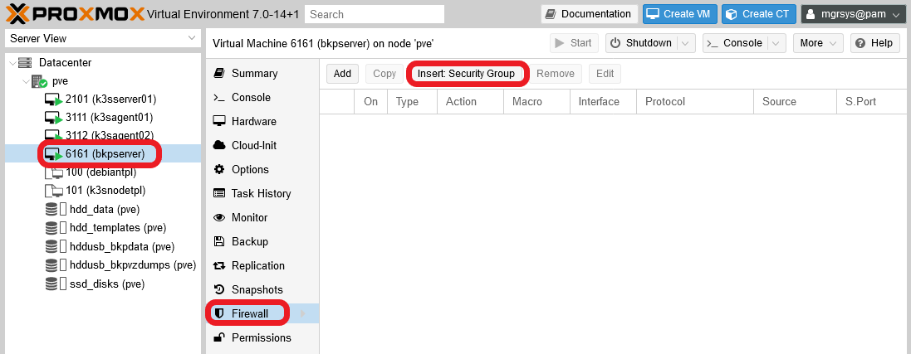

    In the form that appears, be sure of choosing the security group related to this VM (`bkpserver_net0_in` in this guide). Also specify correctly the network interface to which it'll be applied (`net0`), and don't forget to leave the rule enabled!

    

    The security group rule should appear now in the VM firewall as shown below.

    

5. Go to the `Firewall` > `IPset` section of the VM, where you have to add an IP set for the IP filter you'll enable later on the `net0` network device of this VM. Remember that the IP set's name must begin with the string `ipfilter-`, then followed by the network device's name (`net0` here), otherwise the ipfilter won't work.

    As shown next, this IP set must contain only the alias of this VM main network device's IP (`bkpserver_net0` in this case).

    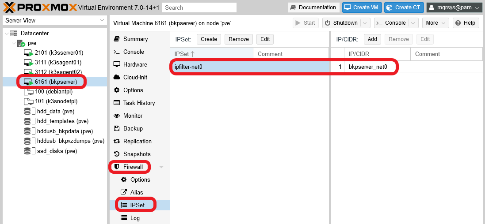

6. To enable the firewall on this VM, click on the `Firewall` > `Options` tab. There you'll have to adjust the options as shown in the following capture.

    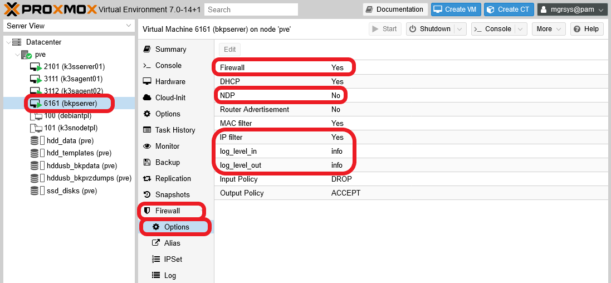

    The changed options are highlighted in red.

    - The `NDP` option is disabled because is only useful for IPv6 networking, which is not active in your VM.

    - The `IP filter` is enabled, which helps to avoid IP spoofing.
        - Remember that enabling the option is not enough. You need to specify the concrete IPs allowed on the network interface in which you want to apply this security measure, something you've just done in the previous step.

    - The `log_level_in` and `log_level_out` options are set to `info`, enabling the logging of the firewall on the VM. This allows you to see, in the `Firewall > Log` view of the VM, any incoming or outgoing traffic that gets dropped or rejected by the firewall.

7. As a final verification, try now browsing to your UrBackup server web interface on the HTTPS url, but also on the HTTP one. Only the HTTPS one should work, while trying to connect with unsecured HTTP should return a time-out or similar error. On the other hand, also try to connect with your preferred SSH client. If any of these checks fails, go over this procedure again to find what you might have missed!

## Adjusting the UrBackup server configuration

Like any other software, the UrBackup server comes with a default configuration that requires some retouching to fit better your circumstances. In particular, you'll adjust next just a couple of general options.

### _Specifying the server URL for clients_

To enable to UrBackup clients the capacity of accessing and restoring the backups stored in the server, you need to specify the concrete server URL they have to reach to do so.

1. Browse to the `Settings` tab of yor UrBackup server's web interface. By default, this page will put you on the `General` > `Server` options view. There, you'll see the empty parameter `Server URL for client file/backup access/browsing`.

    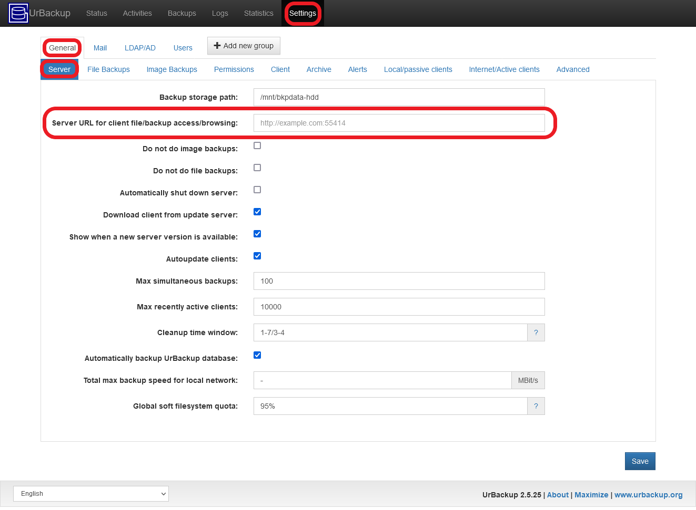

2. By default, that `Server URL` parameter is empty. You have to specify here the secondary network device IP (`10.0.0.61` in this guide) plus the UrBackup server port (`55414`), and all of this preceded by the `http` protocol. So, the URL in this guide is `http://10.0.0.61:55414`, as it's shown in the snapshot below.

    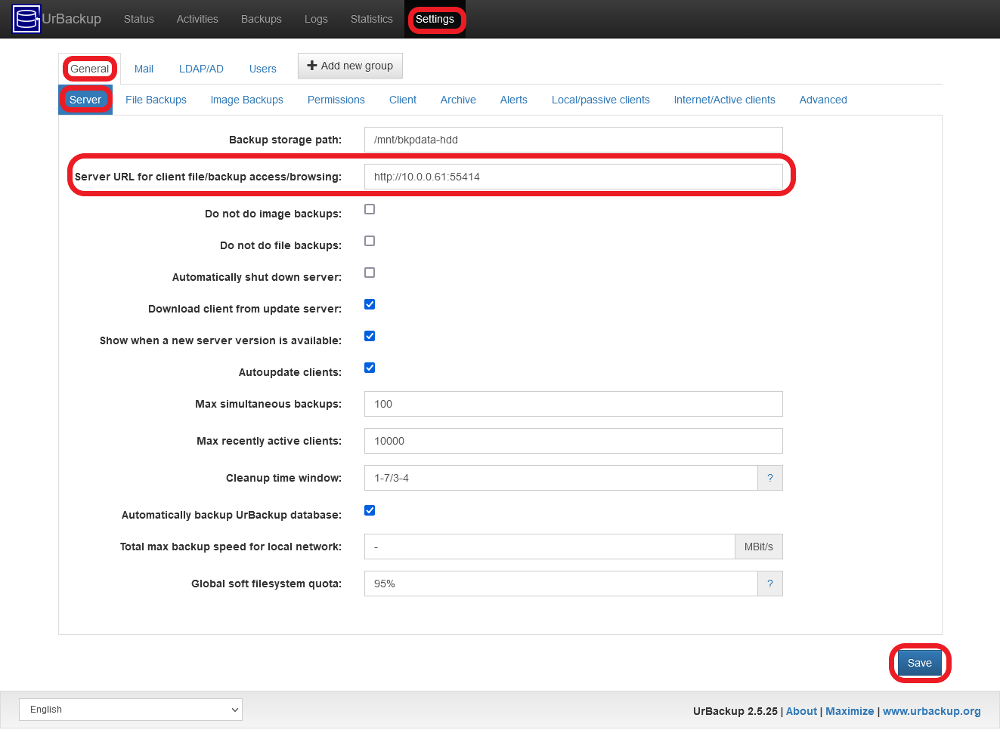

    Press on `Save` to apply the change, which should show you a success message at the bottom of the page.

    

3. Now click on the `General` > `Internet/Active clients` tab. In this page, there's a `Server URL clients connect to` field where you also have to specify the same IP and port as before, although respecting the `urbackup` protocol string already set there.

    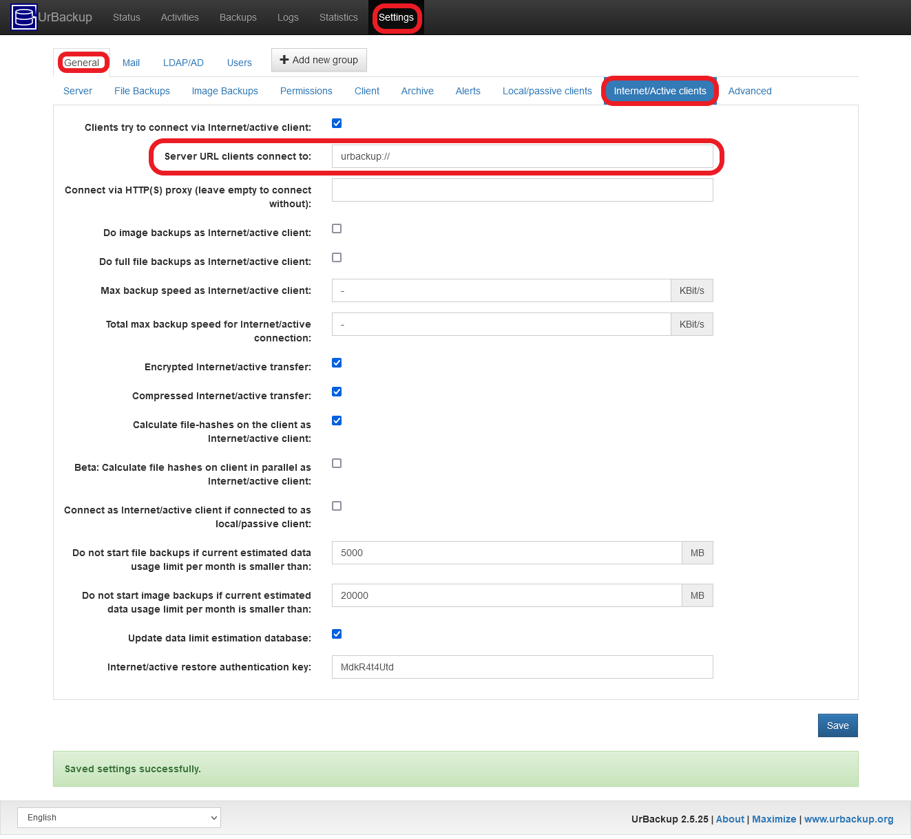

    Notice that the success warning message from the previous change hasn't dissapeared when you've change to this page, which very likely is a bug in this version of UrBackup server.

    Type in the `Server URL` field the correct string, which for this guide is `urbackup://10.0.0.61:55414`, as you can see in the capture next.

    

    Press the `Save` button to apply the change, which should show you the same success message as before at the bottom of the page.

### _Disabling the image backups_

By default, the UrBackup server will execute automatically a full image backup from any client it's connected to. Since you already have full images done by Proxmox VE, you don't need to do the same thing again with UrBackup.

On the other hand, this procedure will fail with your K3s node VMs because the tool UrBackup uses in the clients to do the images is incompatible with the _ext2_ filesystem used in the boot partition used on all your Debian VMs.

With all this in mind, the best thing to do in your particular scenario is to disable, in your UrBackup server, the full image backups altogether.

1. Return to the `Settings` > `General` > `Server` options view of your UrBackup server's web interface. There, you'll see the option `Do not do image backups` unchecked.

    

2. Check the `Do not do image backups` option and then press the `Save` button.

    

    Again, due to a bug in the UrBackup server's web interface, you'll still see the success message from the previous change. So, after pressing `Save`, the same success warning will just stay there.

## UrBackup server log file

Like other services, the UrBackup server has a log file found in the `/var/log` directory. It's full path is `/var/log/urbackup.log`.

This log is rotated, and its default rotation configuration is set in the file `/etc/logrotate.d/urbackupsrv`.

## About backing up the UrBackup server VM

You may consider to schedule in Proxmox VE a job to backup this VM, as you did in the previous [**G039** guide with the K3s node VMs](G039%20-%20Backups%2003%20~%20Proxmox%20VE%20backup%20job.md). If you want to do this, please bear in mind the following details.

- Remember that the backup job copies and compresses all the storages attached to the VM. This is important since the storage drive where UrBackup stores its backups is not only big, but also uses the btrfs filesystem that may not agree well with the Proxmox VE backup procedure.
- Careful with the storage space you have for backups within Proxmox VE, because the images of this VM will eat that space faster than the backups of other VMs.
- Don't include the UrBackup server VM in the same backup job with other VMs. You want it apart from the others so you can schedule it at a different and more convenient time.

## Relevant system paths

### _Directories on Debian VM_

- `$HOME`
- `$HOME/.ssh`
- `/etc`
- `/etc/initramfs-tools/conf.d`
- `/etc/nginx`
- `/etc/nginx/sites-available`
- `/etc/nginx/sites-enabled`
- `/etc/nginx/snippets`
- `/etc/ssl/certs`
- `/mnt`
- `/mnt/bkpdata-hdd`
- `/proc`
- `/var/log`

### _Files on Debian VM_

- `$HOME/.google_authenticator`
- `$HOME/.ssh/authorized_keys`
- `$HOME/.ssh/id_rsa`
- `$HOME/.ssh/id_rsa.pub`
- `/etc/fstab`
- `/etc/initramfs-tools/conf.d/resume`
- `/etc/nginx/sites-available/urbackup.conf`
- `/etc/nginx/sites-enabled/default`
- `/etc/nginx/sites-enabled/urbackup.conf`
- `/etc/nginx/snippets/ssl-params.conf`
- `/etc/ssl/certs/urb-cert.crt`
- `/etc/ssl/certs/urb-cert.key`
- `/proc/swaps`
- `/var/log/urbackup.log`

## References

### _BTRFS_

- [Increase the disk size on Debian 11 with btrfs filesystem](https://unix.stackexchange.com/questions/707540/increase-the-disk-size-on-debian-11-with-btrfs-filesystem)
- [BTRFS on Wikipedia](https://en.wikipedia.org/wiki/Btrfs)
- [Man page. btrfs-filesystem](https://btrfs.readthedocs.io/en/latest/btrfs-filesystem.html)
- [BTRFS. Main page](https://btrfs.wiki.kernel.org/index.php/Main_Page)
- [BTRFS. Getting started](https://btrfs.wiki.kernel.org/index.php/Getting_started)
- [BTRFS. Using Btrfs with Multiple Devices](https://btrfs.wiki.kernel.org/index.php/Using_Btrfs_with_Multiple_Devices)
- [BTRFS support in Debian](https://wiki.debian.org/Btrfs)
- [Btrfs file system stability status update](https://blog.urbackup.org/category/btrfs)
- [Fixing Btrfs Filesystem Full Problems](https://marc.merlins.org/perso/btrfs/post_2014-05-04_Fixing-Btrfs-Filesystem-Full-Problems.html)
- [How to delete btrfs snapshot?](https://superuser.com/questions/846282/how-to-delete-btrfs-snapshot)

### _UrBackup_

- [UrBackup](https://www.urbackup.org/)
- [Administration Manual for UrBackup Server 2.4.x](https://www.urbackup.org/administration_manual.html)
- [Server 2.5.21/Client 2.5.15](https://forums.urbackup.org/t/server-2-5-21-client-2-5-15/10283?u=uroni)
- [Latest versions of UrBackup ARE HERE](https://beta.urbackup.org/)
- [Linux image backups with UrBackup 2.5.y](http://blog.urbackup.org/368/linux-image-backups-with-urbackup-2-5-y)
- [SSL on the web interface](https://forums.urbackup.org/t/ssl-on-the-web-interface/9539)
- [UrBackup_simple_make_web_via_ssl_https](https://github.com/Dmitrius7/UrBackup_simple_make_web_via_ssl_https)
- [Connect clients with a HTTPS CONNECT web proxy](http://blog.urbackup.org/299/connect-clients-with-a-https-connect-web-proxy)
- [Backup server for the raspberry pi](http://blog.urbackup.org/87/backup-server-for-the-raspberry-pi)

## Navigation

[<< Previous (**G039. Backups 03**)](G039%20-%20Backups%2003%20~%20Proxmox%20VE%20backup%20job.md) | [+Table Of Contents+](G000%20-%20Table%20Of%20Contents.md) | [Next (**G041. Backups 05. UrBackup 02**) >>](G041%20-%20Backups%2005%20~%20UrBackup%2002%20-%20Clients%20setup%20and%20configuring%20file%20backups.md)
