# G041 - Backups 05 ~ UrBackup 02 - Clients setup and configuring file backups

With your UrBackup server up and running, now you need to deploy the UrBackup client program in all the systems you want to backup. Those systems in this guide will be the VMs running your K3s Kubernetes cluster. Then, you'll be able to schedule backup jobs in your UrBackup server so it can run them on your clients.

## Deploying the UrBackup client program

As I indicated before, you need to deploy the UrBackup client program on **all** your K3s node VMs. Since those VMs are Debian 11 systems, you'll need to execute the corresponding Linux installer of the UrBackup client in all of them. And by _corresponding_ I mean that you have to install the correct version of the client, which has to correspond with the version of your server.

In this case, since your UrBackup server is a 2.5.x version (`2.5.25` was the one deployed in the previous guide), you'll also require to use the client's 2.5.x version. At the time of writing this, the client's latest version is `2.5.19`. As it happens with the server package, you won't find a download link to the latest client installer on the main official page of [UrBackup](https://www.urbackup.org/), but [in this web folder](https://beta.urbackup.org/Client/).

Being aware of this oddity, let's begin with the procedure.

1. The UrBackup client installer will also install a couple of packages, so it's better to have up to date the references to the Debian packages sources in your VMs. So, just execute the following `apt` command to update just those references.

    ~~~bash
    $ sudo apt update
    ~~~

2. Next, on **EACH** of your K3s node VMs, download the UrBackup client installer with `wget`.

    ~~~bash
    $ wget https://beta.urbackup.org/Client/2.5.19/UrBackup%20Client%20Linux%202.5.19.sh
    ~~~

3. With the installer downloaded, execute it on all the VMs to install the UrBackup client.

    ~~~bash
    $ sudo sh UrBackup\ Client\ Linux\ 2.5.19.sh
    ~~~

    Be aware that this client installation, in its output, will ask you a couple of questions for setting up its configuration, and maybe also your permission to install some packages through `apt`.

    > **BEWARE!**  
    > **Answer the same** in all of your VMs.

    ~~~bash
    Verifying archive integrity... All good.
    Uncompressing UrBackup Client Installer for Linux  100%
    Installation of UrBackup Client 2.5.19 to /usr/local ... Proceed ? [Y/n]

    Uncompressing install data...
    Detected Debian \(derivative\) system
    Detected systemd
    Detected architecture x86_64-linux-glibc
    Installed daemon configuration at /etc/default/urbackupclient...
    Info: Restoring from web interface is disabled per default. Enable by modifying /etc/default/urbackupclient.
    Installing systemd unit...
    Cannot find systemd unit dir. Assuming /lib/systemd/system
    Created symlink /etc/systemd/system/multi-user.target.wants/urbackupclientbackend.service → /lib/systemd/system/urbackupclientbackend.service.
    Starting UrBackup Client service...
    Successfully started client service. Installation complete.
    +Detected Debian stable. Dattobd supported
    -Detected no btrfs filesystem
    +Detected LVM volumes
    +dmsetup present
    Please select the snapshot mechanism to be used for backups:
    1) dattobd volume snapshot kernel module from https://github.com/datto/dattobd (supports image backups and changed block tracking)
    2) LVM - Logical Volume Manager snapshots
    4) Linux device mapper based snapshots (supports image backups and changed block tracking)
    5) Use no snapshot mechanism
    5
    Configured no snapshot mechanism
    ~~~

    In the output above you can see that I was asked two things.

    - `Installation of UrBackup Client 2.5.19 to /usr/local ... Proceed ? [Y/n]`: justs asks for your permission to continue with the installation.
    - `Please select the snapshot mechanism to be used for backups`: I've chosen `5` to disable the snapshot mechanism because, in my tests, it has proven to be rather problematic. In particular:
        - The option 1 requires the installation of an extra DattoDB software.
        - The option 2 uses the snapshot capabilities of LVM but, from what I've found out about it, this method can have relevant performance issues.
        - The option 4 is the one I've tested. It creates creates temporary `.snapshot` files within the snapshooted filesystem but, in my case, the file would fill up the targeted storage completely, always provoking a failure in the snapshot process.

4. With all the clients installed, browse to your UrBackup server's web interface. In the `Status` page, you should see all the clients autodetected already.

    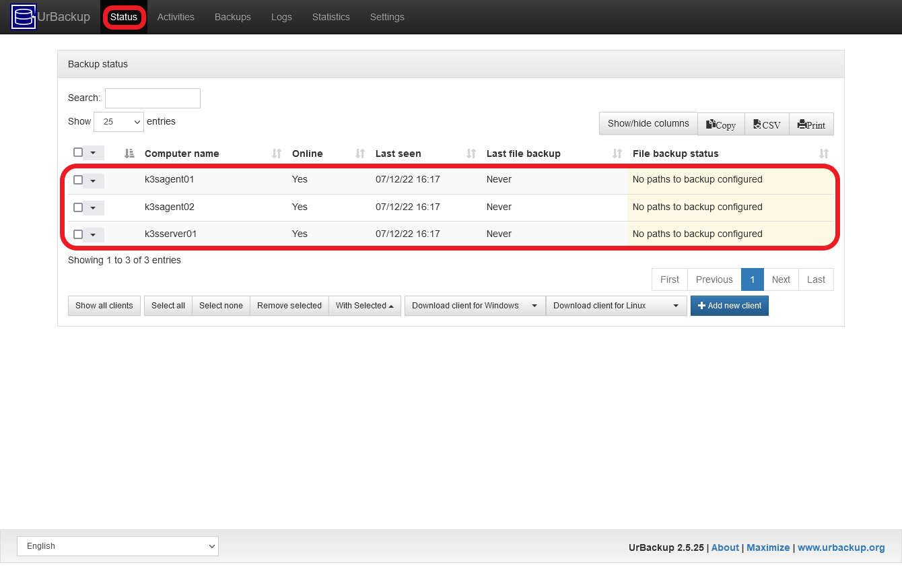

    This autodetection is possible because both the server and the clients are in the same local network and the UrBackup server is able to find on its own any active client in its vicinity.

    Be aware that you can see more details of each client on this page, by enabling some extra columns available with the `Show/hide columns` button.

    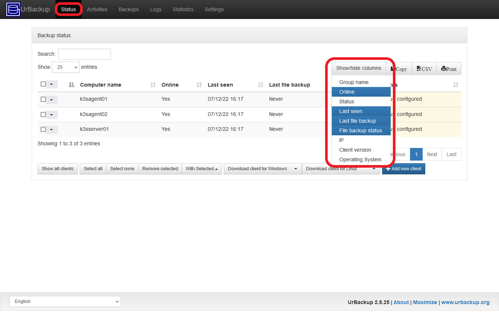

    If you enabled them all, this view would look like below.

    

    Notice how you can see now the status, IP, client and operating system version of your clients. In the IP column, see how all the clients are connected to the UrBackup server through their secondary network devices.

5. Reboot all your K3s node VMs, so any pending changes done by the client installation can be fully applied. You can do this from the Proxmox VE web console, starting with the K3s agent nodes, then the K3s server node.

    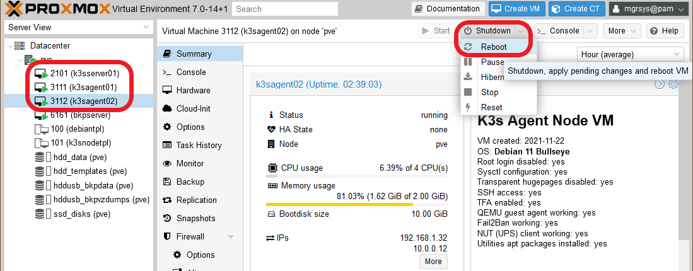

    > **BEWARE!**  
    > Use the `Reboot` button, not the `Reset` one! And only on the K3s node VMs.

    Or, if you like, you can just execute the corresponding command in a shell on each VM.

    ~~~bash
    $ sudo reboot
    ~~~

6. Finally, don't forget to remove the `UrBackup Client Linux 2.5.19.sh` installer from the VMs.

    ~~~bash
    $ rm UrBackup\ Client\ Linux\ 2.5.19.sh
    ~~~

## UrBackup client log file

Like the server, each UrBackup client has its own log file, which is found in the path `/var/log/urbackupclient.log`.

This log file doesn't have a default rotation configuration enabled, so let's create one for it.

1. **On each VM**, create the file `/etc/logrotate.d/urbackupcli`.

    ~~~bash
    $ sudo touch /etc/logrotate.d/urbackupcli
    ~~~

2. Edit `/etc/logrotate.d/urbackupcli` so it has the following configuration.

    ~~~bash
    "/var/log/urbackupclient.log" {
            weekly
            rotate 5
            missingok
            create
            compress
            postrotate
                    /bin/systemctl restart urbackupclientbackend.service
            endscript
    }
    ~~~

    The configuration above means the following.

    - `weekly`: this log file will be rotated weekly.
    - `rotate 5`: only the last five previous old log files will be kept.
    - `missingok`: don't fail if the log file is missing, just keep doing the rotation without issuing an error.
    - `create`: creates the new log file with the same mode and owner as the old one.
    - `postrotate`: after rotation, execute the script above `endscript`. In this case, the rotation will restart the UrBackup client to ensure that it doesn't have an issue with the new log file.

3. After saving the configuration **in all your VMs**, you can test it in any of them with the following `logrotate` command.

    ~~~bash
    $ sudo logrotate -d /etc/logrotate.d/urbackupcli
    WARNING: logrotate in debug mode does nothing except printing debug messages!  Consider using verbose mode (-v) instead if this is not what you want.

    reading config file /etc/logrotate.d/urbackupcli
    Reading state from file: /var/lib/logrotate/status
    Allocating hash table for state file, size 64 entries
    Creating new state
    Creating new state
    Creating new state
    Creating new state
    Creating new state
    Creating new state
    Creating new state
    Creating new state
    Creating new state
    Creating new state
    Creating new state
    Creating new state
    Creating new state
    Creating new state
    Creating new state
    Creating new state
    Creating new state
    Creating new state
    Creating new state
    Creating new state
    Creating new state

    Handling 1 logs

    rotating pattern: "/var/log/urbackupclient.log"  weekly (5 rotations)
    empty log files are rotated, old logs are removed
    considering log /var/log/urbackupclient.log
    Creating new state
      Now: 2022-07-11 13:58
      Last rotated at 2022-07-11 13:00
      log does not need rotating (log has already been rotated)
    ~~~

    If this command doesn't returns you any erros, the configuration should be fine.

## UrBackup client uninstaller

It may happen that you want or need to uninstall the client from any of your VMs, as it happened to me while testing the UrBackup software for this guide. Since its not installed as an apt package, the client comes with an uninstaller script although it's not mentioned in the official documentation. Still, using it is really simple.

1. In the VM you want to uninstall the UrBackup client from, execute the following (as `mgrsys`).

    ~~~bash
    $ sudo uninstall_urbackupclient
    Complete uninstallation of UrBackup Client (purge).. Proceed ? [Y/n]

    Removing device mapper boot volume snapshot...
    update-initramfs: Generating /boot/initrd.img-5.10.0-9-amd64
    Cannot find systemd unit dir. Assuming /lib/systemd/system
    Removed /etc/systemd/system/multi-user.target.wants/urbackupclientbackend.service.
    UrBackup client uninstall complete.
    ~~~

    Notice that the command will ask for your confirmation to proceed. Also be aware that it'll may take around half a minute to finish.

2. To finish the cleanup, you have to remove any remaining log files and the logrotate configuration.

    ~~~bash
    $ sudo rm /etc/logrotate.d/urbackupcli
    $ sudo rm /var/log/urbackupclient*
    ~~~

3. On the other hand, and depending on what option you chose in the client installation regarding the snapshots configuration, the UrBackup client may have installed the `partclone` and `thin-provisioning-tools` packages. Use `apt` to uninstall them if you like.

    ~~~bash
    $ sudo apt purge partclone thin-provisioning-tools
    ~~~

4. Since the client and, in particular, the apt packages uninstalling affects the system at its lowest level, you'll have to reboot the VM.

    ~~~bash
    $ sudo reboot
    ~~~

## Configuring file backup paths on a client

With the clients ready, you can configure the backup of concrete files or folders. In particular, you'd like to backup the data directories of the applications you have running in your K3s Kubernetes cluster: Nextcloud, Gitea and the Prometheus-based monitoring stack. Those directories are found in the K3s **agent** nodes of your cluster, the `k3sagent01` and `k3sagent02` VMs.

I'll show you how to do this by scheduling the backup of the relevant paths in the `k3sagent01` VM.

1. First, you need the full paths of the directories to backup. Then, open a remote shell to `k3sagent01` and list the contents of `/mnt`.

    ~~~bash
    $ ls -al /mnt
    total 20
    drwxr-xr-x  5 root root 4096 Jan 25 17:53 .
    drwxr-xr-x 18 root root 4096 Nov 20  2021 ..
    drwxr-xr-x  3 root root 4096 Dec 21  2021 gitea-hdd
    drwxr-xr-x  4 root root 4096 Dec 21  2021 gitea-ssd
    drwxr-xr-x  3 root root 4096 Jan 25 17:53 monitoring-ssd
    ~~~

    The `k3sagent01` has directories related to gitea and prometheus. Let's do a deeper `ls` to remind us of what was inside them.

    ~~~bash
    $ ls -al /mnt/*
    /mnt/gitea-hdd:
    total 12
    drwxr-xr-x 3 root root 4096 Dec 21  2021 .
    drwxr-xr-x 6 root root 4096 Jul  8 18:11 ..
    drwxr-xr-x 4 root root 4096 Jul 13 15:59 repos

    /mnt/gitea-ssd:
    total 16
    drwxr-xr-x 4 root root 4096 Dec 21  2021 .
    drwxr-xr-x 6 root root 4096 Jul  8 18:11 ..
    drwxr-xr-x 4 root root 4096 Jul 13 17:32 data
    drwxr-xr-x 4 root root 4096 Jul 13 17:32 db

    /mnt/monitoring-ssd:
    total 12
    drwxr-xr-x 3 root root 4096 Jan 25 17:53 .
    drwxr-xr-x 6 root root 4096 Jul  8 18:11 ..
    drwxr-xr-x 4 root root 4096 Jul 13 17:32 grafana-data

    /mnt/urbackup_snaps:
    total 8
    drwxr-xr-x 2 root root 4096 Jul 13 15:59 .
    drwxr-xr-x 6 root root 4096 Jul  8 18:11 ..
    ~~~

    Your Gitea server has here a directory for the git repositories, and two other for the application data and database files. From the monitoring stack, in this VM there's only the data folder for the Grafana application. Remember that in all these folders there's another folder named `k3smnt`, which is the mounting point for the persistent volumes within your Kubernetes cluster. On the other hand, the `urbackup_snaps` is a directory that was created by the UrBackup client and you can ignore. In conclusion, the paths you'll backup from this `k3sagent01` VM are the following.

    - `/mnt/gitea-hdd/repos`
    - `/mnt/gitea-ssd/data`
    - `/mnt/gitea-ssd/db`
    - `/mnt/monitoring-ssd/grafana-data`

2. Now you have to configure the UrBackup client on the `k3sagent01` VM to add those folders to its list of paths to backup. For this, you'll have to use the command `urbackupclientctl` as follows.

    > **BEWARE!**  
    > There's no official specific documentation about this `urbackupclientctl` command, not even a `man` page. The only detailed information you can get about it is from its integrated textual help, that you can see by executing `urbackupclientctl --help`.

    ~~~bash
    $ sudo urbackupclientctl add-backupdir -n gitea-repos -f -x -d /mnt/gitea-hdd/repos
    $ sudo urbackupclientctl add-backupdir -n gitea-data -f -x -d /mnt/gitea-ssd/data
    $ sudo urbackupclientctl add-backupdir -n gitea-db -f -x -d /mnt/gitea-ssd/db
    $ sudo urbackupclientctl add-backupdir -n monitoring-grafana-data -f -x -d /mnt/monitoring-ssd/grafana-data
    ~~~

    The four commands above use all the same options.

    - `add-backupdir`: the action that allows you to add file (or folder) paths to the list monitored by the client.

    - `-n`: any folder added to the client gets assigned a name, which is taken from the deepest element in the path. With this `-n` option you can specify another name, so you can put a more meaningful string in this field.

    - `-f`: this restricts the backup process to **not** follow symlinks that lead outside the backup path. This is to ensure that the backup procedure will care only about the files directly under the specified path.
    - `-x`: its description says `Do not cross filesystem boundary during backup`, so its another way to restrict the backup to just the contents of the specified path.

    - `-d`: the mandatory option after which you type the file or folder path you want to backup through the client.

    This `add-backupdir` action has more options, which you can check out by executing its own help.

    ~~~bash
    $ urbackupclientctl add-backupdir --help
    ~~~

    Of course, you can also get help for the other `urbackupclientctl` actions the same way.

3. Confirm that the paths have been added to the client configuration with the following `urbackupclientctl` command.

    ~~~bash
    $ urbackupclientctl list-backupdirs
    PATH                             NAME                    FLAGS
    -------------------------------- ----------------------- ---------------------------------------------
    /mnt/gitea-hdd/repos             gitea-repos             symlinks_optional,one_filesystem,share_hashes
    /mnt/gitea-ssd/data              gitea-data              symlinks_optional,one_filesystem,share_hashes
    /mnt/gitea-ssd/db                gitea-db                symlinks_optional,one_filesystem,share_hashes
    /mnt/monitoring-ssd/grafana-data monitoring-grafana-data symlinks_optional,one_filesystem,share_hashes
    ~~~

    There are a couple of things to realize from the command above.

    - You don't need to execute `urbackupclientctl` with `sudo` for listing the paths.
    - The flags indicate the options enabled on each path.

Now that you have some paths configured in a client, be aware that the UrBackup server comes configured by default to launch file backups periodically on its own. In other words, it could happen that right after you've added those paths, UrBackup could go and execute a file backup automatically. In the next section, we'll have a look at how file backups are managed in the server.

## Backups on the UrBackup server

Once you've configured the paths you want to backup in your clients, you can manage your backups from the UrBackup server.

### _Executing and monitoring backups_

The UrBackup server comes with a default configuration that schedules it to execute automatically both file and image backups on the clients connected to it. You've already disabled the image backup capability in the [previous **G040** guide](G040%20-%20Backups%2004%20~%20UrBackup%2001%20-%20Server%20setup.md#disabling-the-image-backups), so let's focus on the file backups.

1. Browse to the `Status` page of your UrBackup server, then click on the downward arrow button in the `k3sagent01` row.

    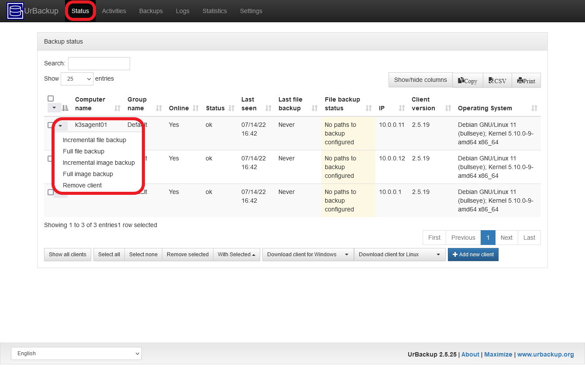

    You'll see a list of five actions.

    - Two for executing incremental or full file backups.

    - Two for launching incremental or full image backups. This option shouldn't appear since the image backups have been disabled, so this is probably a bug of the web interface.

    - The last action for removing the client software from the client computer.

2. Since you want to make a file backup, click on either the `Incremental` or the `Full` `file backup` option. You'll only get to see a thin blue progress bar at the top of the page, and a new short message in the `Last file backup` column at the `k3sagent01` row.

    

    Notice that below the `Never` string now it says `Queued backup`, which doesn't mean much by itself.

3. Go to the `Activities` tab, where you can see the progress of in-progress and the result of past finished tasks.

    

    The top `Activities` table is for activities currently in progress, while the `Last activities` one is where you can see all the backups done in other times, like the one launched before. Be aware that, if you try to execute an incremental backup and there's no previous full backup, UrBackup will execute a full backup instead no matter what. This is because incremental backups only store the differences between the previous (incremental or full) backup and the current state of the content that's being preserved. This also implies that, from time to time, you'll need to do a new full backup because you don't want end having incremental backups that diverge too much from their correlative full one. UrBackup by default is also scheduled to make a fresh full backup every number of days, something I'll show you later in this guide.

    In the case of the backup executed before, you can see it in the `Last activities` and see how it appears classified as a `Full file backup` action. Also notice that it didn't took much to finish, since at this point I didn't really had any data to backup to begin with.

    In the capture below you can see how this `Activities` page looks with an activity currently running.

    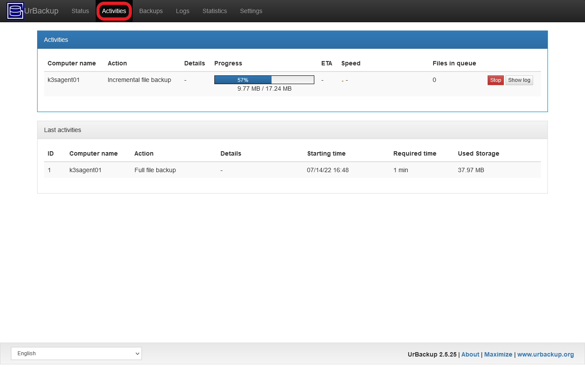

    The `Activities` table gets highlighted and the row of the task in progress has, among other details, a `Stop` button.

4. Now browse to the `Backups` page, where you can navigate through all your backups in a per-client basis.

    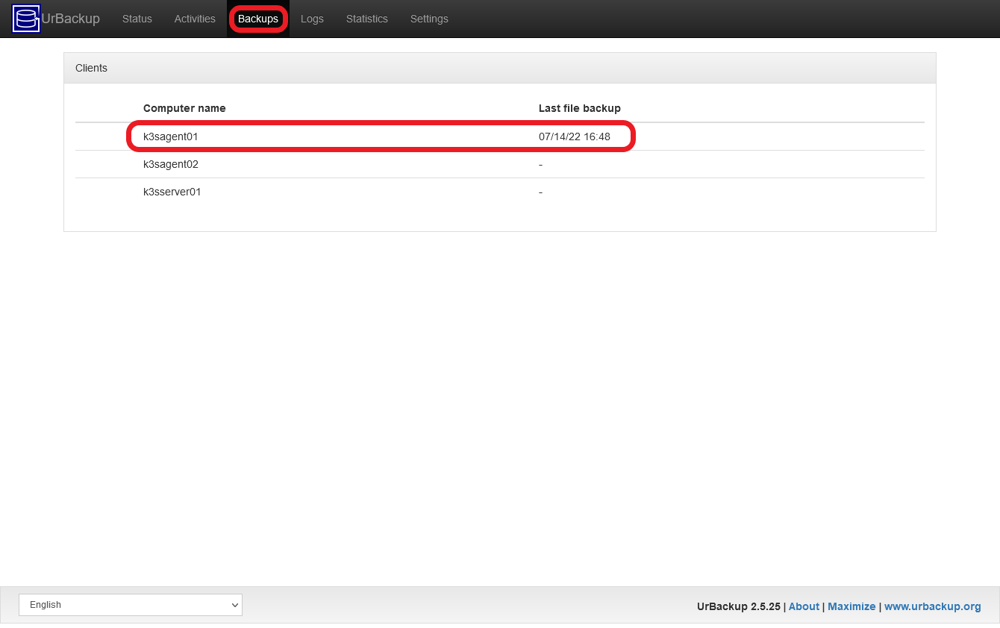

    This page greets you with a list of the clients known by your UrBackup server and the date of the last backup done on each. In this case, only the `k3sagent01` has a backup, so click on its row and you'll reach the page seen below.

    

    This page lists the backups done from the selected client, although in this case it only presents a table of file backups since the image backups are disabled. See that the file backup done before is also listed here as non incremental. Also notice the breadcrumb row over the table, which indicates your location within this `Backups` page. Clicking on a backup takes you to a file browser where you can navigate through the backup's contents.

    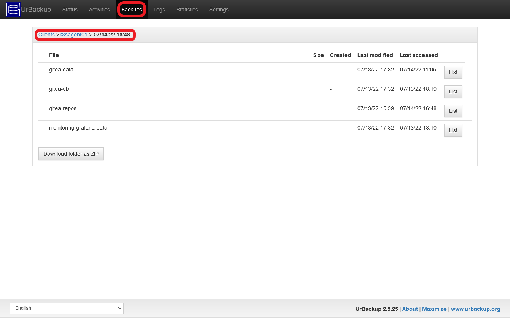

    The first level of the file backup is the list of paths you've configured in the client. They're listed by the names you gave them in the `urbackupclientctl add-backupdir`. If you clicked in any of them, you can browse the files and folders they contain. On the other hand, notice the `Download folder as ZIP` button below the list. That button allows you to export as a ZIP file the folder you're currently seeing.

5. Any backup task produces a log, which you can find in the `Logs` tab.

    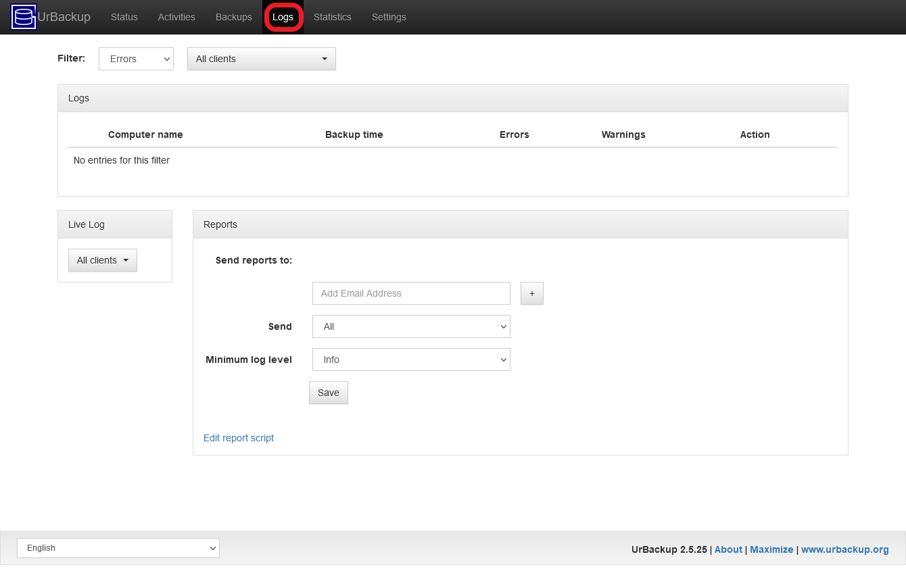

    By default, it has its filter set to show only error logs from all clients, but you can adjust it to list also warning or all the logs of any or all clients.

    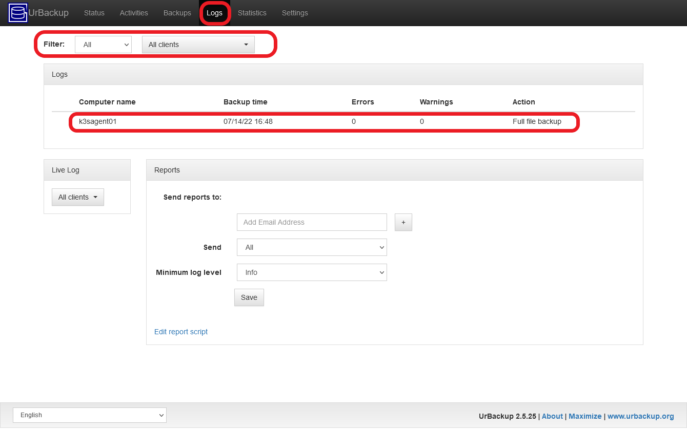

    Now you see, in the `Logs` table, the entry produced by the full file backup executed on the `k3sagent` client, which has no errors or warnings. If you click on it, you'll see its contents.

    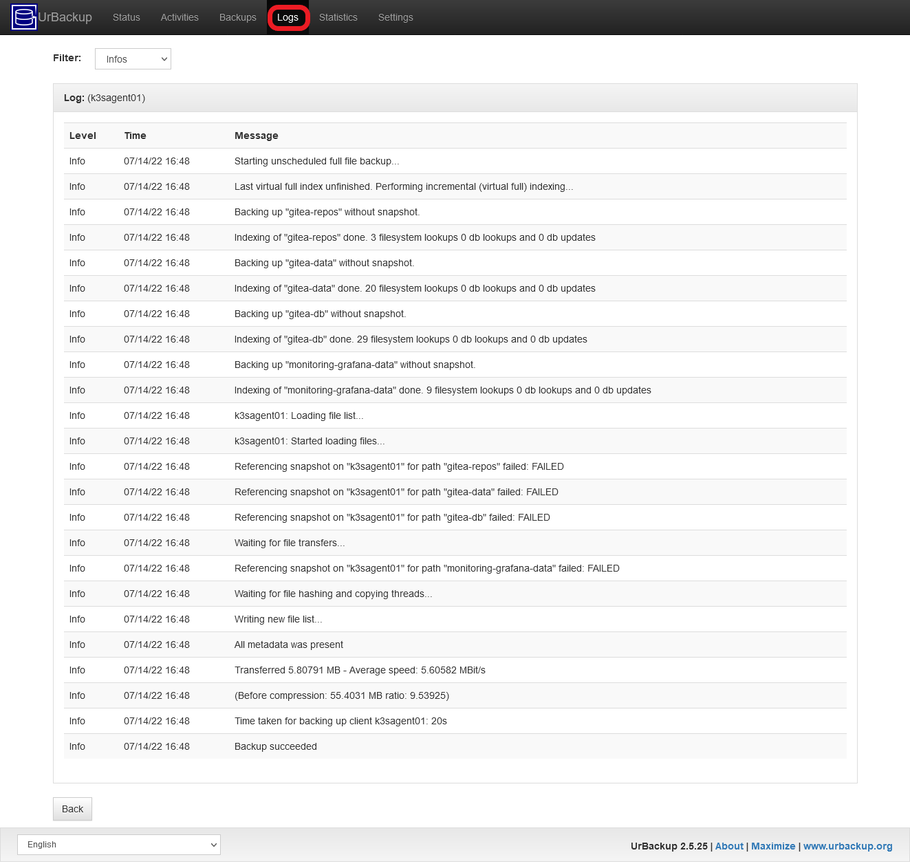

    In this case they are all logs of the `info` category but, if there were errors or warnings, this page would filter the logs to show only those with the highest priority. These log lines are found in the UrBackup server log file `/var/log/urbackup.log`.

    On the other hand, you can also see the most recent registered logs in your clients. Go back to the main `Logs` page, and unfold the `Live Log` clients list.

    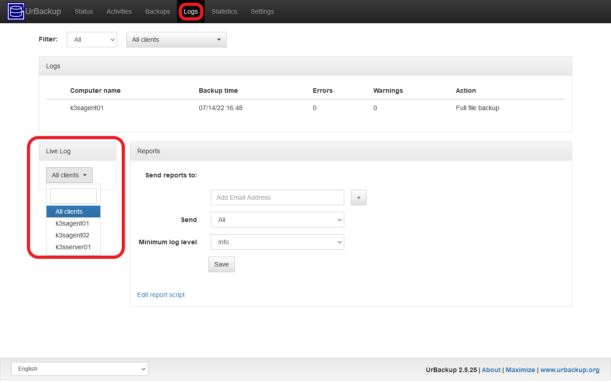

    Let's click for instance on the `k3sagent01` client, and a new page will open in your browser.

    

    Be aware that you don't see the whole client log here, just a few of the most recent entries and those that may appear after them. To see the full log, you'll have to go to the file found at `/var/log/urbackupclient.log` in the client.

    The final detail to know about of this `Logs` page is the `Reports` form, that allows you to send email summaries of the backups done. This feature doesn't work as is, UrBackup needs to connect to an email server to send these messages. I'll show you later were to put this configuration.

6. Another informative tab is the `Statistics` one.

    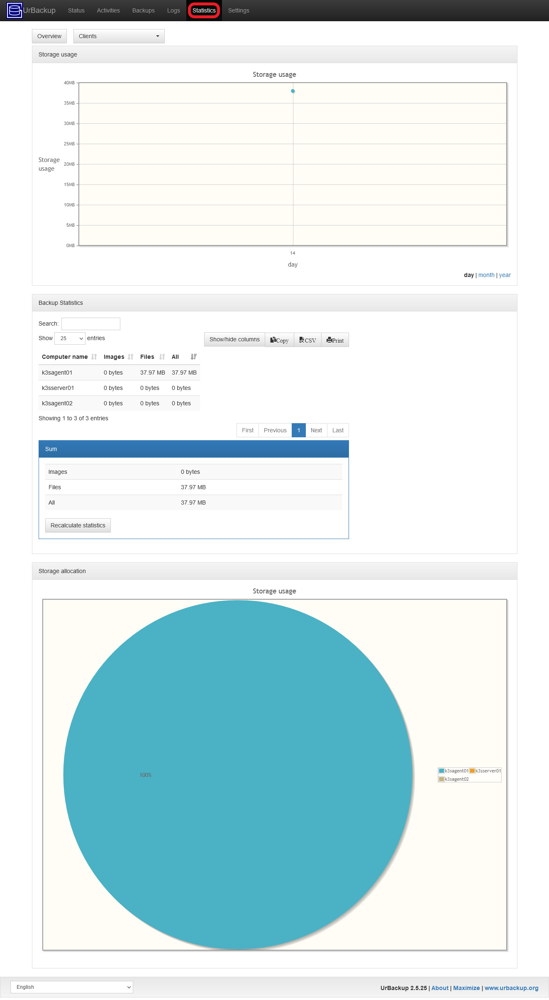

    Here you can see how much storage your backups are taking up in your server.

7. Finally, if you returned to the `Status` page, you'll notice a change in the row of the client from which you took the file backup.

    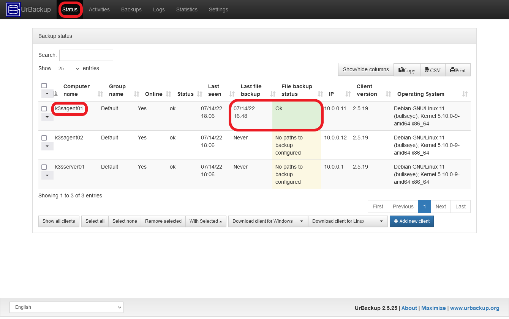

    The `k3sagent01` row now has the date of the last file backup instead of a `Never` string, and the file backup status field has an `Ok`. This should make you aware that this UrBackup server web interface requires switching back and forth between pages to refresh them.

### _Backups' **general** configuration_

There are many parameters to adjust in your UrBackup server, and you've already adjusted a few of them. Here I'll show you a few more general (applied to all clients) parameters you could tweak to adjusts the backup tasks better to the particularities of your system.

1. Browse to the `Settings` page, and stay at the `General` > `Server` tab.

    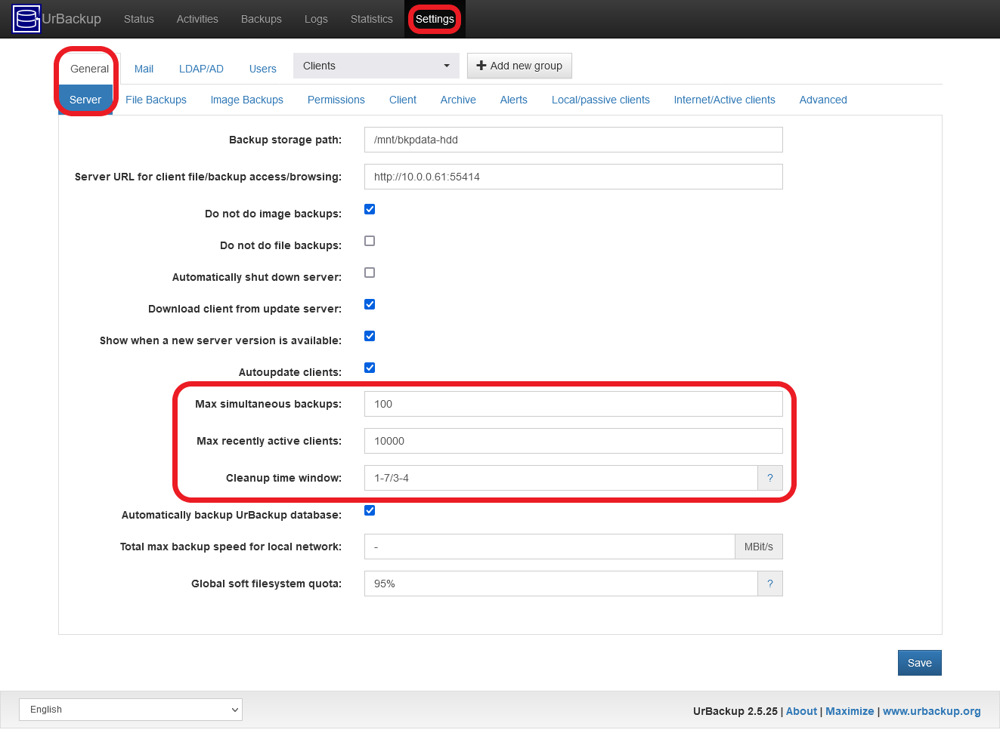

    Notice the highlighted fields in the snapshot above.

    - `Max simultaneous backups`: number of backups started at the same time. The default `100` value is too much for the small and rather loaded system used in this guide series, so its better to reduce it to something like `5`.

    - `Max recently active clients`: how many clients the server accepts. Doesn't make much sense to have such a high default value (`10000`) when you know that you won't have more than a handful of clients connected to this server. Let's reduce it to something like `10`.

    - `Cleanup time window`: time period in which this server will clean old backups and inactive clients up. The default value is `1-7/3-4` which means:

        - `1-7`: this task is executed all days of the week.
        - `3-4`: the task can be launched between the 3 and 4 hours (in 24h format).

        Adjust the time interval to something that fits you better, in my case it was `1-7/10-11`. The time interval format has a certain degree of complexity, so its better if you learn how it goes [from the official documentation](https://www.urbackup.org/administration_manual.html#x1-610008.3.1).

    So, if you applied the changes above, those fields would look as follows.

    

2. The next tab you must check in `Settings` is `General` > `File Backups`.

    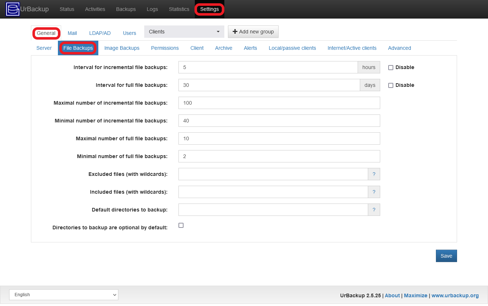

    Here you can adjust certain parameters that apply to all the file backups executed by this UrBackup server.

    - `Interval for incremental file backups`: how much time, in **hours**, must the server wait before executing the next **incremental** file backups.

    - `Interval for full file backups`: how much time, in **days**, must the server wait before executing the next **full** file backups.

    - `Maximal number of incremental file backups` and `Minimal number of incremental file backups`: these two values define the range of maximum and minimum number of **incremental** file backups kept for each client in the server.

    - `Maximal number of full file backups` and `Minimal number of full file backups`: these two values define the range of maximum and minimum number of **full** file backups kept for each client in the server

    - `Excluded files (with wildcards)`: indicates which files, or filetypes, to exclude from all the file backups.

    - `Included files (with wildcards)`: indicates which files, or filetypes, have to be included in all the file backups.

    - `Default directories to backup`: specifies the paths to be backed up from all clients. If you use this field, you should ponder if you have to use the option that comes after this field. Otherwise, if the path doesn't exist in any particular client, the procedure in that client will fail with an error.

    - `Directories to backup are optional by default`: with this option enabled, a file backup won't fail if it doesn't find a concrete path. Leave it disable if you really want a file backup to return an error if an expected path is missing in a client.

    At this point, there's no need to change anything here.

3. Now go to the `General` > `Image Backups` tab.

    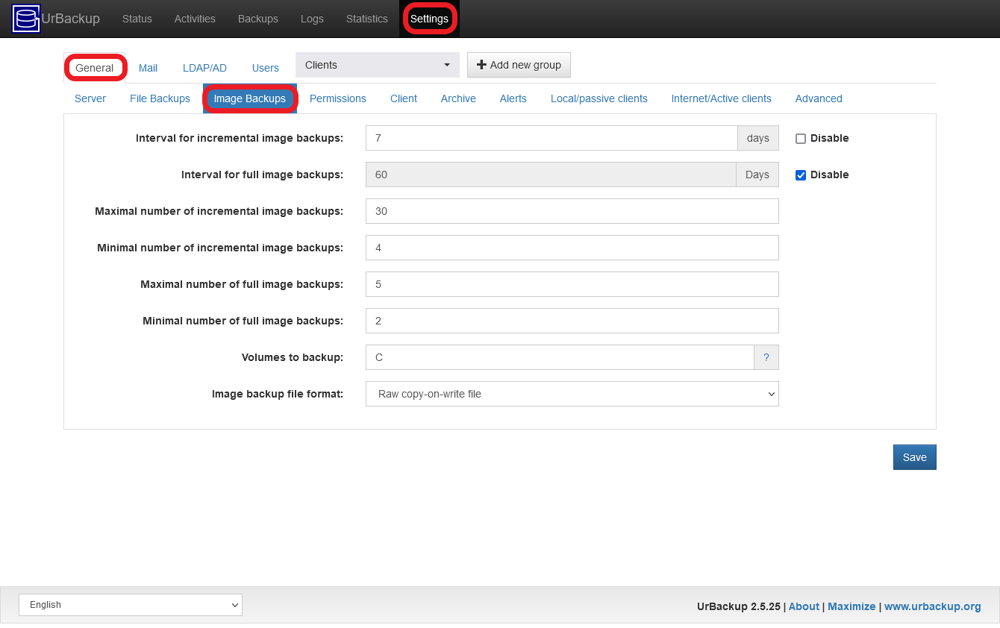

    The first six fields are the image backup equivalents of also the first six ones in the `File Backups` tab, although the `Interval for incremental image backups` field is measured in days rather than in hours. Also see how `Interval for full image backups` is disabled, which is the consequence of disabling the image backups in the `General` > `Server` tab. The `Volumes to backup` field has a `C` letter specified as in the `C` volume of a Windows system. It's not clear in the documentation if this parameter is applied exclusively to Windows clients.

4. Next, jump to the `General` > `Client` tab.

    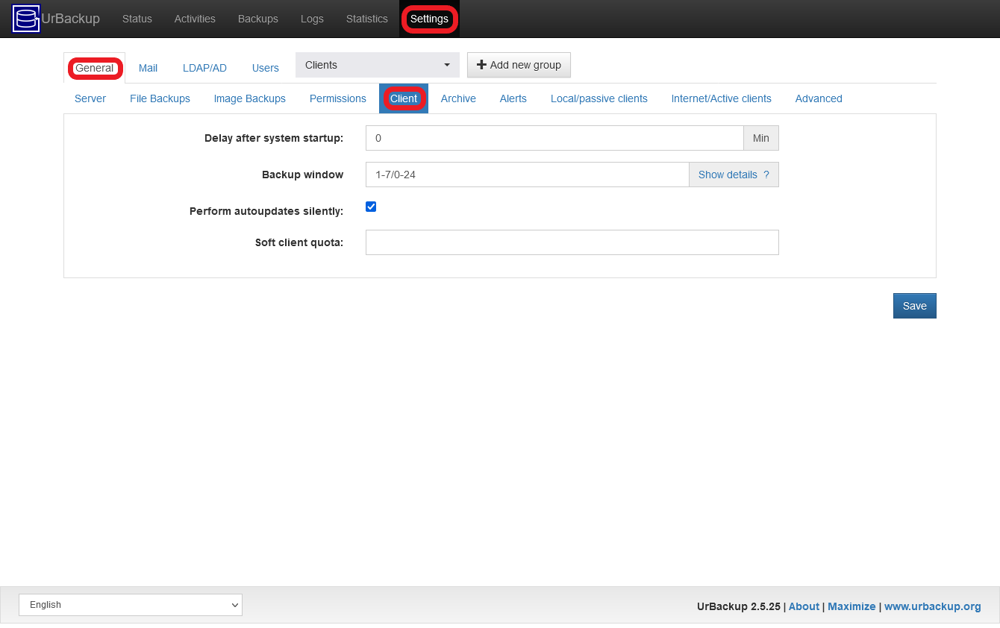

    These options configure certain behaviours of the server that affect the client program.

    - `Delay after system startup`: when the server discovers a client, how much time in minutes must the server wait to start a backup in that client. Being aware that your clients are all K3s nodes, you'll prefer to give them some time to properly start all their services before doing anything. So, here I'd put at least `5` or even `10` minutes.

    - `Backup window`: the server only starts backups on clients in this particular time period. Here you must remember that you have already configured in Proxmox VE a backup job acting on all your K3s node VMs, so you don't want that process and the UrBackup backups start in the same time period. So, to avoid that collision, let's adjust this backup window to something like `1-7/0-13:30;1-7/17-0` (all days of the week, between 00:00 and 13:30 or between 17:00 and 00:00). Check out this time period format [in the official UrBackup documentation](https://www.urbackup.org/administration_manual.html#x1-610008.3.1).

        This field can be finely tuned for each type of backup. To do so, click on the `Show details` link next to the field.

        

        After clicking on it, `Backup window` will unfold into four different fields, one per each kind of backup.

        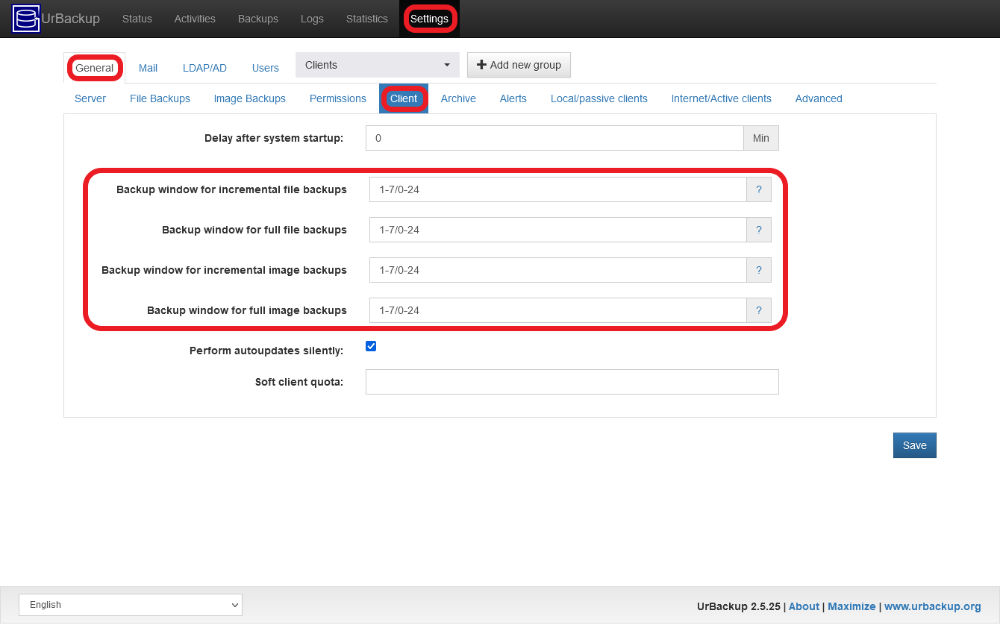

        This way, you can adjust a different time period for each kind of backup. Notice how the default value appears in all the fields.

    - `Perform autoupdates silently`: by default, the updates of the client software won't ask the user for its permission.

    - `Soft client quota`: storage space quota applied to the backups of each client during cleanups. Any backups that go over this quota and also beyond the minimal number of file or image backups configured for clients will be removed from the server.

    In my case, I left this page configured like below.

    

### _Backups' **client** configuration_

You've seen the UrBackup server general configuration, but know that you can also set a particular configuration to each client.

1. Regardless of what tab you are in the `Settings` page, you always have the list of `Clients` available over the tab bar.

    

    When unfolded, you'll see a list of active clients organized in groups. In this case, there's only the `Default` group, where UrBackup puts all clients by default. Notice how `k3sagent01` has an `*` next to its name. Although I haven't found the meaning of this in the UrBackup documentation, it probably means that the configuration of that client diverges in some aspects from the common one applied to all clients.

2. If you click on the `k3sagent01` client, you'll get to its own `Settings` page.

    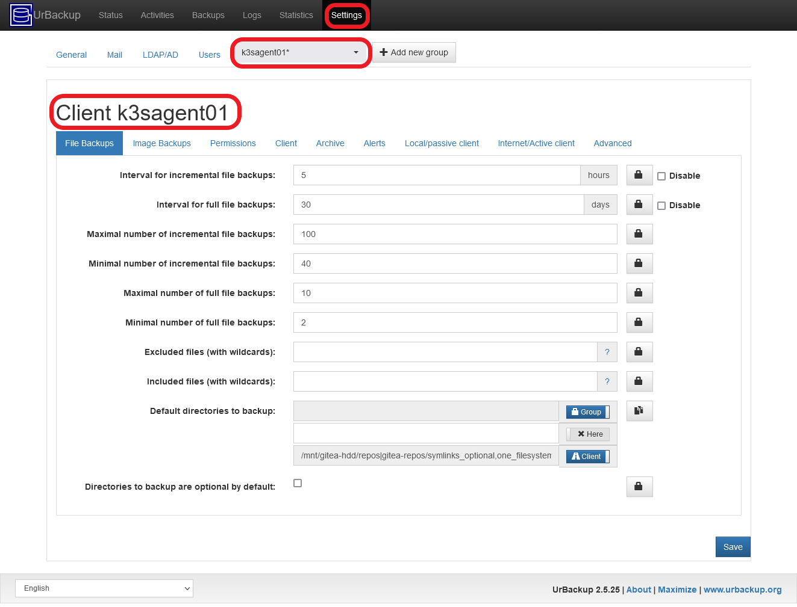

    By default you'll get inside the `File Backups` tab, and notice that there's no `Server` tab now. Also see how the fields' values here are the common ones, except in the `Default directories to backup` field. This parameter now has three fields:

    - The first one shows the group configuration.
    - The second one is for specifying paths in this page.
    - The third one is the path configuration set in the client itself. You cannot edit it from this web interface.

    The lock button indicates if a field is using an inherited "group" value or one that has been set explicitly for this client.

3. If you browse through the other tabs, you'll see that they're essentially the same as the ones found in the `Settings` > `General` page (except the `Server` tab), although with some differences.

## Restoration from file backups

In the setup explained in this guide, the filesystem snapshots in the clients are disabled, which makes automatic complete restorations with UrBackup uncertain (maybe impossible even). The [official UrBackup documentation is quite thin on this regard](https://www.urbackup.org/administration_manual.html#x1-840009), so expect a manual restoration file by file when using file backups (and this would also imply setting the correct owners and permissions manually to each recovered file or folder).

Anyway, to restore any UrBackup backup automatically on a linux client you have to use the `urbackupclientctl restore-start` command. Check out its help (`urbackupclientctl restore-start --help`) to know more about it.

## Relevant system paths

### _Directories on Debian VMs_

- `/etc/logrotate.d`
- `/mnt/gitea-hdd/repos`
- `/mnt/gitea-ssd/data`
- `/mnt/gitea-ssd/db`
- `/mnt/monitoring-ssd/grafana-data`
- `/var/log`

### _Files on Debian VMs_

- `/etc/logrotate.d/urbackupcli`
- `/var/log/urbackupclient.log`

## References

### _Logrotate_

- [logrotate(8) - Linux man page](https://linux.die.net/man/8/logrotate)
- [logrotate command in Linux with examples](https://linuxconfig.org/logrotate)

### _About snapshots_

- [Snapshot behavior on classic LVM vs ThinLVM](https://linux-lvm.redhat.narkive.com/DsOflGYe/snapshot-behavior-on-classic-lvm-vs-thinlvm)
- [Selection of linux filesystem for snapshots - For file backups on a VM](https://unix.stackexchange.com/questions/421245/selection-of-linux-filesystem-for-snapshots-for-file-backups-on-a-vm)
- [Device-mapper snapshot support](https://docs.kernel.org/admin-guide/device-mapper/snapshot.html)
- [Using Linux Device Mapper Snapshots to Rescue a Failed RAID](http://st.xorian.net/blog/2013/03/using-linux-device-mapper-snapshots-to-rescue-a-failed-raid/)

### _UrBackup_

- [UrBackup](https://www.urbackup.org/)
- [UrBackup FAQ](https://www.urbackup.org/faq.html)
- [Administration Manual for UrBackup Server 2.4.x](https://www.urbackup.org/administration_manual.html)
- [Server 2.5.21/Client 2.5.15](https://forums.urbackup.org/t/server-2-5-21-client-2-5-15/10283?u=uroni)
- [Latest versions of the UrBackup software are HERE](https://beta.urbackup.org/)
- [Howto fully uninstall urbackup client on Ubuntu](https://forums.urbackup.org/t/howto-fully-uninstall-urbackup-client-on-ubuntu/3040)
- [Linux Debian / Ubuntu - add-backupdir CLI issue](https://forums.urbackup.org/t/linux-debian-ubuntu-add-backupdir-cli-issue/11446)
- [Linux Client not cleaning up .Overlay Files](https://forums.urbackup.org/t/linux-client-not-cleaning-up-overlay-files/2351)

## Navigation

[<< Previous (**G040. Backups 04. UrBackup 01**)](G040%20-%20Backups%2004%20~%20UrBackup%2001%20-%20Server%20setup.md) | [+Table Of Contents+](G000%20-%20Table%20Of%20Contents.md) | [Next (**G042. System update 01**) >>](G042%20-%20System%20update%2001%20~%20Considerations.md)
