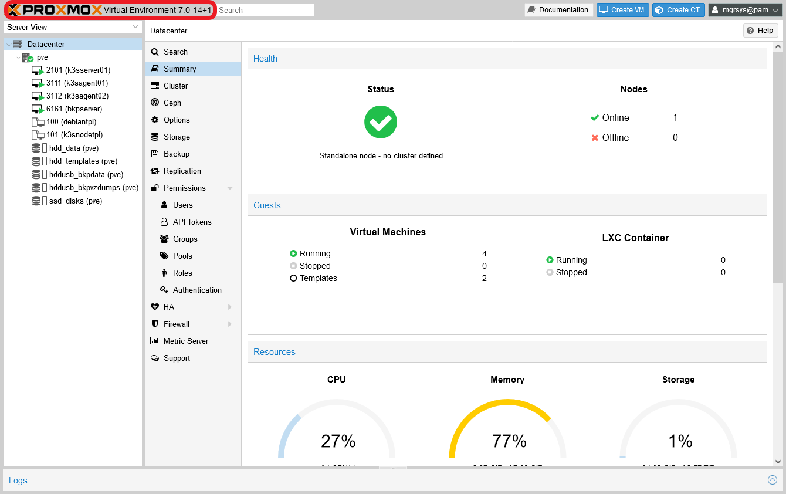
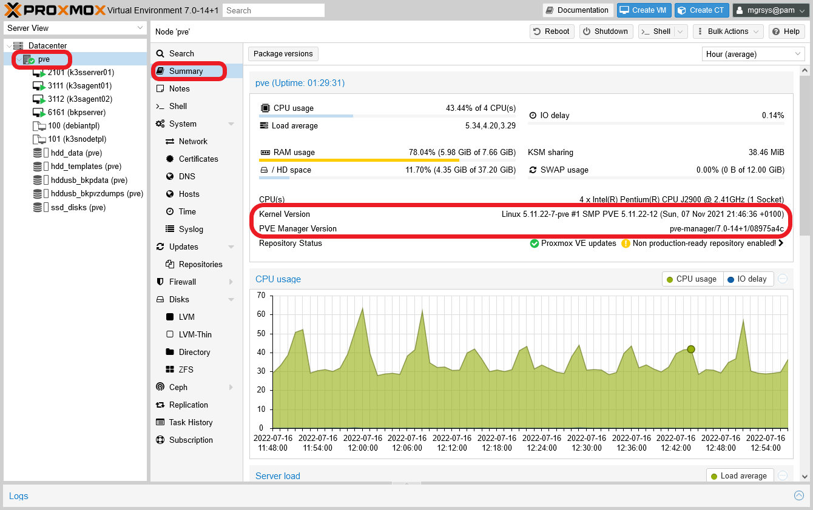
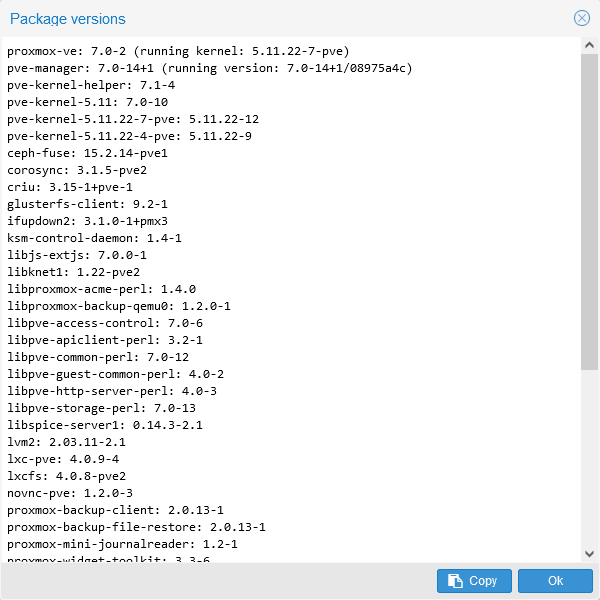
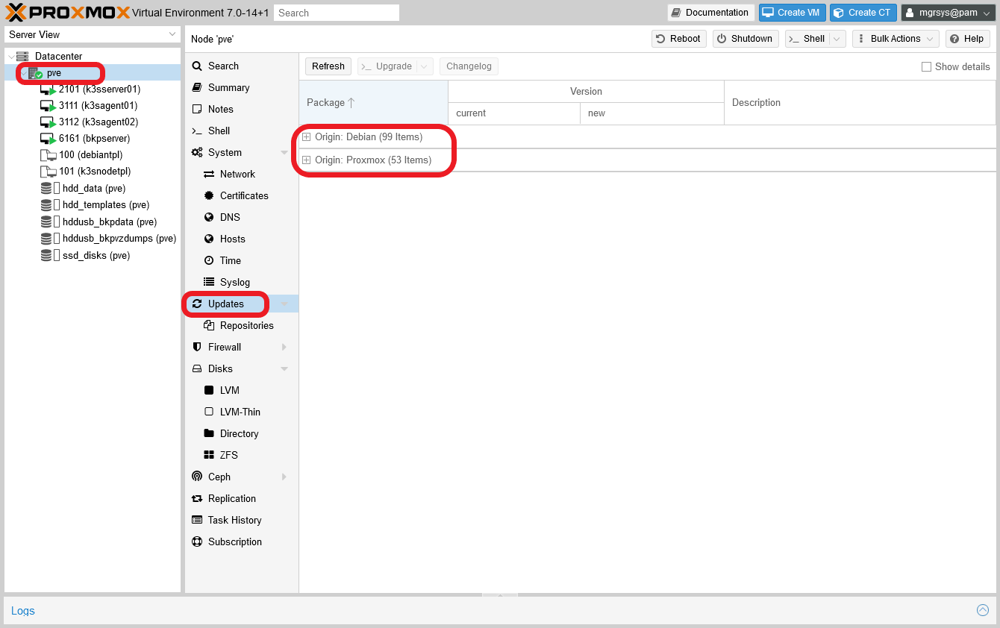
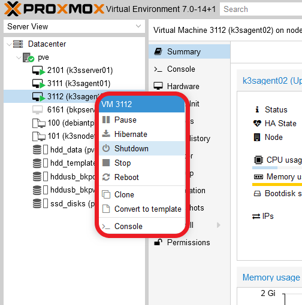
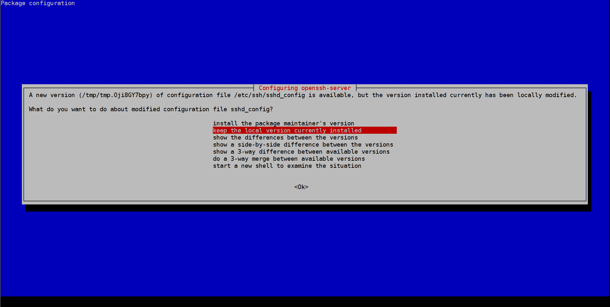
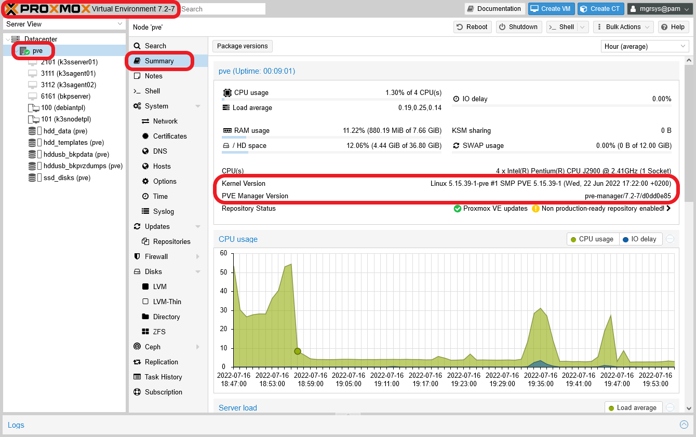

# G043 - System update 02 ~ Updating Proxmox VE

Following the order I suggested [in the previous **G042** guide](G042%20-%20System%20update%2001%20~%20Considerations.md#update-order), let's start updating the Proxmox VE system.

## Examining your Proxmox VE system

To update Proxmox VE you must be aware first of what version you're using and what updates are available for it. This also implies checking the changes or fixes that come with the updates, and see if anything has been modified dramatically.

### _Proxmox VE's current version_

To see what version of Proxmox VE you're currently running is really easy. Just get into the PVE web console and take a look at the top bar, you'll see the version number next to the software's name.

In this case, the version reported is `7.0-14+1`. But you must remember that Proxmox VE is meant to work in a cluster configuration, and could happen that each node of a cluster could have a different version. This particularity means that an administrator must know what version of Proxmox VE is running on each node, and this can be seen in their `Summary` tab. Try it with your standalone `pve` node.

Notice the two highlighted fields.

- `Kernel version`: informs you of the Linux version you're running, although notice that it **doesn't** specify the Linux distribution version (Debian 11 bullseye).

- `PVE Manager Version`: this indicates the exact Proxmox VE version running in this node. See how in this case it not only indicates the same version you read in the top bar, but also some extra code (a git repository hexadecimal identifier) that you shouldn't really worry about.

On the other hand, the Proxmox VE software is a collection of packages, each of which have their own version. At the top of the `Summary` page of your `pve` node, there's a `Package versions` button.

Click on this button, and first you'll be greeted by the same warning about not having a "valid subscription" (a paid one) for enterprise updates.

Accept the warning so you can reach the next window.

Here you can see the current versions of the packages directly or indirectly related to your Proxmox VE installation. In other words, this window only shows packages that have something to with the Proxmox VE software, filtering out the rest. In particular, notice that, at the top of the list, there's a `proxmox-ve` package and right below it a `pve-manager` one. The `pve-manager` version is what's informed in the `Summary` tab of the `pve` node.

After all this analysis, you can conclude that, in this case, the system is running a Proxmox VE of the **7.0** family.

### _Debian packages' current version_

Since Proxmox VE is, after all, a Debian 11 bullseye environment, you'll also want to know the versions of the rest of the packages installed in your system. To do so, just go to the `Updates` page of your `pve` node.

This view shows you all the packages that are pending of update, including the Proxmox VE ones. The packages in this view are separated in groups depending on which is their source repository, or `Origin`. You can see this better if you fold the packages lists.

There are two origins or sources for the packages of this system, the official Debian one and the Proxmox repository.

### _Proxmox VE most recent version_

You know that you have to update your Proxmox VE system, but to what version exactly? The web console doesn't warn you of upcoming new versions, so this forces you to go to the [official Proxmox page](https://www.proxmox.com/en/) and see if they announce a new version of their Proxmox VE product. They announce their new major and minor versions in press releases, which you can [find here](https://www.proxmox.com/en/news).

For the system updated in this guide, the jump is significant since, at the time of writing this, the most recent version is the **7.2** one. And yes, there has been also a **7.1** released previously. In their respective press releases, you can see what improvements, fixes and changes bring these newer versions.

- [Proxmox Virtual Environment 7.2 released](https://www.proxmox.com/en/news/press-releases/proxmox-virtual-environment-7-2-available)
- [Proxmox Virtual Environment 7.1 released](https://www.proxmox.com/en/news/press-releases/proxmox-virtual-environment-7-1-released)

Since these are minor version updates part of the same major 7.x family, updating this Proxmox VE 7.0 system will be quite straigthforward.

> **NOTE**  
> You might think at this point why I didn't follow my own advice and updated frequently this Proxmox VE system, and all the other software running in it. Think that writing this collection of guides has taken a long time, and I needed to keep the same versions till the end to ensure coherence among the guides. To give you some perspective, know that I started an early version of this guide series with a Proxmox VE **6.x**. So yeah, quite a bit of time.

## Updating Proxmox VE

After learning what updates you have to apply, and what they bring, you can start the procedure of updating your Proxmox VE system.

### _Backup your system_

Upgrading to a newer minor version is a significant change to the system, specially one that is two numbers newer (the jump is from **7.0** to **7.2**). So, to remain on the safe side, first you should do a complete host backup with Clonezilla, as is explained in the [**G038** guide](G038%20-%20Backups%2002%20~%20Host%20platform%20backup%20with%20Clonezilla.md).

### _Checking the activities on UrBackup_

Check in your UrBackup server's web interface, in the `Activities` tab, if there are backup tasks running. If so, wait for them to finish before you proceed with the rest of this update procedure.

### _Careful with the backup jobs in Proxmox VE_

Likewise as with UrBackup, if they have started, wait for the backup jobs you may have scheduled in your Proxmox VE system.

### _Shutting down the VMs_

Being sure that you don't need to use the services provided by the VMs running in your Proxmox VE, shut them down in the following order.

1. The UrBackup server (`bkpserver`).
2. The K3s agent nodes (`k3sagent01` and `k3sagent02`).
3. The K3s server node (`k3sserver01`).

Know that you have the `Shutdown` action, and several others, in a contextual menu that appears when you click, with your right mouse button, on a VM at the tree on the left.

On the other hand, you don't know how many times you'll need to reboot the Proxmox VE host during or after the update. This is relevant to consider because your VMs are configured to start automatically when the host does, and with a big update as the one posed in this guide, you might prefer to temporarily disable this capacity in all your VMs. Remember, this feature is the `Start at boot` parameter found in the `Options` page of your VMs.

### _Starting the masked spiceproxy service_

Back in the [**G011** guide](G011%20-%20Host%20hardening%2005%20~%20Proxmox%20VE%20services.md), you disabled certain Proxmox VE services that aren't necessary in a standalone PVE node as the one used in this guide series. I also warned you [in the same guide](G011%20-%20Host%20hardening%2005%20~%20Proxmox%20VE%20services.md#errors-in-the-apt-upgrade-process) that some updates of Proxmox VE packages may expect certain services to be running and, if not, the update may warn of an error and not finish correctly. In particular, it's the `spiceproxy` service the one that, when disabled, provoked a warning when updating the `pve-manager` package. So, let's leave it unmasked and running, to avoid that possible issue during the update. Execute the following commands on a shell opened on your Proxmox VE system as `mgrsys`.

~~~bash
$ sudo systemctl unmask spiceproxy.service
$ sudo systemctl start spiceproxy.service
~~~

### _Applying the updates_

With all the previous steps covered, now you can start the update. I already explained you how to do this from the Proxmox VE web console, in the [**G003** guide](G003%20-%20Host%20configuration%2001%20~%20Apt%20sources,%20updates%20and%20extra%20tools.md#update-your-system). You can follow those instructions, or just use `apt` in a shell as you would do with any Debian-based system.

~~~bash
$ sudo apt update
$ sudo apt upgrade
~~~

Since in this case there are a lot of packages to update, it'll take some minutes to finish. Stay put for any questions the upgrade process may prompt you. In particular, apt asked me about the file `/etc/ssh/sshd_config`.

The default answer is the correct one, because in this file you have declared your particular configuration that hardened the remote SSH access to this host.

When the update process has finished, reboot the host. After the system is fully started, get into the web console and go straight to the `Summary` page of your `pve` node.

Notice that now the version is 7.2-7 both in the name at the top bar and in the `PVE Manager Version` field, and that also the `Kernel Version` is newer. Also, check if there are more updates pending. Remember that you can see this directly in the web console, in the `Updates` page of your `pve` node.

On the other hand, open a shell on your Proxmox VE host and execute the following `apt` command.

~~~bash
$ sudo apt autoremove
~~~

This will clean up any files (like old kernel files) that apt detects as not necessary to keep any more in the system and will be deleted. In my case, there was none of the sort after doing this upgrade.

### _Checking disabled services_

It's possible that an update could "resurrect" any of the services you disabled in the [**G011** guide](G011%20-%20Host%20hardening%2005%20~%20Proxmox%20VE%20services.md). Or maybe they have been changed or even eliminated. Either way you'll want to check them out to see if they remain disabled and stopped, and you can do that just by checking them with `systemctl`. Below I leave you a quick command rundown for checking all those services.

- **RPC services**, all related to NFS storage access.

    ~~~bash
    $ sudo systemctl status rpcbind.target rpcbind.socket rpcbind.service nfs-client.target
    ~~~

- **ZFS services**.

    ~~~bash
    $ sudo systemctl status zfs-mount.service zfs-share.service zfs-volume-wait.service zfs-zed.service zfs-import.target zfs-volumes.target zfs.target
    ~~~

- **CEPH services**.

    ~~~bash
    $ sudo systemctl status ceph-fuse.target ceph.target
    ~~~

- **SPICE proxy service**.

    ~~~bash
    $ sudo systemctl status spiceproxy.service
    ~~~

- **Proxmox VE High-Availability (HA) services**.

    ~~~bash
    $ sudo systemctl status pve-ha-crm pve-ha-lrm corosync
    ~~~

In my case, two services appeared active: `ceph.target` and `spiceproxy.service`. On the other hand, the `corosync` service warned of a missing configuration file, but in the system used here this won't be a concern. So, let's disable those two active services.

~~~bash
$ sudo systemctl mask --now ceph.target spiceproxy
~~~

Here notice that I've also masked `ceph.target`. This is because after this update it's not enough to disable the service, after a reboot it appears active and running otherwise. When you execute the command above, reboot your system and confirm again that these two and the other indicated services remain disabled and stopped.

### _Restarting the VMs_

The last thing to do is to start your VMs. Do this in exactly the opposite order you followed when you shut them down.

1. The K3s server node (`k3sserver01`).
2. The K3s agent nodes (`k3sagent01` and `k3sagent02`).
3. The UrBackup server (`bkpserver`).

Also, don't forget to reenable the `Start at boot` feature found in the `Options` page of all your VMs

## References

### _Proxmox VE_

- [Proxmox](https://www.proxmox.com/en/)
- [Proxmox. Press Releases](https://www.proxmox.com/en/news/press-releases)
- [Proxmox Virtual Environment 7.2 released](https://www.proxmox.com/en/news/press-releases/proxmox-virtual-environment-7-2-available)
- [Proxmox Virtual Environment 7.1 released](https://www.proxmox.com/en/news/press-releases/proxmox-virtual-environment-7-1-released)

## Navigation

[<< Previous (**G042. System update 01**)](G042%20-%20System%20update%2001%20~%20Considerations.md) | [+Table Of Contents+](G000%20-%20Table%20Of%20Contents.md) | [Next (**G044. System update 03**) >>](G044%20-%20System%20update%2003%20~%20Updating%20VMs%20and%20UrBackup.md)
